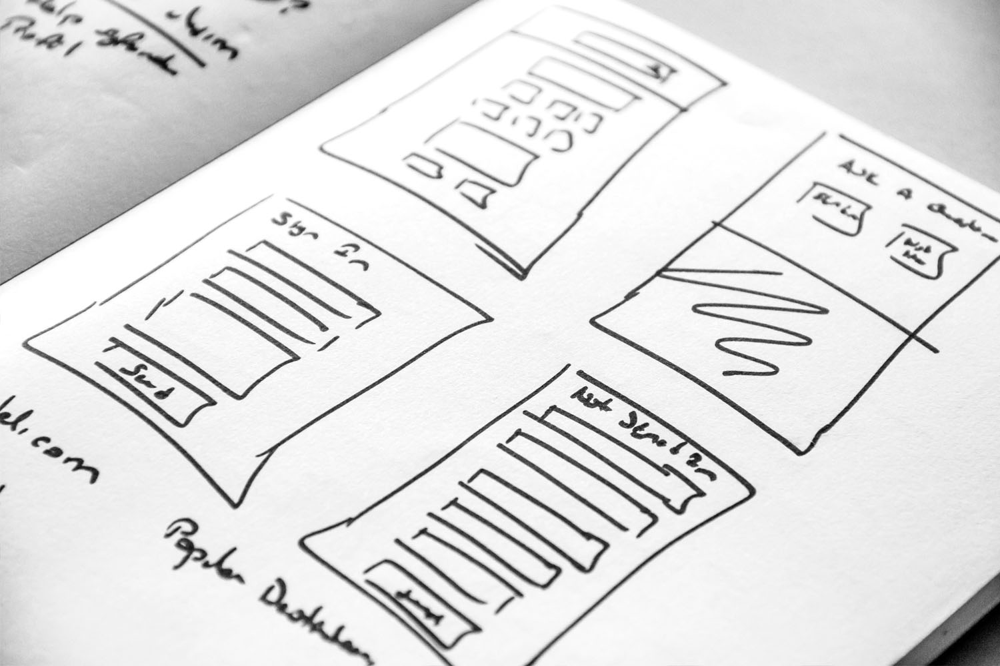

# 开始使用登陆页 {#get-sarted-lp}

>[!CONTEXTUALHELP]
>id="acw_homepage_welcome_rn5"
>title="登陆页面"
>abstract="探索新的登陆页面体验。即时创建、设计和共享登陆页面，以将您的用户定向到在线网页，在这里，您可以根据内置模板管理客户获取、订阅/退订和阻止列表用例。"
>additional-url="https://experienceleague.adobe.com/docs/campaign-web/v8/whats-new.html?lang=zh-Hans" text="请参阅发行说明"

[!DNL Adobe Campaign] 允许您创建、设计和共享登陆页面。

在营销活动的上下文中，登陆页面是一个独立的网页，访客单击投放或网站中的链接后，会被定向到该页面。

通过登陆页面，您可以将用户定向到在线表单，他们可以在其中更新数据、选择加入/退出接收您的通信或订阅特定服务（如新闻稿）。

>[!CAUTION]
>
>在Campaign Web用户界面中创建的登陆页面与从客户端控制台创建的Web表单不同。 您不能在Campaign Web用户界面中显示或编辑Web窗体。
>
>要了解有关Web窗体的更多信息，请参阅 [Campaign控制台文档](https://experienceleague.adobe.com/docs/campaign/campaign-v8/content/webapps.html){target="_blank"}.

登陆页面关键功能列示如下：

* 使用现成的应用程序即时创建、设计和共享登陆页面 **预填充模板** 匹配不同的用例。 [了解详情](create-lp.md)
* 利用 [!DNL Adobe Campaign] 轻松构建的内容设计功能 **响应式登陆页面**. [了解详情](lp-content.md)
* 设置 **选择启用和选择禁用流程** 快速、无缝。 [了解详情](lp-use-cases.md)
* 创建订阅服务以使用户能够 **订购服务**. [了解详情](lp-use-cases.md#lp-subscription)
* 向收件人提供 **取消订阅的功能** 接收您的通信。 [了解详情](lp-use-cases.md#lp-unsubscription)
  <!--Send a **confirmation email** upon opt-in or opt-out.-->

<table style="table-layout:fixed"><tr style="border: 0;">
<td>

<a href="create-lp.md"><strong>创建登陆页面</strong>

</td>
<td>

<a href="../audience/manage-services.md"><strong>创建订阅服务</strong></a>

</td>
<td>

<a href="lp-content.md"><strong>设计登陆页面</strong></a>

</td>
<td>

<a href="lp-templates.md"><strong>使用内容模板</strong></a>

</td>
</tr></table>
