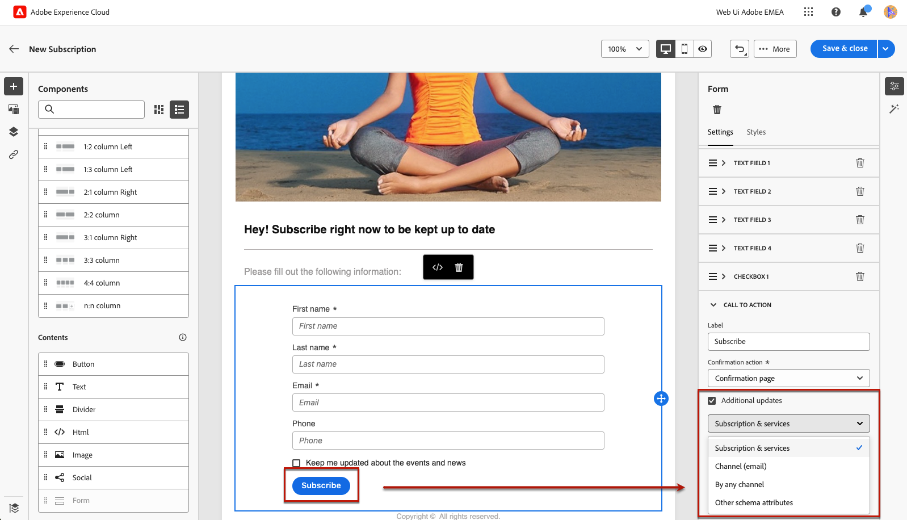
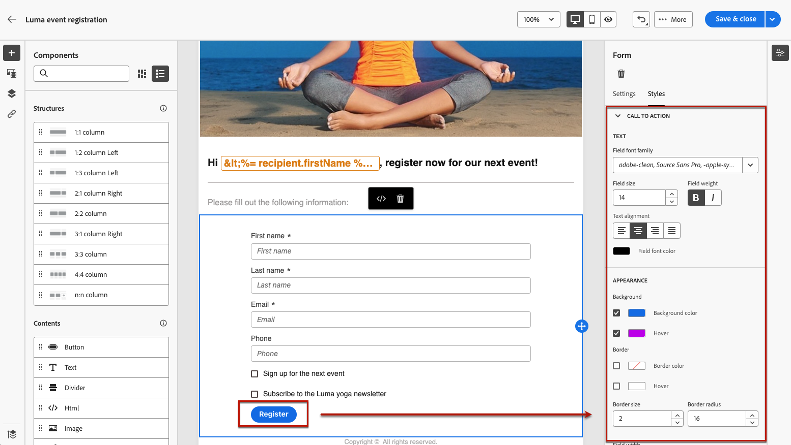

# 定义特定于登陆页面的内容 {#lp-content}

>[!CONTEXTUALHELP]
>id="ac_lp_components"
>title="使用内容组件"
>abstract="内容组件是空的内容占位符，您可用它来创建登陆页面的版面。要定义特定内容使得用户能够进行选择并提交其选择内容，请使用表单组件。"

编辑登陆页面中任何页面的内容时，该内容均已预填充。

第一个页面（在用户单击指向您的登陆页面的链接后立即向用户显示）已预填充 [特定于登陆页面的表单组件](#use-form-component) （对于所选模板）<!-- to enable users to select and submit their choices-->. 您还可以定义 [登陆页面的样式](#lp-form-styles).

要进一步设计登陆页面内容，您可以使用与电子邮件相同的组件。 [了解详情](../email/content-components.md#add-content-components)

的内容 **[!UICONTROL 确认]**， **[!UICONTROL 错误]** 和 **[!UICONTROL 过期]** 页面也会预先填充。 根据需要编辑它们。

## 使用表单组件 {#use-form-component}

>[!CONTEXTUALHELP]
>id="ac_lp_formfield"
>title="设置表单组件字段"
>abstract="定义您的收件人如何从登陆页面查看和提交他们的选择。"

>[!CONTEXTUALHELP]
>id="acw_landingpages_calltoaction"
>title="单击按钮时会出现的情况"
>abstract="定义在用户提交登陆页面表单时将会出现的情况。"

要定义特定内容，以允许用户从登陆页面选择并提交所做的选择，请使用 **[!UICONTROL 表单]** 组件。 为此，请执行以下步骤。

1. 登陆页面特定 **[!UICONTROL 表单]** 组件已显示在所选模板的画布中。

   >[!NOTE]
   >
   >此 **[!UICONTROL 表单]** 组件只能在同一页面上使用一次。

1. 选择它。 此 **[!UICONTROL 表单内容]** 选项卡显示在右侧面板中，允许您编辑表单的不同字段。

   

   >[!NOTE]
   >
   >切换到 **[!UICONTROL 样式]** 选项卡，随时编辑表单组件内容的样式。 [了解详情](#lp-form-styles)

1. 展开第一个文本字段（如果有），或者使用 **[!UICONTROL 添加]** 按钮。 从 **[!UICONTROL 文本字段1]** 部分，可以编辑字段类型、要更新的数据库字段、标签以及在用户输入值之前显示在字段中的文本。

   

1. 查看 **[!UICONTROL 将表单字段设为必填]** 选项（如果需要）。 在这种情况下，仅当用户填写此字段后才能提交登陆页面。

   >[!NOTE]
   >
   >如果未填写必填字段，则用户提交页面时会显示错误消息。

1. 展开该复选框（如果有），或者使用 **[!UICONTROL 添加]** 按钮。 选择该复选框应更新数据库中的服务或字段。

   

   如果您选择 **[!UICONTROL 订阅和服务]**，从列表中选择服务，然后在以下两个选项之间进行选择：

   * **[!UICONTROL 如果选中，则订阅]**：用户需要选中复选框才能同意（选择加入）。
   * **[!UICONTROL 如果选中，则取消订阅]**：用户需要选中复选框以取消同意（选择退出）。

   如果您选择 **[!UICONTROL 字段]**，从属性列表中选择一个字段，然后在以下两个选项之间进行选择：

   * **[!UICONTROL 如果选中，则为Yes]**<!--TBC-->

   * **[!UICONTROL 如果选中，则否]**<!--TBC-->

1. 您可以删除和添加尽可能多的字段（如文本字段、单选按钮、复选框、下拉列表等） 根据需要。

1. 添加或更新所有字段后，单击 **[!UICONTROL 行动号召]** 以展开相应的部分。 它允许您在中定义按钮的行为 **[!UICONTROL 表单]** 组件。

   

1. 定义单击按钮时将发生的操作：

   * **[!UICONTROL 确认页面]**：用户将被重定向到 **[!UICONTROL 确认]** 页面集。

   * **[!UICONTROL 重定向URL]**：输入用户将被重定向到的页面的URL。

1. 如果要在提交表单时进行其他更新，请选择 **[!UICONTROL 其他更新]**，然后选择要更新的项目：
   * 订阅服务 — 在这种情况下，定义您是在提交表单时选择加入还是选择退出用户。
   * 填写表单时使用的电子邮件地址。
   * 所有渠道 — 在提交表单时，用户将选择加入或退出（取决于所选模板），以进入或退出所有渠道上来自您品牌的所有通信
   * 数据库中的字段 — 从属性列表中选择一个字段，并定义在提交表单时该字段应设置为True还是False。

   

1. 保存您的内容以返回至 [登陆页面属性](create-lp.md#create-landing-page).

## 定义登陆页面表单样式 {#lp-form-styles}

1. 要修改表单组件内容的样式，请随时切换到 **[!UICONTROL 样式]** 选项卡。

1. 此 **[!UICONTROL 文本字段]** 默认情况下，部分处于扩展状态。 它允许您编辑文本字段的外观，如标签字体、标签位置、字段背景颜色或字段边框。

   

1. 展开 **[!UICONTROL 复选框]** 部分定义复选框和相应文本的外观。 例如，您可以调整字体系列和大小，或复选框边框颜色。

   

1. 展开并编辑与您可能添加的其他字段（单选按钮、下拉列表、日期和时间等）对应的任何其他部分 到你的表格里。

1. 展开 **[!UICONTROL 行动号召]** 部分，以修改组件窗体中按钮的外观。 例如，您可以更改字体、添加边框、在光标悬停时编辑标签颜色或调整按钮的对齐方式。

   

   您可以使用来预览某些设置，例如悬停时的按钮标签颜色 **[!UICONTROL 模拟内容]** 按钮。 [了解详情](create-lp.md#test-landing-page)

1. 保存您的更改。
