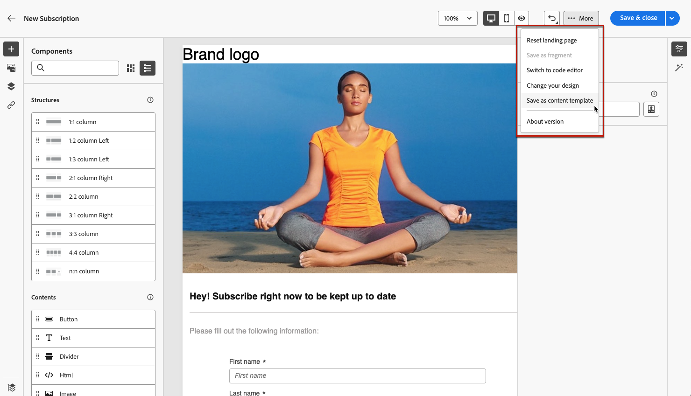
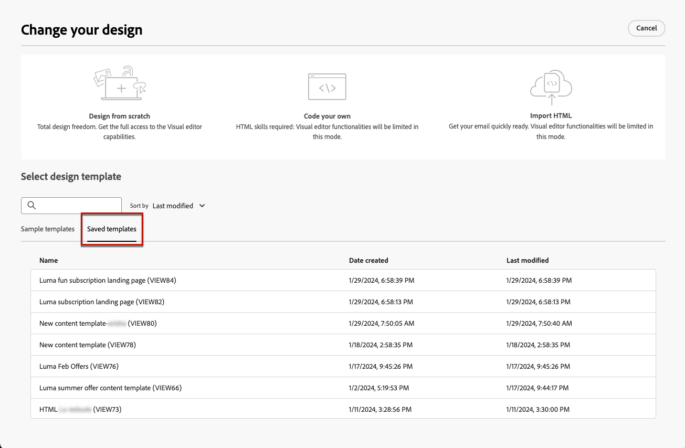

# 使用登陆页面内容模板 {#work-with-templates}

## 将页面另存为模板 {#save-as-template}

一旦您设计 [登陆页面内容](lp-content.md)，您可以保存它以供将来重用。 为此，请执行以下步骤。

1. 单击 **[!UICONTROL 更多]** 按钮。

1. 选择 **[!UICONTROL 另存为内容模板]** 从下拉菜单中。

   

1. 为此模板添加一个名称。

1. 单击&#x200B;**[!UICONTROL 保存]**。

下次创建登陆页面时，您可以使用此模板来构建内容。 了解如何在 [部分](#use-saved-template) 下。

## 使用保存的模板 {#use-saved-template}

<!--Not for GA?-->

1. 编辑登陆页面内容时，单击 **[!UICONTROL 更多]** 按钮并选择 **[!UICONTROL 更改您的设计]**.

   

1. 确认您的选择。

   >[!NOTE]
   >
   >此操作删除当前内容，并将其替换为新模板中的内容。

1. 之前保存的所有模板列表将显示在 **[!UICONTROL 已保存模板]** 选项卡。 您可以按&#x200B;**[!UICONTROL 名称]**、**[!UICONTROL 上次修改日期]**&#x200B;和&#x200B;**[!UICONTROL 上次创建日期]**&#x200B;对它们进行排序。

   

1. 从列表中选择您选择的模板。 选定后，您可以使用左右箭头在所有保存的模板之间导航。

   

1. 单击 **[!UICONTROL 使用此模板]**.

1. 使用登陆页设计器根据需要编辑您的内容。

<!--Primary page templates and subpage templates are managed separately, meaning that you cannot use a primary page template to create a subpage, and vice versa. TBC in Web user interface-->
