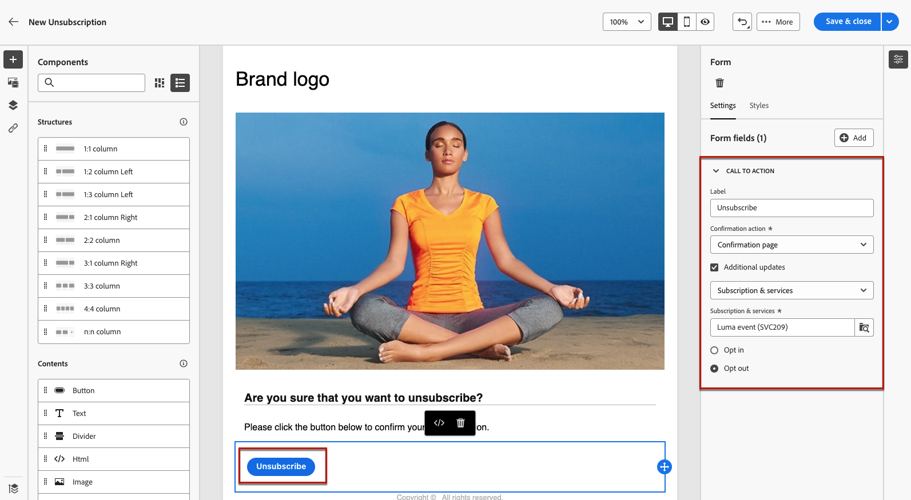

# 如何使用登陆页面 {#lp-use-cases}

>[!CONTEXTUALHELP]
>id="acw_landingpages_url"
>title="谨慎复制 URL"
>abstract="要全面测试或利用您的登陆页面，您无法将此链接直接复制并粘贴到 Web 浏览器或您的投放中。相反，请使用&#x200B;**模拟内容**&#x200B;功能对其进行测试，并执行文档中描述的步骤来正确使用登陆页面。"

>[!CONTEXTUALHELP]
>id="acw_landingpages_templates"
>title="谨慎复制 URL"
>abstract="在创建登陆页面时，通过四个现成的模板可实现不同的用例：将配置文件添加到 Campaign 数据库或更新配置文件、为客户订阅服务、为客户取消订阅服务或帮助用户退出。"
>additional-url="https://experienceleague.adobe.com/docs/campaign-web/v8/landing-pages/create-lp.html?#create-landing-page" text="创建登陆页面"

要正确使用登陆页面，您应使用专用选项在投放中将其引用为链接。

>[!CAUTION]
>
>要充分利用登陆页面，您不能将已发布的投放仪表板中显示的链接直接复制粘贴到您的投放或网页中。 在本节中了解如何正确执行此操作。

在[!DNL Adobe Campaign Web]界面中，有四个现成的模板允许您实施不同的用例。 但是，主要步骤保持不变，详见下文。

1. [创建登陆页面](create-lp.md#create-landing-page)，并根据您的用例选择您选择的模板。

1. 定义登陆页面的属性和设置。

   {zoomable="yes"}

1. 列入阻止列表根据您的情况，选择&#x200B;**[!UICONTROL 客户获取]**、**[!UICONTROL 订阅]**、**[!UICONTROL 退订]**&#x200B;或&#x200B;**[!UICONTROL 订阅]**&#x200B;页。

1. 将显示页面内容。 选择与登陆页面表单对应的部分。

   {zoomable="yes"}

1. 根据所选模板编辑内容：

   * [客户获取](#lp-acquisition)
   * [订阅](#lp-subscription)
   * [退订](#lp-unsubscription)
   * [阻止列表](#lp-denylist)

1. 根据需要修改其余内容，保存更改并关闭。

1. 根据需要编辑&#x200B;**[!UICONTROL Confirmation]**&#x200B;页面，以及&#x200B;**[!UICONTROL Error]**&#x200B;和&#x200B;**[!UICONTROL Expiration]**&#x200B;页面。 在收件人提交表单后，**[!UICONTROL Confirmation]**&#x200B;页面将向收件人显示。

   {zoomable="yes"}

1. [测试](create-lp.md#test-landing-page)和[发布](create-lp.md#publish-landing-page)您的登陆页面。

1. 创建[电子邮件](../email/create-email.md)投放以将流量引导至登陆页面。

1. [在消息内容中插入链接](../email/message-tracking.md#insert-links)。 选择&#x200B;**[!UICONTROL 登陆页面]**&#x200B;作为&#x200B;**[!UICONTROL 链接类型]**，然后选择您创建的登陆页面。

   {zoomable="yes"}

   >[!NOTE]
   >
   >要能够发送消息，请确保您选择的登陆页面尚未过期。 [了解详情](create-lp.md#create-landing-page)

收到电子邮件后，如果您的收件人单击登陆页面的链接并提交表单：

* 他们将被定向到确认页面。

* 将应用登陆页面中定义的任何其他操作。 例如，用户将订阅您的服务，或者他们不会再收到您的任何通信。

以下是如何在不同的可能用例中使用[!DNL Adobe Campaign]登陆页面的一些示例。

## 用户档案获取 {#lp-acquisition}

第一个模板允许您向Campaign数据库添加或更新用户档案。

1. 在[创建登陆页面](create-lp.md#create-landing-page)时，选择&#x200B;**[!UICONTROL 客户获取]**&#x200B;模板。

1. 在登陆页面属性中，确保选择&#x200B;**[!UICONTROL 使用表单]**&#x200B;中引用的数据预填充选项，以便预加载配置文件中的任何现有信息并避免创建重复项。

1. 选择&#x200B;**[!UICONTROL 客户获取]**&#x200B;页面以编辑其内容。

1. 根据要在用户档案上收集的信息，根据需要编辑文本字段。

1. 此外，您可以添加复选框来邀请客户订阅您的新闻稿服务。 [了解如何创建服务](../audience/manage-services.md)

   {zoomable="yes"}

1. 根据需要调整内容并保存更改。

1. 查看并[发布](create-lp.md#publish-landing-page)您的登陆页面。

1. 创建一个[电子邮件](../email/create-email.md)和[添加一个链接](../email/message-tracking.md#insert-links)到您的登陆页面。

收到电子邮件后，如果您的收件人单击登陆页面的链接并提交表单，则其用户档案将会添加到Campaign数据库中，或更新时会包含他们提供的信息。

{zoomable="yes"}

如果他们选择接收您的新闻稿，他们将订阅相应的服务。

{zoomable="yes"}

## 订阅服务 {#lp-subscription}

>[!CONTEXTUALHELP]
>id="acw_landingpages_subscription"
>title="设置您的订阅登陆页面"
>abstract="通过订阅页面，您的客户可订阅服务。"

最常见的用例之一是邀请您的客户通过登陆页面[订阅服务](../audience/manage-services.md)（例如新闻稿或活动）。 请按照以下步骤操作。

<!--For example, let's say you organize an event next month and you want to launch an event registration campaign. To do this, you're going to send an email including a link to a landing page that will enable your recipients to register for this event. The users who register will be added to the subscription list that you created for this purpose.-->

1. 首先，为订阅事件的用户创建确认模板，以便在创建服务时可以轻松选择它。 [了解详情](../audience/manage-services.md#create-confirmation-message)

   {zoomable="yes"}

1. 创建订阅服务，该服务会将已注册的用户存储到您的事件中。 [了解如何创建服务](../audience/manage-services.md)

1. 选择您创建的模板，作为用户订阅时将收到的确认电子邮件。

   {zoomable="yes"}

1. [创建登陆页面](create-lp.md#create-landing-page)，让您的收件人注册您的活动。 选择&#x200B;**[!UICONTROL 订阅]**&#x200B;模板。

1. 选择&#x200B;**[!UICONTROL 订阅]**&#x200B;页面以编辑其内容。

1. 将显示页面内容。 选择与登陆页面表单对应的部分，并展开&#x200B;**[!UICONTROL 复选框1]**&#x200B;部分。

1. 在&#x200B;**[!UICONTROL 订阅和服务]**&#x200B;字段中，选择为事件创建的服务。 如果启用&#x200B;]**选项，请保留**[!UICONTROL  Subscribe in。

   {zoomable="yes"}
<!--
1. You can add an additional checkbox to offer subscription to your newsletter for example.-->

1. 根据需要调整内容并保存更改。

1. 查看并[发布](create-lp.md#publish-landing-page)您的登陆页面。

1. 创建一个[电子邮件](../email/create-email.md)和[添加一个链接](../email/message-tracking.md#insert-links)以将流量引导到注册登陆页面。

1. 设计电子邮件以宣布您的活动现已开放注册。

收到电子邮件后，如果您的收件人单击登陆页面的链接并提交表单，则他们将被定向到确认页面，并将被添加到订阅列表。

## 退订 {#lp-unsubscription}

您可以让客户使用登陆页面取消订阅服务。

1. 确保您已经为取消订阅服务的用户创建了确认模板，以便能够在创建服务时轻松选择它。 [了解详情](../audience/manage-services.md#create-confirmation-message)

1. 在您的[订阅服务](../audience/manage-services.md)中，选择您创建的模板，作为用户取消订阅时将收到的确认电子邮件。

1. [创建登陆页面](create-lp.md#create-landing-page)。 选择&#x200B;**[!UICONTROL 取消订阅]**&#x200B;模板。

1. 选择&#x200B;**[!UICONTROL 取消订阅]**&#x200B;页面以编辑其内容。

1. 将显示页面内容。 选择与登陆页面表单对应的部分。

1. 您可以添加&#x200B;**[!UICONTROL 复选框]**&#x200B;部分，选择服务，然后选择&#x200B;**[!UICONTROL 如果选中，则取消订阅]**&#x200B;选项。

   {zoomable="yes"}

1. 您还可以展开&#x200B;**[!UICONTROL 行动号召]**&#x200B;部分并选择&#x200B;**[!UICONTROL 其他更新]**&#x200B;选项。 选择服务并选中&#x200B;**[!UICONTROL 选择退出]**&#x200B;选项。

   {zoomable="yes"}

1. 根据需要调整内容并保存更改。

1. 查看并[发布](create-lp.md#publish-landing-page)您的登陆页面。

1. 创建一个[电子邮件](../email/create-email.md)和[添加一个链接](../email/message-tracking.md#insert-links)到登陆页面。

收到电子邮件后，如果您的收件人单击登陆页面的链接并提交表单，则他们将被定向到退订确认页面，并且将从相应的订阅服务中移除。

## 阻止列表 {#lp-denylist}

向收件人提供取消从品牌接收通信的功能是一项法律要求。 因此，您必须在发送给收件人的每封电子邮件中始终包含&#x200B;**取消订阅链接**。 单击此链接后，收件人将被定向到一个包含确认选择退出的按钮的登陆页面。

您可以设置&#x200B;**[!UICONTROL 阻止列表]**&#x200B;登录页面，以允许用户选择退出所有投放。

1. 列入阻止列表在[创建登陆页面](create-lp.md#create-landing-page)时，请选择&#x200B;****&#x200B;模板。

1. 选择&#x200B;**[!UICONTROL 阻止列表]**&#x200B;页面以编辑其内容。

1. 展开&#x200B;**[!UICONTROL 行动号召]**&#x200B;部分并选择&#x200B;**[!UICONTROL 其他更新]**&#x200B;选项。

1. 从相应的下拉列表中，选择&#x200B;**[!UICONTROL 渠道（电子邮件）]**，以使收件人仅选择退出电子邮件通信。 您还可以选择&#x200B;**[!UICONTROL 通过所有渠道]**&#x200B;从所有渠道的所有通信中选择所有渠道。

   {zoomable="yes"}

1. 根据需要调整内容并保存更改。

1. 查看并[发布](create-lp.md#publish-landing-page)您的登陆页面。

1. 创建一个[电子邮件](../email/create-email.md)和[将链接](../email/message-tracking.md#insert-links)添加到您的登陆页面，使用户可以选择退出接收通信。

收到电子邮件后，如果您的收件人单击登陆页面的链接并提交表单，则他们将被定向到阻止列表确认页面，并且其用户档案将更新为其提供的信息。

要检查相应用户档案的选择是否已更新，请浏览到&#x200B;**[!UICONTROL 用户档案]**&#x200B;菜单并选择该用户档案。

例如，如果您选择更新登陆页面中的&#x200B;**[!UICONTROL 渠道（电子邮件）]**&#x200B;选项，则将选中&#x200B;**[!UICONTROL 不再通过电子邮件联系]**&#x200B;选项。

{zoomable="yes"}

除非再次订阅，否则此配置文件将不会收到来自您品牌的电子邮件通信。
