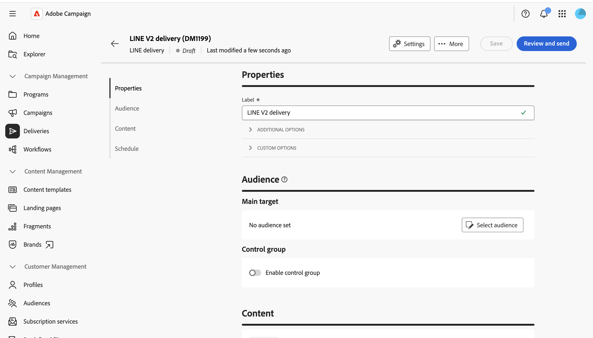
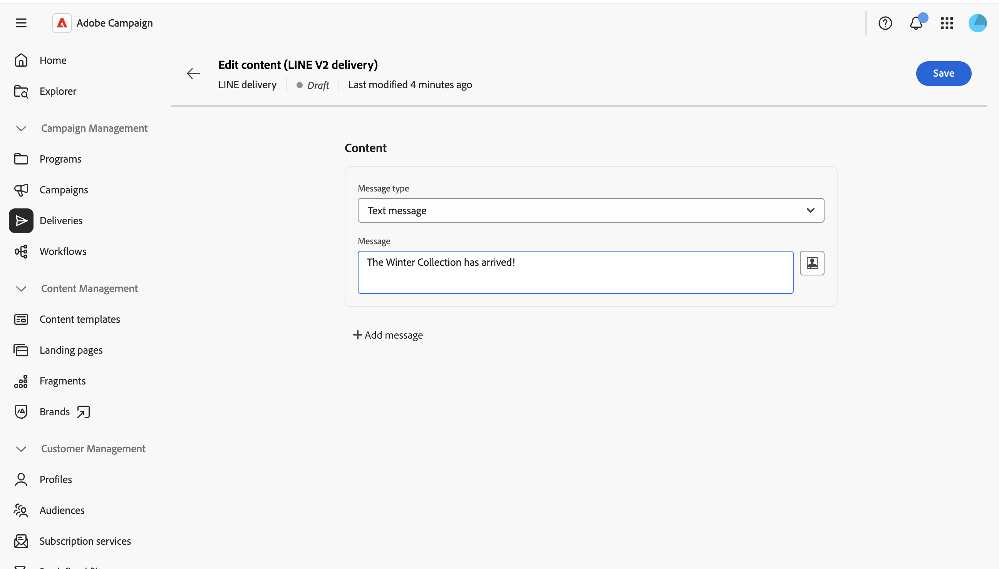

# 发送LINE消息 {#send-line}

您可以使用文本、图像或视频内容创建LINE消息并将其发送给订阅者。 LINE投放可创建为独立投放或添加到工作流中。

本页将介绍如何创建独立的LINE投放，但在工作流中配置LINE渠道活动时，这些步骤同样适用。

>[!IMPORTANT]
>
>LINE投放当前不支持消息预览。 发送之前在编辑器中仔细审查您的内容，因为您无法预先预览渲染的消息。

## 创建LINE投放 {#create-line-delivery}

1. 浏览到&#x200B;**[!UICONTROL 投放]**&#x200B;菜单，然后单击&#x200B;**[!UICONTROL 创建投放]**。

1. 选择&#x200B;**[!UICONTROL LINE]**&#x200B;并选择投放模板，如默认的&#x200B;**[!UICONTROL LINE V2投放]**&#x200B;模板。 [了解有关模板的更多信息](../msg/delivery-template.md)。

   

1. 单击&#x200B;**[!UICONTROL 创建投放]**&#x200B;以确认并显示投放配置屏幕。

1. 为投放输入&#x200B;**[!UICONTROL 标签]**，并根据需要定义其他或自定义选项。 [了解详情](../push/create-push.md#configure-push-settings)。

   

## 选择受众 {#audience}

1. 单击&#x200B;**[!UICONTROL 选择受众]**&#x200B;以定位现有受众或构建一个受众。 LINE投放的定位基于&#x200B;**[!UICONTROL 访客订阅]**。 [了解有关受众的详细信息](../audience/about-recipients.md)。

1. 打开&#x200B;**[!UICONTROL 启用控制组]**&#x200B;选项以设置控制组并测量传递的影响。 消息不会发送到该控制组，因此您可以将收到消息的群体的行为与未收到消息的联系人的行为进行比较。 [了解详情](../audience/control-group.md)

## 定义内容 {#content}

单击&#x200B;**[!UICONTROL 编辑内容]**。

此时将显示LINE内容编辑器。

LINE投放最多可包含五条消息。 单击&#x200B;**[!UICONTROL 添加邮件]**&#x200B;以向传递中添加其他邮件，或单击&#x200B;**[!UICONTROL 删除邮件]**&#x200B;以删除邮件。

您可以使用个性化编辑器（如果可用）插入动态内容。 [了解详情](../personalization/personalize.md)。

每条消息使用下列类型之一。

>[!NOTE]
>
>仅支持图像和视频URL。 上传本地文件不可用，这与客户端控制台的行为相匹配。

### 文本消息 {#text-message}

文本消息是以文本形式发送的简单消息。 只需在相关字段中键入消息，并根据需要使用个性化字段。

### 图像消息 {#image-message}

您可以使用图像消息发送图像（可以选择将其划分为可单击区域，每个区域均链接到不同的URL）。

* **[!UICONTROL 个性化图像]**：为每个收件人动态定义图像。
* **[!UICONTROL 图像URL]**：提供图像的URL。 推荐的大小为1040 x 1040像素。 启用&#x200B;**[!UICONTROL 按设备屏幕大小定义图像]**&#x200B;以提供针对不同屏幕大小优化的不同图像分辨率。
* **[!UICONTROL 替换文本]**：强制替换文本，在无法加载图像时显示。
* **[!UICONTROL 链接]**：选择布局以将图像划分为一个或多个可点击区域，然后为每个区域分配一个URL。

### 视频消息 {#video-message}

通过视频消息，可向收件人发送视频。

* **[!UICONTROL 视频URL]**：视频的URL。 仅支持MP4格式。
* **[!UICONTROL 预览图像URL]**：在播放视频之前显示的图像的URL。

## 计划和发送 {#schedule-send}

1. 定义内容后，单击&#x200B;**保存**，然后单击“上一步”图标以返回投放配置屏幕。

1. 启用&#x200B;**[!UICONTROL 启用计划]**&#x200B;以在特定的日期和时间发送。 [了解详情](../msg/gs-deliveries.md#gs-schedule)。

   

1. 内容准备就绪后，单击&#x200B;**[!UICONTROL 查看并发送]**。 这将打开投放仪表板。

   

1. 单击&#x200B;**[!UICONTROL 准备]**，然后确认。 如果有任何错误，请修复这些错误，然后再次单击&#x200B;**[!UICONTROL 准备]**。

1. 单击&#x200B;**[!UICONTROL 发送]**。 然后，您可以跟踪投放&#x200B;**[!UICONTROL 报告]**&#x200B;和&#x200B;**[!UICONTROL 日志]**&#x200B;入口点中的结果。
