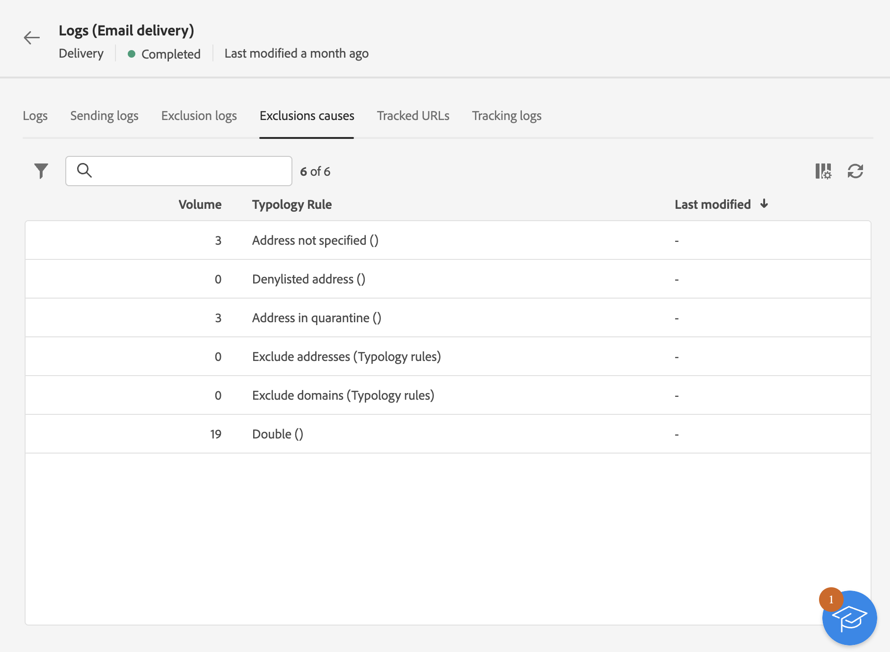

# 监控投放日志 {#delivery-logs}

>[!CONTEXTUALHELP]
>id="acw_deliveries_email_preparation_logs"
>title="投放日志"
>abstract="利用投放日志，可验证是否没有错误。"

准备并发送电子邮件后，利用投放日志可验证是否存在错误。 可直接从消息仪表板访问这些日志。 日志中包含发送、已排除的目标及排除原因，以及打开和单击等跟踪信息的详情。

要查看日志，请访问投放仪表板，然后单击 **日志** 按钮。

提供了以下几个选项卡：

## 日志

的 **日志** 选项卡包含与投放和校样相关的所有消息。 利用特定的图标，可识别错误或警告。

列出了所有验证步骤、警告和错误。 彩色图标显示消息类型：

* 灰色图标表示信息性消息。
* 黄色图标表示非关键处理错误。
* 红色图标表示阻止发送投放的严重错误。

## 投放

的 **发送日志** 选项卡提供了每次进行此投放的历史记录。 此处保存了已发送消息的列表及其状态。您可通过该处查看每个收件人的投放状态。

## 排除项

的 **排除日志** 选项卡列出了从目标中排除的所有消息，并说明了发送失败的原因。

## 排除原因

的 **排除原因** 选项卡显示从目标中排除的消息量（消息数）。

## 跟踪的 URL

的 **跟踪的URL** 选项卡会重组已发送消息中包含的URL，包括其URL类型和源URL。

## 跟踪

的 **跟踪** 选项卡列出了此投放的跟踪历史记录。 此选项卡显示已发送消息的跟踪数据，即所有受Adobe Campaign跟踪的URL。

>[!NOTE]
>
>如果未为投放启用跟踪，则不会显示此选项卡。

