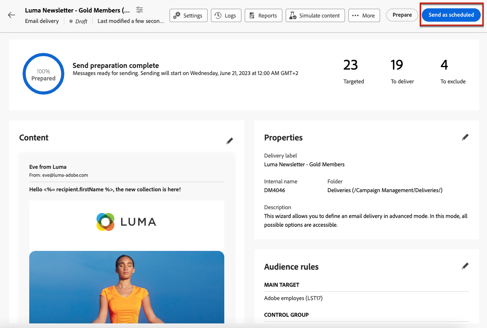
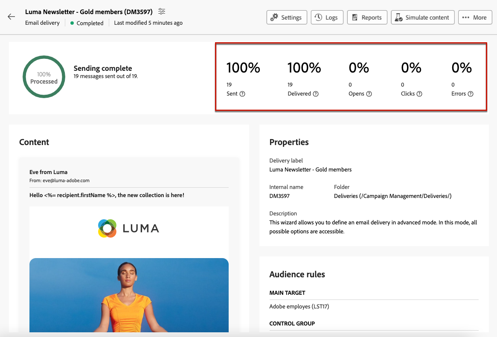

# 准备并发送您的电子邮件 {#prepare-send}

## 准备发送 {#prepare}

当您定义了 [内容](../content/edit-content.md)， [受众](../audience/add-audience.md) 和计划，您已准备好准备电子邮件投放。

在准备期间，计算目标人群并为目标中包含的每个配置文件生成邮件内容。在准备工作完成后，可以立即发送邮件，也可以在计划的日期和时间发送。

有关投放准备期间使用的验证规则，请参见 [Campaign v8（客户端控制台）文档](https://experienceleague.adobe.com/docs/campaign/campaign-v8/campaigns/send/validate/delivery-analysis.html){target="_blank"}.

下面列出了准备发送的主要步骤。

1. 在投放仪表板中，单击 **[!UICONTROL 审阅并发送]**.

   

1. 单击 **[!UICONTROL 准备]** 按钮进行确认。

   

   >[!NOTE]
   >
   >如果您计划了投放并禁用了 **[!UICONTROL 发送前启用确认]** 选项，则准备和发送步骤将分组在 **[!UICONTROL 准备和发送]** 按钮。 [了解有关计划的更多信息](../msg/gs-messages.md#gs-schedule)

1. 这将显示准备进度。根据目标人群的规模，此操作可能需要花费一些时间。

   您可以随时使用&#x200B;**[!UICONTROL 停止准备]**&#x200B;按钮来停止准备过程。

   

   >[!NOTE]
   >在准备阶段，不发送任何邮件。因此，您可以开始或停止准备而不影响任何内容。

1. 在准备完成后，检查 KPI。如果要发送的邮件数不符合您的期望，请修改您的受众并重新开始准备。

   

   以下是显示的不同 KPI：

   * **[!UICONTROL 定位]**：目标收件人的数量。
   * **[!UICONTROL 投放]**：将发送的邮件数.
   * **[!UICONTROL 排除]**[：由类型规则排除的邮件数](../advanced-settings/delivery-settings.md#typology).

1. 单击&#x200B;**[!UICONTROL 日志]**&#x200B;按钮并检查确认没有错误。最后一条日志消息显示了所有错误消息和错误数。[了解详情](delivery-logs.md)

   

1. 如果准备阶段检测到阻止发送投放的严重错误，则准备状态在投放仪表板中显示为失败。

   

1. 如果在准备之后对投放进行了任何更改，则必须重新开始准备以将这些更改考虑在内。

在准备工作完成且未出现错误后，便可发送邮件。

## 发送邮件 {#send}

>[!CONTEXTUALHELP]
>id="acw_deliveries_email_metrics_delivered"
>title="已投放"
>abstract="成功送达的邮件数。该指示器每 5 分钟更新一次。显示的百分比是基于已发送邮件的总数计算所得。"

>[!CONTEXTUALHELP]
>id="acw_deliveries_email_metrics_opens"
>title="打开"
>abstract="打开的邮件数。该指示器每 5 分钟更新一次。显示的百分比是不同打开次数与已送达邮件数的比率。"

>[!CONTEXTUALHELP]
>id="acw_deliveries_email_metrics_clicks"
>title="点击次数"
>abstract="在电子邮件中至少单击一次的收件人的数目。该指示器每 5 分钟更新一次。显示的百分比是不同单击次数与已送达邮件数的比率。"

一旦 [准备](#prepare) 完成，您现在可以发送电子邮件。

如果消息是按计划发送的，则会在定义的日期和时间发送该消息。 [了解详情](../msg/gs-messages.md#gs-schedule)

### 立即发送 {#send-immediately}

要立即发送电子邮件，请执行以下步骤。

1. 在投放仪表板中，单击 **[!UICONTROL 发送]** 按钮进行标记。

   

1. 确认此操作以立即将消息发送到主目标。

1. 这将显示发送进度。

### 计划发送 {#schedule-the-send}

如果您计划稍后发送电子邮件，请按照以下步骤操作。

1. 在您点击之前 **[!UICONTROL 审阅并发送]** 按钮，确保您为电子邮件定义了计划。 [了解详情](../msg/gs-messages.md#gs-schedule)

1. 在投放仪表板中，单击 **[!UICONTROL 按计划发送按钮]** 按钮进行标记。

   

1. 单击 **[!UICONTROL 确认发送]**. 投放将在计划日期发送到主目标。

   >[!NOTE]
   >
   >如果您禁用了 **[!UICONTROL 发送前启用确认]** 选项，则准备和发送步骤将分组在 **[!UICONTROL 准备和发送]** 按钮。 [了解有关计划的更多信息](../msg/gs-messages.md#gs-schedule)

## 暂停或停止发送 {#pause-stop-sending}

无论是否计划了您的投放，都可以在发送过程中随时执行两个操作：

* 单击 **[!UICONTROL 暂停发送]** 中断消息的发送。 您可以随时恢复发送。

* 单击 **[!UICONTROL 停止发送]** 立即中断发送。 一旦停止，准备工作和发送均无法恢复。

## 检查KPI {#check-kpis}

>[!CONTEXTUALHELP]
>id="acw_deliveries_email_metrics_sent"
>title="已发送数指标"
>abstract="投放分析期间处理的消息的总数。"

>[!CONTEXTUALHELP]
>id="acw_deliveries_email_metrics_errors"
>title="错误数指标"
>abstract="投放和自动返回处理期间累积的错误的总数与已发送邮件总数有关。"

发送完成后，您可以检查显示的KPI：

* **[!UICONTROL 已发送]**：投放的消息数。 显示的百分比基于要投放的消息总数。

* **[!UICONTROL 已送达]**：成功送达的邮件数。显示的百分比是基于已发送邮件的总数计算所得。

* **[!UICONTROL 打开]**：打开的邮件数。显示的百分比是不同打开次数与已投放消息数的对比。

* **[!UICONTROL 点击次数]**：在电子邮件中至少点击一次的收件人数量。 显示的百分比是不同点击次数与已投放消息数的对比。

* **[!UICONTROL 错误]**：包含错误状态的电子邮件数量。 显示的百分比是基于已发送邮件的总数计算所得。

>[!NOTE]
>
>在投放开始后，所有指标每 5 分钟更新一次。投放准备指标是实时的。

您也可以查看日志。[了解详情](delivery-logs.md)