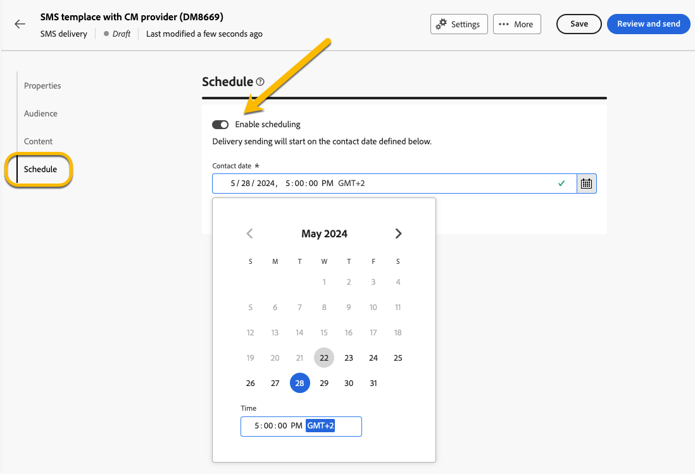

# 计划投放的发送 {#schedule-sending}

您可以计划投放的发送。 执行此操作的步骤将取决于它是独立（一次性）投放，还是您在营销活动工作流上下文中工作。

## 独立投放

对于独立投放，您可以直接计划投放中的日期和时间。
有关每种类型的投放，请参阅以下示例：电子邮件、短信、推送通知。

### 电子邮件 {#schedule-email-standalone}

要计划电子邮件投放的发送，请执行以下步骤：

1. 在 **[!UICONTROL 计划]** 部分，激活 **[!UICONTROL 启用计划]** 切换

1. 设置所需的发送日期和时间，然后单击 **[!UICONTROL 审阅并发送]** 按钮。

   {zoomable="yes"}

>[!NOTE]
>
>默认情况下，**[!UICONTROL 启用发送前确认]**&#x200B;选项处于启用状态。此选项要求您在安排的日期和时间发送投放之前确认发送。如果您需要 **自动发送投放** 在计划的日期和时间，您需要禁用此选项。
>

1. 检查计划是否正确，然后单击 **[!UICONTROL 准备]** 按钮。

{zoomable="yes"}

1. 准备完成后，即可发送消息。 显示投放的关键量度：目标总人口、要投放的消息数、排除的收件人数。 单击 **[!UICONTROL 按计划发送]** 按钮确认您是否允许在计划的日期和时间将投放发送到主目标。

{zoomable="yes"}

### 短信

要将短信投放计划到特定的日期和时间，步骤与电子邮件投放相同， [请参阅上文](#schedule-email-standalone).

{zoomable="yes"}

您还可以检查是否已将计划考虑在内：

{zoomable="yes"}

### 推送通知

要将独立推送投放计划为特定日期和时间，步骤与电子邮件投放相同， [请参阅上文](#schedule-email-standalone).

{zoomable="yes"}

您还可以检查是否已将计划考虑在内：

{zoomable="yes"}

### 活动中的独立投放

您无需使用工作流，即可在营销策划中创建独立投放。 您可以为此投放设置如上所述的日期和时间计划。
营销策划可能有自己的计划，包括开始日期和结束日期。 此计划不会干扰您的投放计划。

{zoomable="yes"}

## 在活动工作流中计划投放

在活动工作流的上下文中， **最佳实践** 就是使用 **[!UICONTROL 计划程序]** 活动，用于应用启动工作流的日期和时间，包括发送投放。 [了解有关调度程序的更多信息](../workflows/activities/scheduler.md)

{zoomable="yes"}

您需要在 **[!UICONTROL 计划程序]** 活动。

{zoomable="yes"}

>[!NOTE]
>
>当您使用 **[!UICONTROL 计划程序]** 活动，以安排在工作流中发送投放， **不激活** 该 **[!UICONTROL 启用计划]** 切换到 **[!UICONTROL 投放]** 活动设置。 系统会自动发送您的投放。
>

如果激活 **[!UICONTROL 启用计划]** 切换到 **[!UICONTROL 投放]** 活动设置并设置日期和时间，则投放将在此日期和时间等待发送。 这意味着，如果启动工作流的日期与发送日期之间存在延迟，则受众可能不是最新的。

