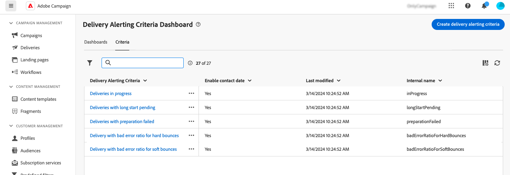

# 投放提醒条件 {#delivery-alerting-criteria}

>[!CONTEXTUALHELP]
>id="acw_delivery_alerting_criteria"
>title="投放提醒标准仪表板"
>abstract="Campaign Web用户界面提供了预定义的警报标准（吞吐量低的投放，准备失败的投放……），您可以将这些标准添加到仪表板。 您也可以根据自己的需求创建自己的标准。"

Campaign Web用户界面提供了预定义的警报标准（吞吐量低的投放，准备失败的投放……），您可以将这些标准添加到仪表板。 您也可以根据自己的需求创建自己的标准。

警报标准可从 **投放警报** 菜单，位于左侧导航窗格中的 **标准** 选项卡。

## 预定义的警报条件 {#ootb-criteria}

Campaign Web用户界面中提供了预定义的警报标准。 这些标准涵盖一系列场景，如下所示：

* **投放失败**：在定义的范围内计划的任何投放，具有错误状态。
* **准备投放失败**：在定义的范围内修改的任何投放，其准备步骤（目标计算和内容生成）已失败。
* **投放具有不良的软退回错误率**：在定义的范围内计划的任何投放，状态至少为进行中，软退回错误率大于定义的百分比。
* **硬退回的投放错误率错误**：在定义的范围内计划的任何投放，状态至少为进行中，硬退回错误率大于定义的百分比。
* **等待长时间开始的投放**：在定义的范围内计划的任何投放，其“开始挂起”状态超过定义的持续时间，“开始挂起”状态表示系统尚未考虑消息。
* **吞吐量较低的投放**：任何投放开始的持续时间均超过定义的持续时间，并且已处理消息的百分比少于定义的百分比，吞吐量低于定义的值。
* **投放进行中**：在定义的范围内计划的任何投放，具有正在进行状态。

>[!NOTE]
>
>默认值将应用于上述标准的所有参数。 这些值可在以下位置自定义： **标准参数** 投放警报仪表板中使用它们的部分。 [了解如何使用仪表板](../msg/delivery-alerting-dashboards.md)

## 创建警报标准 {#criteria}

>[!CONTEXTUALHELP]
>id="acw_delivery_alerting_criteria_create"
>title="创建投放提醒条件"
>abstract="除了Adobe Campaign提供的预定义警报标准之外，您还可以根据自己的需求创建自己的标准。"

>[!CONTEXTUALHELP]
>id="acw_delivery_alerting_criteria_create_indicators"
>title="添加到提醒中的指标"
>abstract="选择要作为列显示在电子邮件警报“详细信息”部分中的指示器。"

>[!CONTEXTUALHELP]
>id="acw_delivery_alerting_criteria_create_alert"
>title="提醒类型"
>abstract="指定 **警报类型** 对于标准，表示要在警报的“摘要”部分中投放标准旁边显示的标签和颜色。"

>[!CONTEXTUALHELP]
>id="acw_delivery_alerting_criteria_create_frequency"
>title="条件频率"
>abstract="控制每个符合条件的投放每天的警报频率。"

>[!CONTEXTUALHELP]
>id="acw_delivery_alerting_filter"
>title="创建警报标准"
>abstract="要创建您自己的传递过滤器，请从 Campaign v8 控制台中的“**管理**”>“**配置**”>“**预定义过滤器**”节点创建一个新的预定义过滤器。"

要创建新标准，请执行以下步骤：

1. 导航至 **交付警报** 菜单，然后选择 **标准** 选项卡。
1. 单击 **创建投放警报标准** 按钮。
1. 提供条件的标签。 内部名称会自动填充为只读。
1. 此 **按此标准应用的投放过滤器** 允许通过将预定义过滤器应用于标准范围来缩小标准的范围。

   在以下示例中， **正在投放(critInProgressDeliveries)** 已选择过滤器，这意味着该标准仅考虑状态为“正在进行”的投放。

   

   >[!NOTE]
   >
   >如果任何预定义过滤器都不适合您的需要，您可以联系管理员以创建自己的过滤器。  有关如何在Campaign控制台中创建预定义过滤器的详细信息，请参阅 [Adobe Campaign v8 （控制台）文档](https://experienceleague.adobe.com/en/docs/campaign/campaign-v8/audience/create-audiences/create-filters){target="_blank"}
   >
   >此操作只能由高级用户执行。

1. 在 **要添加到警报的指示器** 部分，选择要作为列显示在电子邮件警报“详细信息”部分中的指示器。

1. 指定 **警报类型** 对于标准，表示要在警报的“摘要”部分中投放标准旁边显示的标签和颜色。

1. 此 **标准频率** 部分允许您控制每个符合条件的投放每天的警报频率：

   * **此投放标准将在每个通知中重复**：在当天的每个电子邮件警报中显示符合条件的投放。
   * **此投放标准仅在当天第一次发生时发送**：仅在当天的第一次报告中显示符合标准的投放，而不会在后续电子邮件警报中重复显示。
