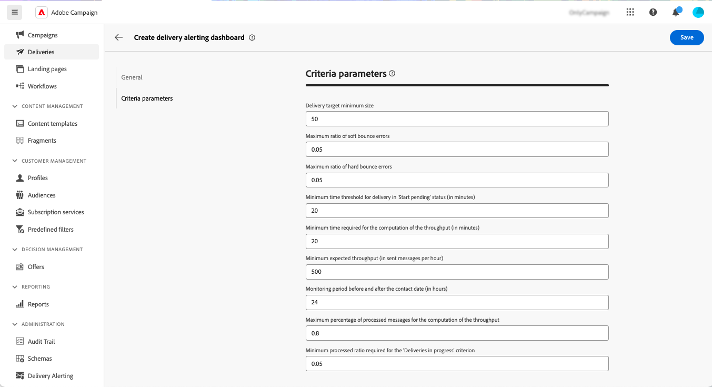

# 投放警报仪表板 {#delivery-alerting-dashboards}

>[!CONTEXTUALHELP]
>id="acw_delivery_alerting_dashboards"
>title="投放警报仪表板"
>abstract="投放警报是一种警报管理系统，它使用户组能够自动接收电子邮件通知，其中包含有关其投放执行的信息。 利用投放警报仪表板，可指定接收电子邮件警报的人员、选择并配置用于发送这些警报的警报标准，以及访问所有已发送通知的历史记录。"

利用投放警报仪表板，可指定接收电子邮件警报的人员、选择并配置用于发送这些警报的警报标准，以及访问所有已发送通知的历史记录。 可从以下位置访问它们 **投放警报** 菜单，位于左侧导航窗格中的 **仪表板** 选项卡。

## 创建投放仪表板 {#dashboards}

>[!CONTEXTUALHELP]
>id="acw_delery_alerting_dashboard_create"
>title="创建投放提醒仪表板"
>abstract="通过创建投放警报仪表板，您可以指定接收电子邮件警报的人员，选择并配置用于发送这些警报的警报标准，以及访问所有已发送通知的历史记录。"

>[!CONTEXTUALHELP]
>id="acw_delivery_alerting_create_general"
>title="投放提醒通用参数"
>abstract="指定投放警报功能板的常规属性。 此 **选择警报组** 字段，以指定 **操作员组** 以接收由此仪表板发送的警报。"

>[!CONTEXTUALHELP]
>id="acw_delivery_alerting_create_criteria_add"
>title="投放提醒条件"
>abstract="在此部分中，添加要用于从该仪表板发送警报的标准。 从预定义标准中进行选择，或者根据特定需求创建自己的标准。"

>[!CONTEXTUALHELP]
>id="acw_delivery_alerting_create_criteria_parameters"
>title="标准参数"
>abstract="标准具有默认参数值，这些值定义必须如何应用标准。 您可以根据本节中的需要更改这些值。"

要创建投放仪表板，请执行以下步骤：

1. 导航至 **投放警报** 菜单，然后单击 **创建投放仪表板**.

   

1. 在中命名您的仪表板 **标签** 字段。 此 **内部名称** 字段会自动填充且为只读。

1. 在 **选择警报组** 字段，指定 **操作员组** 以接收由此仪表板发送的警报。 所选操作员组的所有成员都将收到警报。

   在中了解有关权限和操作员组的更多信息 [Adobe Campaign v8 （控制台）文档](https://experienceleague.adobe.com/en/docs/campaign/campaign-v8/admin/permissions/gs-permissions){target="_blank"}

1. 在 **投放警报标准** 部分，添加要用于发送警报的标准。 从预定义标准中进行选择，或者根据特定需求创建自己的标准。 [了解如何使用标准](../msg/delivery-alerting-criteria.md)

1. 标准具有默认参数值，这些值定义必须如何应用标准。 您可以根据自己的需要更改这些值，具体方法为 **标准参数** 部分。

   

   例如，默认情况下， **投放目标最小大小** “标准”参数设置为50，这意味着仅当投放至少针对50个用户档案时，该投放才会包含在由此功能板发送的警报中。 如果要包含定向少于50个用户档案的投放，可以更改此参数。

   展开以下部分，以了解有关每个标准参数的更多信息：

   +++可用的标准参数

   * **投放目标最小大小**：例如，如果在此字段中输入100，则仅会为目标等于或大于100个收件人的投放发送通知。 此参数适用于所有标准。
   * **联系日期之前和之后的监控时段（以小时为单位）**：当前时间之前和之后的小时数。 只考虑联系日期在此时间范围内的投放。 此参数适用于所有标准。 默认情况下，此字段值设置为24小时。
   * **软退回错误的最大比率**：对于软退回错误率大于指定值的所有投放，将发送通知。 默认情况下，此字段值设置为0.05 (5%)。
   * **最大硬退回错误比率**：对于硬退回错误率大于指定值的所有投放，将发送通知。 默认情况下，此字段值设置为0.05 (5%)。
   * **处于“开始搁置”状态的投放的最短时间阈值（以分钟为单位）**：对于其开始挂起状态超过此字段中所指定持续时间的所有投放都会发送通知，开始挂起状态意味着系统尚未考虑消息。
   * **计算吞吐量所需的最小时间（分钟）**：对于吞吐量较低的投放，只考虑已开始（处于正在进行状态）超过指定持续时间的投放。
   * **用于计算吞吐量的已处理消息的最大百分比**：对于吞吐量较低的投放，只考虑已处理消息百分比低于指定百分比的投放。
   * **最小预期吞吐量（以每小时发送的消息数为单位）**：对于吞吐量较低的投放，只考虑吞吐量低于指定值的投放。
   * **“正在进行的投放”标准所需的最小处理率**：仅考虑其处理消息百分比高于指定百分比的投放。

+++

1. 默认情况下，警报仪表板处于禁用状态，这意味着不会发送链接到此仪表板的电子邮件警报。 要立即启用仪表板，请切换 **已启用** 中的选项 **常规** 警报组选择字段旁边的区域。

   您还可以保存仪表板并在以后启用它。

   

1. 要保存警报仪表板，请单击 **保存** 按钮。

警报仪表板打开，并显示空白数据。 当您准备好激活它并发送通知时，单击 **设置** 按钮并切换 **已启用** 选项（如果以前未这样做）。

现在，每次投放满足此仪表板中定义的标准时，都会向指定的操作员组发送警报通知。

## 管理警报仪表板

>[!CONTEXTUALHELP]
>id="acw_delivery_alerting_dashboard_alerts"
>title="已发送投放提醒"
>abstract="利用此部分，可显示与最新发送警报相关的信息。"

>[!CONTEXTUALHELP]
>id="acw_delivery_alerting_dashboard_history"
>title="投放提醒历史记录"
>abstract="此 **历史记录** 窗格包含从此仪表板发送的所有警报。 单击某个项目可访问在该特定时间发送的相应警报。"

所有创建的警报仪表板都可从以下位置访问： **投放警报** 菜单，在 **仪表板** 选项卡。

您可以使用来复制或删除功能板 **更多操作** 按钮的名称旁边的。

要访问功能板的详细视图，请在列表中单击其名称。 在此屏幕中，您可以可视化最新发送的警报。 所有已发送的警报都列在左窗格中。 单击某个项目可访问在该特定时间发送的相应警报。

要编辑仪表板，请单击 **设置** 按钮进行所需的更改。
