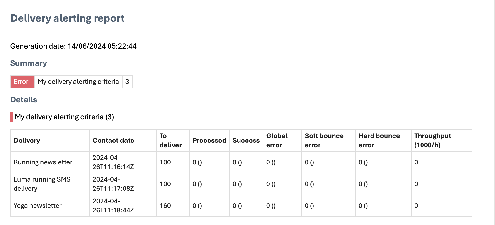

# 开始使用投放警报 {#gs-delivery-alerting}

投放警报是一种警报管理系统，它使用户组能够自动接收电子邮件通知，其中包含有关其投放执行的信息。 收件人会监控Adobe Campaign正在处理的投放，并在出现问题时采取适当措施。

通知是根据通过Adobe Campaign Web用户界面定义的特定警报条件自定义的。

有关管理投放失败的更多信息，请参阅[Adobe Campaign v8 （控制台）文档](https://experienceleague.adobe.com/zh-hans/docs/campaign/campaign-v8/send/failures/delivery-failures#send){target="_blank"}。

## 电子邮件通知内容 {#content}

电子邮件通知包含以下部分：

* **摘要**：显示符合您定义的条件的投放数量，以及每个条件的标签和颜色。
* **详细信息**：列出仪表板的所有已定义投放标准以及每个标准的相应投放。

## 设置投放警报 {#set-up}

要设置这些警报，可使用Campaign Web用户界面创建和管理：

* **投放警报仪表板**：指定收件人，设置要包含在仪表板中的警报条件，并访问已发送警报的历史记录。 [了解如何使用仪表板](../msg/delivery-alerting-dashboards.md)。
* **投放警报标准**： Campaign Web用户界面提供了预定义的警报标准，例如吞吐量较低的投放或准备失败的投放。 您可以将这些标准添加到功能板或创建自己的标准以满足您的需求。 [了解如何使用标准](../msg/delivery-alerting-criteria.md)。

例如，仅通知具有管理权限的用户投放失败，并通知营销用户软退回错误率较高的投放。 要实现此目的，请为每个收件人组创建两个包含相应标准的单独功能板。

>[!NOTE]
>
>要访问和配置功能板和警报条件，您必须具有&#x200B;**管理权限**&#x200B;或是&#x200B;**投放主管**&#x200B;安全组的成员。 标准用户无法访问Adobe Campaign界面中的仪表板，但会收到警报通知。 [了解有关访问和权限的详细信息](../get-started/permissions.md)。