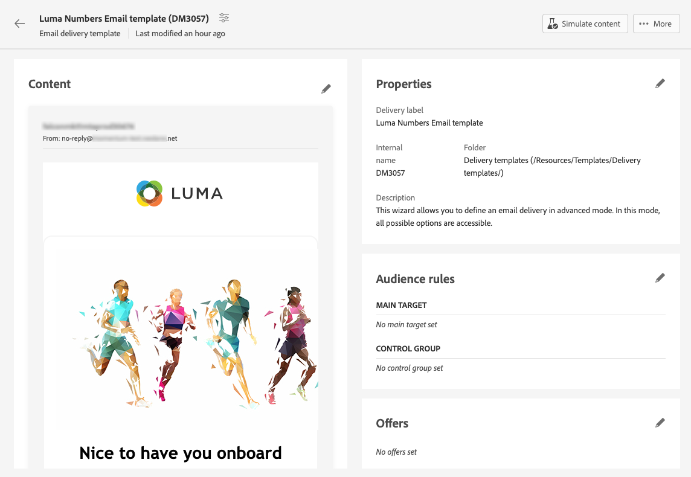
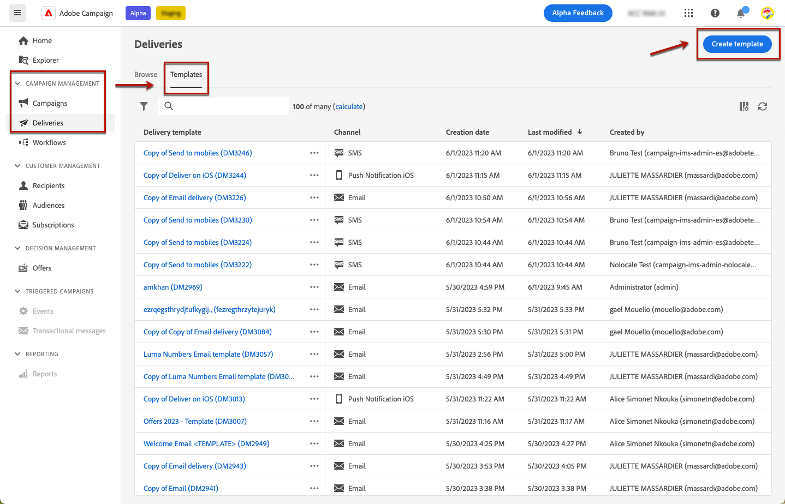

# 使用投放模板 {#work-with-delivery-templates}

>[!CONTEXTUALHELP]
>id="acw_delivery_template_for_campaign"
>title="投放模板"
>abstract="使用投放模板标准化创意外观，以便更快地执行和启动活动"

为了加快并改进设计过程，您可以创建投放模板以轻松地在营销活动中重复使用自定义内容和设置。 此功能使您能够标准化创意外观，以便更快地执行和启动营销活动。

模板可以包括：

* [分类](../advanced-settings/delivery-settings.md#typology),
* 发件人地址，
* An [受众](../audience/about-audiences.md)，包括 [对照组](../audience/control-group.md)，
* 自定义 [内容](../content/edit-content.md)，
* [个性化字段](../personalization/personalize.md) 和 [条件内容](../personalization/conditions.md)，
* 链接到 [镜像页面](../content/mirror-page.md) 和退订 [链接](../content/message-tracking.md)，
* 其他投放属性，例如资源有效性、重试参数或隔离设置。

<!--
>[!NOTE]
>
>Delivery templates are different from email content templates, which allow you to reuse only the content of your messages.-->

>[!NOTE]
>
>投放模板与不同 [内容模板](../content/email-sample-templates.md)，您可以使用提供的现成示例电子邮件模板之一开始构建内容。

## 访问和管理投放模板 {#access-manage-templates}

>[!CONTEXTUALHELP]
>id="acw_delivery_templates"
>title="使用投放模板"
>abstract="使用投放模板可轻松创建并保存现有投放以供将来使用。"
>additional-url="https://experienceleague.adobe.com/docs/campaign-web/v8/msg/delivery-template.html#copy-an-existing-template" text="复制现有模板"
>additional-url="https://experienceleague.adobe.com/docs/campaign-web/v8/msg/delivery-template.html#convert-an-existing-delivery" text="将投放转换为模板"

要访问内容模板列表，请选择 **[!UICONTROL Campaign Management]** > **[!UICONTROL 投放]** 从左侧菜单中，浏览到 **模板** 选项卡。

所有模板都是 [已创建](#create-a-delivery-template) 上显示的内容。

您可以在渠道和文件夹上筛选内容模板。 您还可以通过使用投放属性构建规则来设置高级过滤器。 [了解有关规则生成器的更多信息](../audience/segment-builder.md)

要编辑模板，请在列表中单击所需的项目。 从那里：

* 您可以修改其内容、属性、受众以及附加到该受众的任何选件。
* 您还可以测试模板。 [了解详情](#test-template)

要删除或 [重复](#copy-an-existing-template) 在模板中，选择相应的操作 **[!UICONTROL 更多操作]** 菜单，从 **[!UICONTROL 模板]** 列表或从模板版本屏幕中。

>[!NOTE]
>
>编辑或删除模板时，使用此模板创建的投放不会受到影响。

## 创建投放模板 {#create-a-delivery-template}

要创建投放模板，您可以：
* 复制现有模板 —  [了解详情](#copy-an-existing-template)
* 将现有投放转换为模板 —  [了解详情](#convert-an-existing-delivery)
* 从头开始创建投放模板 —  [了解详情](#create-a-new-template)

### 复制现有投放模板 {#copy-an-existing-template}

Campaign 为每个渠道提供了一组内置模板：电子邮件、推送、短信。创建投放模板的最简单方法是复制和自定义内置模板。

>[!NOTE]
>
>您还可以复制任何自定义模板。

要复制投放模板，请执行以下步骤：

1. 浏览到&#x200B;**模板**&#x200B;选项卡，从&#x200B;**投放**&#x200B;左侧菜单中，[了解详情](#access-manage-templates)
1. 单击 **[!UICONTROL 更多操作]** 按钮，然后选择  **[!UICONTROL 复制]**.

   您还可以从列表中选择模板，然后从模板版本屏幕中选择此选项。

1. 确认复制。

   

1. 新模板仪表板将在中心屏幕中打开。 根据需要编辑模板设置。

   

1. 单击 **[!UICONTROL 审核]** 按钮以保存并查看您的模板。 您仍然可以编辑其所有设置、删除和复制它。

   

1. 根据需要测试模板渲染。 [了解详情](#test-template)

新模板将添加到 [**模板** 列表](#access-manage-templates). 您现在可以在创建新投放时选择它。

### 将投放转换为模板 {#convert-an-existing-delivery}

任何投放都可以转换为模板，以便将来重复投放操作。

要将投放另存为模板，请执行以下步骤：

1. 转到 **[!UICONTROL 营销活动管理]** > **[!UICONTROL 投放]** 菜单。
1. 从 **[!UICONTROL 浏览]** 选项卡，单击 **[!UICONTROL 更多操作]** 按钮，然后选择 **[!UICONTROL 复制为模板]**.

   

1. 确认复制。

1. 新模板仪表板将在中心屏幕中打开。 根据需要编辑模板设置。

1. 单击 **[!UICONTROL 审核]** 按钮以保存并查看您的模板。 您仍然可以编辑其所有设置、删除和复制它。

1. 根据需要测试模板渲染。 [了解详情](#test-template)

新模板将添加到 [**模板** 列表](#access-manage-templates). 您现在可以在创建新投放时选择它。

### 创建新投放模板 {#create-a-new-template}

>[!NOTE]
>
>为避免配置错误，Adobe 建议您[复制内置模板](#copy-an-existing-template)并自定义其属性，而不是创建新模板。

要从头开始配置投放模板，请执行以下步骤：

1. 浏览到&#x200B;**模板**&#x200B;选项卡，从&#x200B;**投放**&#x200B;左侧菜单中，[了解详情](#access-manage-templates)
1. 单击&#x200B;**[!UICONTROL 创建模板]**&#x200B;按钮。

   

1. 选择要用于模板的渠道。
1. 默认情况下，会使用该渠道的内置投放模板来帮助您构建自己的模板。 如果需要，请使用所选渠道右侧的专用按钮选择其他模板。

   

1. 单击 **[!UICONTROL 创建模板]** 再次按按钮。

1. 定义模板属性， [受众](../audience/add-audience.md) 和内容，具体取决于所选的渠道。

   >[!NOTE]
   >
   >请在以下部分中了解有关投放渠道以及如何设计相应内容的更多信息：
   >
   > * [电子邮件渠道](../email/create-email.md)
   > * [推送通知渠道](../push/gs-push.md)
   > * [短信渠道](../sms/create-sms.md)

1. 此外，对于电子邮件模板，可通过访问高级设置，例如类型规则和目标映射 **[!UICONTROL 设置]** 按钮。 [了解详情](../advanced-settings/delivery-settings.md)

1. 单击 **[!UICONTROL 审核]** 按钮以保存并查看您的模板。 您仍然可以编辑其所有设置、删除和复制它。

1. 根据需要测试模板渲染。 [了解详情](#test-template)

新模板将添加到 [**模板** 列表](#access-manage-templates). 您现在可以在创建新投放时选择它。

## 测试投放模板 {#test-template}

您可以测试任何投放模板的渲染，无论是从头开始还是从现有内容创建。 为此，请执行以下步骤。

1. 浏览至 **模板** 穿过 **[!UICONTROL 营销活动管理]** > **[!UICONTROL 投放]** 菜单，然后选择任意模板。 [了解详情](#access-manage-templates)

1. 单击 **[!UICONTROL 模拟内容]** 按钮。

   

1. 选择一个或多个测试用户档案以检查您的电子邮件渲染。 您还可以从数据库中选择真实的用户档案。

1. 在不同用户档案之间切换，以根据选定的用户档案获得消息的个性化呈现。

   <!--[Learn more on test profiles](../preview-test/test-deliveries.md#recipients)-->

   您还可以调整缩放级别，并选择桌面视图或移动设备视图。

   

1. 关闭窗口以返回模板版本屏幕。

>[!NOTE]
>
>您不能在投放模板中使用电子邮件渲染或发送校样。

* [了解有关预览电子邮件内容的更多信息](../preview-test/preview-content.md)

* [了解有关预览短信内容的更多信息](../sms/content-sms.md)

* [了解有关预览推送内容的更多信息](../push/gs-push.md)

