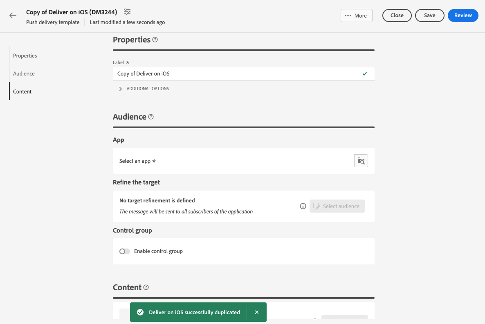

# 使用投放模板 {#work-with-delivery-templates}

>[!CONTEXTUALHELP]
>id="acw_delivery_template_for_campaign"
>title="投放模板"
>abstract="为了加快和改进设计流程，可创建投放模板以在营销活动中重用自定义内容和设置。这一功能使创意的外观标准化，从而能够更快地执行和启动营销活动。"

为了加快和改进设计流程，可创建投放模板以在营销活动中重用自定义内容和设置。这一功能使创意的外观标准化，从而能够更快地执行和启动营销活动。

模板包括：

* 模板的&#x200B;**文件夹**&#x200B;和&#x200B;**执行文件夹**。 文件夹是保存投放模板的位置。 执行文件夹是保存基于此模板创建的投放的文件夹。
* [类型](../advanced-settings/delivery-settings.md#typology)，
* 发件人地址，
* [受众](../audience/about-recipients.md)，包括[对照组](../audience/control-group.md)，
* 自定义[内容](../email/edit-content.md)，
* [个性化字段](../personalization/personalize.md)和[条件内容](../personalization/conditions.md)，
* 链接到[镜像页面](../email/mirror-page.md)和退订[链接](../email/message-tracking.md)，
* 其他投放属性，例如资源有效性、重试参数或隔离设置。

>[!NOTE]
>
>传递模板不同于[内容模板](../email/create-email-templates.md)，后者允许您仅重用电子邮件的内容，并开始使用提供的现成示例电子邮件模板之一构建内容。

## 访问和管理投放模板 {#access-manage-templates}

>[!CONTEXTUALHELP]
>id="acw_delivery_templates"
>title="使用投放模板"
>abstract="使用投放模板创建并保存投放设置，以便将来在营销活动中使用。从头开始创建投放模板、复制现有模板或将某个投放内容转换为模板。"

要访问内容模板列表，请从左侧菜单中选择&#x200B;**[!UICONTROL 促销活动管理]** > **[!UICONTROL 投放]**，然后浏览到&#x200B;**模板**&#x200B;选项卡。

{zoomable="yes"}

此时将显示在当前环境中创建的所有模板。

您可以按渠道和文件夹筛选内容模板。 您还可以通过使用投放属性构建规则来设置高级过滤器。 [了解有关查询建模器的更多信息](../audience/../query/query-modeler-overview.md)

{zoomable="yes"}

要编辑模板，请在列表中单击所需的项目。 从那里：

* 修改其内容、属性、受众以及附加到的任何选件。
* 测试您的模板。 [了解详情](#test-template)

{zoomable="yes"}

要删除或[复制](#copy-an-existing-template)模板，请从&#x200B;**[!UICONTROL 更多操作]**&#x200B;菜单（从&#x200B;**[!UICONTROL 模板]**&#x200B;列表或模板版本屏幕中）中选择相应的操作。

模板的{zoomable="yes"}

>[!NOTE]
>
>编辑或删除模板时，使用此模板创建的投放不会受到影响。

## 创建投放模板 {#create-a-delivery-template}

要创建投放模板，您可以：

* 复制现有模板 — [了解更多](#copy-an-existing-template)
* 将现有投放转换为模板 — [了解更多](#convert-an-existing-delivery)
* 从头开始创建投放模板 — [了解更多](#create-a-new-template)

### 复制现有投放模板 {#copy-an-existing-template}

Campaign包括每个渠道的内置模板：电子邮件、推送和短信。 创建投放模板的最简单方法是复制和自定义内置模板。

>[!NOTE]
>
>您还可以复制任何自定义模板。

要复制投放模板，请执行以下步骤：

1. 从&#x200B;**投放**&#x200B;左侧菜单浏览到&#x200B;**模板**&#x200B;选项卡。 [了解详情](#access-manage-templates)
1. 单击所需模板名称右侧的&#x200B;**[!UICONTROL 更多操作]**&#x200B;按钮，然后选择&#x200B;**[!UICONTROL 复制]**。

   您还可以从列表中选择模板，然后从模板版本屏幕中选择此选项。

1. 确认复制。

   用于复制模板的{zoomable="yes"}

1. 新模板仪表板将在中心屏幕中打开。 根据需要编辑模板设置。

   {zoomable="yes"}

1. 单击&#x200B;**[!UICONTROL 审阅]**&#x200B;按钮以保存并审阅您的模板。 您仍然可以编辑它的所有设置、删除和复制它。

   {zoomable="yes"}

1. 根据需要测试模板渲染。 [了解详情](#test-template)

新模板已添加到&#x200B;[**模板**&#x200B;列表](#access-manage-templates)。 您现在可以在创建新投放时选择它。

### 将投放转换为模板 {#convert-an-existing-delivery}

任何投放都可以转换为模板，以便将来重复投放操作。

要将投放另存为模板，请执行以下步骤：

1. 浏览到&#x200B;**[!UICONTROL 营销活动管理]** > **[!UICONTROL 投放]**&#x200B;菜单。
1. 在&#x200B;**[!UICONTROL 浏览]**&#x200B;选项卡中，单击所需投放名称右侧的&#x200B;**[!UICONTROL 更多操作]**&#x200B;按钮，然后选择&#x200B;**[!UICONTROL 复制为模板]**。

   {zoomable="yes"}

   您还可以从列表中选择模板，然后从模板版本屏幕中选择此选项。

1. 确认复制。

1. 新模板仪表板将在中心屏幕中打开。 根据需要编辑模板设置。

1. 单击&#x200B;**[!UICONTROL 审阅]**&#x200B;按钮以保存并审阅您的模板。 您仍然可以编辑它的所有设置、删除和复制它。

1. 根据需要测试模板渲染。 [了解详情](#test-template)

新模板已添加到&#x200B;[**模板**&#x200B;列表](#access-manage-templates)。 您现在可以在创建新投放时选择它。

### 创建新投放模板 {#create-a-new-template}

>[!NOTE]
>
>为避免配置错误，Adobe建议[复制内置模板](#copy-an-existing-template)并自定义其属性，而不是创建新模板。

要从头开始配置投放模板，请执行以下步骤：

1. 从&#x200B;**投放**&#x200B;左侧菜单浏览到&#x200B;**模板**&#x200B;选项卡。 [了解详情](#access-manage-templates)
1. 单击&#x200B;**[!UICONTROL 创建模板]**&#x200B;按钮。

   {zoomable="yes"}

1. 选择要用于模板的渠道。
1. 默认情况下，会使用该渠道的内置投放模板来帮助您构建自己的模板。 如果需要，请使用所选渠道右侧的专用按钮选择其他模板。

   新模板的{zoomable="yes"}

1. 再次单击&#x200B;**[!UICONTROL 创建模板]**&#x200B;按钮。

1. 根据所选渠道定义模板属性、[受众](../audience/add-audience.md)和内容。

   >[!NOTE]
   >
   >请在以下部分中了解有关投放渠道以及如何设计相应内容的更多信息：
   >
   > * [电子邮件渠道](../email/create-email.md)
   > * [推送通知渠道](../push/gs-push.md)
   > * [短信渠道](../sms/create-sms.md)

1. 此外，对于电子邮件模板，可通过屏幕右上角的&#x200B;**[!UICONTROL 设置]**&#x200B;按钮访问高级设置，如类型规则和目标映射。 [了解详情](../advanced-settings/delivery-settings.md)

1. 单击&#x200B;**[!UICONTROL 审阅]**&#x200B;按钮以保存并审阅您的模板。 您仍然可以编辑它的所有设置、删除和复制它。

1. 根据需要测试模板渲染。 [了解详情](#test-template)

新模板已添加到&#x200B;[**模板**&#x200B;列表](#access-manage-templates)。 您现在可以在创建新投放时选择它。

## 测试投放模板 {#test-template}

您可以测试任何投放模板的渲染，无论是从头开始还是从现有内容创建。 为此，请执行以下步骤：

1. 通过&#x200B;**[!UICONTROL 营销活动管理]** > **[!UICONTROL 投放]**&#x200B;菜单浏览到&#x200B;**模板**&#x200B;选项卡并选择任意模板。 [了解详情](#access-manage-templates)

1. 单击屏幕右上角的&#x200B;**[!UICONTROL 模拟内容]**&#x200B;按钮。

   {zoomable="yes"}

1. 选择一个或多个测试用户档案以检查您的电子邮件渲染。 您还可以从数据库中选择真实的用户档案。 [了解有关测试用户档案的详细信息](../audience/test-profiles.md)

1. 在不同用户档案之间切换，以根据选定的用户档案获得消息的个性化呈现。 您还可以调整缩放级别，并选择桌面视图或移动设备视图。

[了解有关预览内容的更多信息](../preview-test/preview-content.md)

   {zoomable="yes"}

1. 关闭窗口以返回到模板版本屏幕。

>[!NOTE]
>
>您不能在投放模板中使用电子邮件渲染或发送校样。