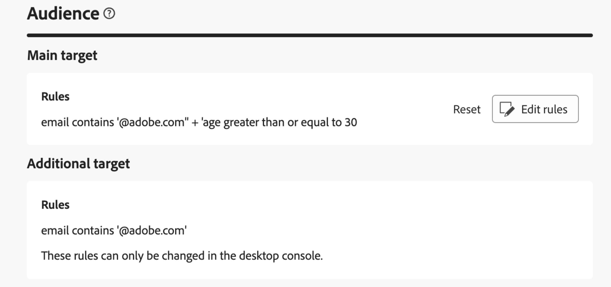

# 访问传递 {#work-with-deliveries}

>[!CONTEXTUALHELP]
>id="acw_deliveries_list"
>title="投放"
>abstract="投放是在电子邮件、短信或推送通知等特定渠道上发给受众的通信。在此屏幕上，您可以编辑、复制和删除现有投放。您还可以查看已完成的投放的报表。单击&#x200B;**创建投放**&#x200B;按钮以添加新投放。"

## 访问传递 {#access}

>[!CONTEXTUALHELP]
>id="acw_deliveries_additional_target"
>title="其他目标"
>abstract="这些规则只能在客户端控制台中进行更改。"

可从左侧导航栏的&#x200B;**[!UICONTROL 投放]**&#x200B;菜单访问投放。 从客户端控制台或Web用户界面创建的所有投放都将显示在此列表中。 在此屏幕中，您可以监控所有现有投放、复制或删除它们或创建新投放。

要打开投放，请在列表中单击其名称。 投放将打开，允许您执行各种操作，例如编辑其参数、检查其执行或使用专用报告监控其性能。

>[!NOTE]
>
>如果打开在客户端控制台中创建的投放，则可能会为受众显示&#x200B;**[!UICONTROL 其他目标]**&#x200B;部分。 这意味着已为此投放配置了多个目标。 这些参数只能在控制台中修改。
>
>{zoomable="yes"}

## 复制投放 {#delivery-duplicate}

您可以从投放列表或投放仪表板创建现有投放的副本。

要从投放列表中复制投放，请执行以下步骤：

1. 单击右侧位于要复制的投放名称旁边的三点按钮。
1. 选择&#x200B;**[!UICONTROL 复制]**。
1. 确认复制：新的投放仪表板在中央屏幕中打开。

要从仪表板复制投放，请执行以下步骤：

1. 打开投放并单击屏幕顶部的 **[!UICONTROL ...更多]**&#x200B;按钮。
1. 选择&#x200B;**[!UICONTROL 复制]**。
1. 确认复制：新投放将替换中央屏幕中的当前投放。

## 删除投放 {#delivery-delete}

从投放列表中删除投放 - 从左边栏中的主要投放条目或从营销活动的投放列表中。

要从投放列表中删除投放，请执行以下步骤：

1. 单击右侧位于要复制的投放名称旁边的三点按钮。
1. 选择&#x200B;**[!UICONTROL 删除]**。
1. 确认删除。

所有投放都在这些列表中可用，但无法从中删除在工作流中创建的投放。要删除在工作流的上下文中创建的投放，必须从该工作流中删除投放活动。

要从工作流中删除投放，请执行以下步骤：

1. 选择投放活动。
1. 单击右侧面板上的&#x200B;**[!UICONTROL 删除]**&#x200B;图标。
1. 确认删除。如果投放具有子节点，您也可以选择删除子节点，或者保留它们。

