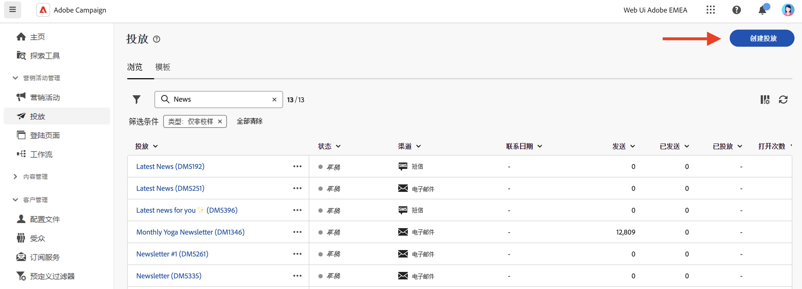
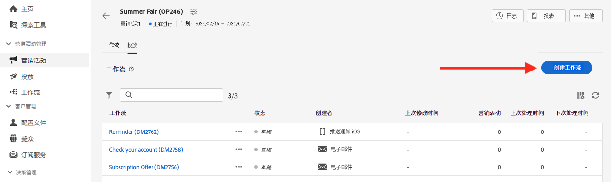

# 开始使用消息{#gs-messages}

>[!CONTEXTUALHELP]
>id="acw_deliveries_list"
>title="投放"
>abstract="浏览您的投放列表。可查看其状态、联系人、修改日期和关键 KPI。可按状态、联系日期或渠道筛选该列表。单击“创建投放”按钮以添加新投放。选择投放以查看其内容、受众和详细信息。"

借助 Adobe Campaign，您可以发送跨渠道营销活动内容，包括电子邮件、短信和推送通知，并使用各种专门的报告衡量其有效性。

这些消息通过投放设计和发送，并且可以针对每个收件人进行个性化。这些投放可以是独立的，也可以包含在市场营销活动的上下文中。

Adobe Campaign v8 附带以下投放渠道：电子邮件、短信和移动应用程序。

<table style="table-layout:fixed">
    <tr style="border: 0;">
    <td>
    
    
<a href="../email/create-email.md"><strong>创建电子邮件</strong>
    

    

    </td>
    <td>
    
    

    <a href="../push/gs-push.md"><strong>创建推送通知</strong></a>
    

    

    </td>
    <td>
    
    

    <a href="../sms/create-sms.md"><strong>创建短信消息</strong></a>
    

    

    </td>
    </tr>
    </table>

## 创建投放 {#create-delivery}

您可以从&#x200B;**[!UICONTROL 投放]**&#x200B;左侧菜单创建独立投放，也可以从&#x200B;**[!UICONTROL 营销活动]**&#x200B;左侧菜单在市场营销活动的上下文中创建投放。

浏览以下选项卡以了解如何创建投放：

>[!BEGINTABS]

>[!TAB 创建独立投放]

要创建独立投放，请执行以下步骤：

1. 浏览到左侧导航上的&#x200B;**[!UICONTROL 投放]**&#x200B;菜单，然后单击&#x200B;**[!UICONTROL 创建投放]**&#x200B;按钮。

   

1. 选择投放的渠道。在以下各部分中了解有关投放渠道以及如何定义投放内容的更多信息：

   * [电子邮件渠道](../email/create-email.md)
   * [推送通知渠道](../push/gs-push.md)
   * [短信渠道](../sms/create-sms.md)

1. 为主要目标和控制组定义投放受众。在[此章节](../audience/about-audiences.md)中详细了解受众。
1. 定义消息内容。
1. （可选）定义投放计划。如果未定义计划，则在单击&#x200B;**[!UICONTROL 发送]**&#x200B;按钮后立即发送消息。
1. 单击&#x200B;**[!UICONTROL 查看并发送]**&#x200B;按钮可检查您的设置。
1. 使用&#x200B;**[!UICONTROL 模拟内容]**&#x200B;按钮可测试您的投放和个性化设置。在[此章节](../preview-test/preview-test.md)中详细了解消息模拟。
1. 单击&#x200B;**[!UICONTROL 准备]**&#x200B;按钮可计算目标群体并生成消息。准备步骤可能需要几分钟时间。准备完成后，消息随时即可发送。如果出现错误，请浏览到&#x200B;**日志**&#x200B;检查警报和警告。
1. 检查结果，然后单击&#x200B;**[!UICONTROL 发送]**&#x200B;按钮开始发送消息。
1. 发送消息后，浏览到&#x200B;**报告**&#x200B;部分以访问关键量度。在[此章节](../reporting/delivery-reports.md)中详细了解投放报告。

>[!TAB 在营销活动中创建投放]

要在营销活动中创建投放，请执行以下步骤：

1. 创建一个营销活动或打开一个现有的营销活动。详细了解[市场营销活动](../campaigns/gs-campaigns.md)。
1. 创建一个工作流或打开一个现有的工作流。
1. 添加并配置一个&#x200B;**[!UICONTROL 生成受众]**&#x200B;活动，然后单击 `+` 按钮。

   

   **[!UICONTROL 生成受众]**&#x200B;活动详见[此章节](../workflows/activities/build-audience.md)。

1. 选择投放活动：**[!UICONTROL 电子邮件]**、**[!UICONTROL 短信]**、**[!UICONTROL 推送通知 (Android)]** 或&#x200B;**[!UICONTROL 推送通知 (iOS)]**。在此[章节](../workflows/activities/about-activities.md#channel)中详细了解工作流中的投放渠道活动，以及如何定义投放内容。
1. 启动工作流，并检查日志。

您还可以在不创建工作流的情况下在营销活动中添加投放。为此，请浏览到营销活动的&#x200B;**[!UICONTROL 投放]**&#x200B;选项卡，然后单击&#x200B;**[!UICONTROL 创建投放]**&#x200B;按钮。

配置步骤与独立投放类似。

有关如何配置营销活动和管理属于营销活动的投放的更多信息，请参阅[此章节](../campaigns/gs-campaigns.md)。

>[!ENDTABS]

## 添加个性化内容{#personalization}

由 Adobe Campaign 投放的消息可以通过各种方式实现个性化。[了解关于个性化功能的更多信息](../personalization/gs-personalization.md)。

使用 Campaign 创建动态内容并发送个性化消息。可以结合个性化功能来改进您的消息并创建自定义用户体验。

可以通过以下方式个性化邮件内容：

* 插入动态&#x200B;**个性化字段**

  个性化字段用于邮件的第一级个性化。您可以从个性化编辑器中选择数据库中可用的任何字段。对于投放，您可以选择与收件人、邮件或投放相关的任何字段。可将这些个性化属性插入邮件的主题行或正文中。[了解详情](../personalization/personalize.md)

* 插入预定义的&#x200B;**内容块**

  Campaign 附带了一组个性化块，其中包含可插入投放中的特定渲染。例如，您可以添加徽标、问候邮件或指向邮件的镜像页面的链接。可以从个性化编辑器的专用条目中获得内容块。[了解详情](../personalization/personalize.md#ootb-content-blocks)

* 创建&#x200B;**条件内容**

  例如，配置条件内容以根据收件人的配置文件添加动态个性化内容。满足特定条件时可插入文本块和/或图像。[了解详情](../personalization/conditions.md)

* 添加&#x200B;**个性化优惠**

  根据收件人位置、当前天气或上次采购订单，在您的消息内容中插入个性化优惠。

## 预览和测试投放

定义消息内容后，您可以预览内容以控制消息的渲染，并使用测试配置文件检查个性化设置。[了解详情](../preview-test/preview-test.md)

## 监控和跟踪日志{#gs-tracking-logs}

在发送后监控投放是确保营销活动有效并接触到客户的重要步骤。

您可以在发送投放后进行监控，并了解如何管理投放失败和隔离。

请参阅[本章节](../reporting/gs-reports.md)以详细了解监控和跟踪功能。

## 复制投放 {#delivery-duplicate}

您可以从投放列表或投放仪表板创建现有投放的副本。

要从投放列表中复制投放，请执行以下步骤：

1. 单击右侧位于要复制的投放名称旁边的三点按钮。
1. 选择&#x200B;**[!UICONTROL 复制]**。
1. 确认复制：新的投放仪表板在中央屏幕中打开。

要从仪表板复制投放，请执行以下步骤：

1. 打开投放并单击屏幕顶部的 **[!UICONTROL ...更多]**&#x200B;按钮。
1. 选择&#x200B;**[!UICONTROL 复制]**。
1. 确认复制：新投放将替换中央屏幕中的当前投放。

## 删除投放 {#delivery-delete}

从投放列表中删除投放 - 从左边栏中的主要投放条目或从营销活动的投放列表中。

要从投放列表中删除投放，请执行以下步骤：

1. 单击右侧位于要复制的投放名称旁边的三点按钮。
1. 选择&#x200B;**[!UICONTROL 删除]**。
1. 确认删除。

所有投放都在这些列表中可用，但无法从中删除在工作流中创建的投放。要删除在工作流的上下文中创建的投放，必须从该工作流中删除投放活动。

要从工作流中删除投放，请执行以下步骤：

1. 选择投放活动。
1. 单击右侧面板上的&#x200B;**[!UICONTROL 删除]**&#x200B;图标。
1. 确认删除。如果投放具有子节点，您也可以选择删除子节点，或者保留它们。

