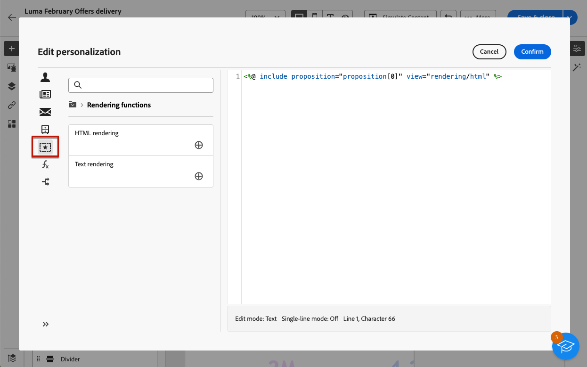

# 将产品建议添加到您的消息 {#offers-content}

您可以在Adobe Campaign Web用户界面中将选件添加到投放。 这些选件可从&#x200B;**选件**&#x200B;左侧菜单获得，通过该菜单可访问选件列表。 所有这些选件都是只读的，必须在Campaign客户端控制台中使用&#x200B;**[!UICONTROL 交互]**&#x200B;模块创建。 有关交互以及如何管理控制台中的优惠目录的详细信息，请参阅[Campaign v8（客户端控制台）文档](https://experienceleague.adobe.com/docs/campaign/campaign-v8/offers/interaction.html?lang=zh-Hans){target="_blank"}。

通过投放发送优惠的步骤如下：

1. [配置要推荐的产品建议](#configure)
1. [将优惠插入投放](#insert)

## 配置要推荐的产品建议 {#configure}

>[!CONTEXTUALHELP]
>id="acw_deliveries_email_offers_settings"
>title="定义产品建议参数"
>abstract="通过定义产品建议空间（还可包括类别和主题）并指定要插入到投放中的产品建议的数量，从而配置应为收件人建议哪些产品建议。"

>[!CONTEXTUALHELP]
>id="acw_deliveries_email_offers_advanced_settings"
>title="设置产品建议高级设置"
>abstract="可实现排除其没有足够多合格优惠的收件人，并选择在其中一项提议不存在时处理消息的方式。"

Adobe Campaign允许您通过在交互过程中向给定联系人建议一个或多个特定优惠来实时响应。 这些优惠可以是简单的通信消息、一个或多个产品上的特殊优惠或服务。

要选择要添加到投放的优惠，请执行以下步骤。

1. 单击投放内容版本屏幕中的&#x200B;**[!UICONTROL 设置选件]**&#x200B;按钮。

   {zoomable="yes"}

1. 配置应向收件人推荐的产品建议。

   首先，选择与您的优惠环境匹配的&#x200B;**[!UICONTROL 优惠空间]**。 请参阅[Campaign v8 （客户端控制台）文档](https://experienceleague.adobe.com/docs/campaign/campaign-v8/offers/interaction-settings/interaction-offer-spaces.html){target="_blank"}以了解如何创建优惠空间。

   {zoomable="yes"}

1. 要细化引擎的产品建议选择，请选择已在其中对产品建议排序的特定&#x200B;**[!UICONTROL 产品建议类别]**。

   选择文件夹时，会自动包含所有子文件夹，并且无法将其删除。 请注意，[!DNL Campaign]接口不反映此行为。

   >[!NOTE]
   >
   >如果未指定类别，除非已选中&#x200B;**[!UICONTROL 产品建议主题]**，否则产品建议引擎将考虑环境中包含的所有产品建议。

1. （可选）输入主题以筛选类别。 主题是在类别中上游定义的关键字。 它们充当过滤器，通过在一组类别中选择优惠来优化要呈现的优惠数量。

1. 使用&#x200B;**[!UICONTROL 建议]**&#x200B;字段指定要插入到投放中的优惠数量。

1. 如有必要，可以选择&#x200B;**[!UICONTROL 排除不符合条件的收件人]**&#x200B;选项。

   通过此选项，您可以激活或取消激活对没有足够的合格优惠的收件人的排除：

   * 如果启用此选项，则将从投放中排除不具有足量建议的收件人。
   * 如果禁用该选项，则不排除这些收件人，但它们不能具有所请求的建议数量。

1. 如有必要，可以选择&#x200B;**[!UICONTROL 如果未选择任何产品建议，则隐藏所有内容]**&#x200B;选项。

   利用此选项，可选择在建议不存在时如何处理消息：

   * 如果启用了该选项，将不显示缺少的建议的表示形式，并且此建议的消息中不显示任何内容。
   * 如果禁用该选项，则消息本身在发送期间会被取消，收件人将无法再接收任何消息。

将优惠配置为在投放中建议后，可以将它们插入到投放内容中。

## 将优惠插入投放 {#insert}

可以使用[表达式编辑器](../personalization/gs-personalization.md#access)将选件添加到投放中。 可以将它们插入主题行或投放正文中。

>[!CAUTION]
>
>在将选件插入投放中之前，请确保已[配置要与该投放一起建议哪些选件](#configure)。

要使用表达式编辑器插入选件，请执行以下步骤。

1. 访问任何投放的主题行或内容。

1. 将光标放在要插入选件的位置，然后使用个性化图标打开表达式编辑器。

   {zoomable="yes"}

1. 选择&#x200B;**[!UICONTROL 建议]**&#x200B;菜单。 可用建议会显示在列表中。

   >[!NOTE]
   >
   >在为当前投放[设置选件](#configure)时定义建议数。

1. 使用可用的个性化字段、渲染函数或优惠属性定义每个建议。

   {zoomable="yes"}

   >[!NOTE]
   >
   >可用建议的数目取决于引擎调用的配置方式，其顺序取决于优惠的优先级。 请参阅[Campaign v8 （客户端控制台）文档](https://experienceleague.adobe.com/docs/campaign/campaign-v8/offers/interaction-best-practices.html){target="_blank"}以了解详情。

1. 保存您的更改。

1. 完成内容、测试并发送投放。 [了解详情](gs-messages.md)。

现在，当收件人收到投放时，将会向该特定用户档案显示正确的优惠。