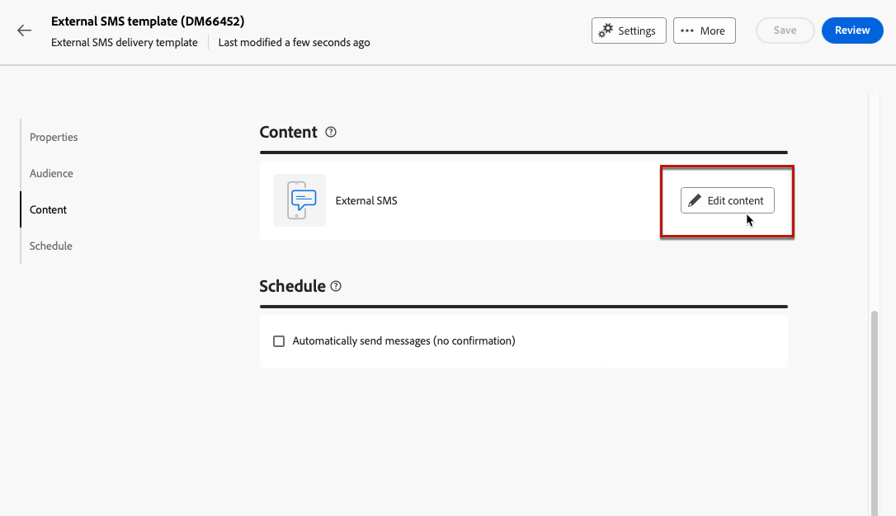
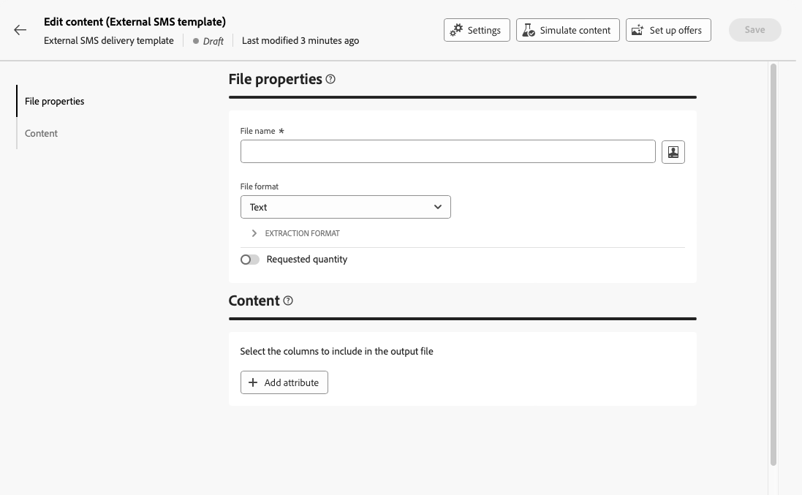

# 发送外部投放 {#gs-direct-mail}

Adobe Campaign允许您管理在Campaign之外创建的投放，以通过外部系统批量投放个性化电子邮件、短信消息或推送通知(iOS和Android)。

<!--The supported channels are Email, Mobile (SMS), and Push (iOS and Android).-->

创建外部投放时，Adobe Campaign会自动生成一个提取文件，其中包含所有定向的用户档案和选定数据。 此文件将发送到您选择的服务器，服务器将处理发送过程。

## 创建专用外部帐户 {#routing-external-account}

您需要配置特定的外部帐户以在外部投放中使用。 它必须是&#x200B;**[!UICONTROL 路由]**&#x200B;类型。

>[!NOTE]
>
>在[本节](../administration/external-account.md#routing)中了解如何创建路由类型的外部帐户。

例如，为外部帐户选择&#x200B;**[!UICONTROL 移动（短信）]**&#x200B;渠道。 默认情况下选择&#x200B;**[!UICONTROL 外部]**&#x200B;作为&#x200B;**[!UICONTROL 传递模式]**。

{zoomable="yes"}

## 创建并发送外部投放 {#create-external-delivery}

配置特定外部帐户后，创建外部投放。 请按照以下步骤操作。

1. 创建投放。 [了解如何操作](create-deliveries.md)

   您有三个选项：

   * **在工作流中**：向工作流添加外部渠道活动（电子邮件、短信或推送）。 有关配置工作流的详细说明，请参阅[此页面](../workflows/gs-workflow-creation.md)。
   * **在营销活动中**：创建营销活动后，您可以创建电子邮件、短信或推送渠道外部投放。 有关如何设置营销活动的更多信息，请参阅[此页面](../campaigns/gs-campaigns.md)。
   * **独立投放**：通过单个外部投放直接和即时吸引客户。 [了解如何创建投放](../msg/gs-deliveries.md)

1. 在投放或投放模板[设置](../advanced-settings/delivery-settings.md)中，选择为您选择的渠道（在此示例中为SMS渠道）创建的外部帐户并保存。

   {zoomable="yes"}

   >[!NOTE]
   >
   >如果要创建投放，请确保已使用[路由](delivery-template.md)类型的外部帐户选择了&#x200B;**[!UICONTROL 投放模板]**。 否则，您将无法选择[以上](#routing-external-account)创建的专用帐户。

1. 在投放&#x200B;**[!UICONTROL 内容]**&#x200B;部分中，单击&#x200B;**[!UICONTROL 编辑内容]**。

   {zoomable="yes"}

1. 与标准投放不同，您不需要设计消息本身的内容。 而是定义将发送到外部系统的文件的属性和列。

   外部投放的{zoomable="yes"}

   按照与设计[直邮投放](../direct-mail/content-direct-mail.md)生成的提取文件的内容时相同的步骤进行操作：

   * 定义提取文件的属性。 [了解详情](../direct-mail/content-direct-mail.md#properties)
   * 选择包含要导出到文件中的信息的列。 [了解详情](../direct-mail/content-direct-mail.md#content)

1. 预览文件并发送校样<!--not in UI right now - to check-->。 [了解如何操作](../direct-mail/send-direct-mail.md#preview-dm)

   {zoomable="yes"}

1. 发送投放以生成提取文件。 [了解如何操作](../direct-mail/send-direct-mail.md#send-dm)

发送投放后，将自动生成提取文件并将其导出到在投放模板的设置中选择的[外部帐户](../administration/external-account.md#create-ext-account)中指定的位置。

跟踪投放页面中的KPI和&#x200B;**[!UICONTROL 日志]**&#x200B;菜单中的数据。