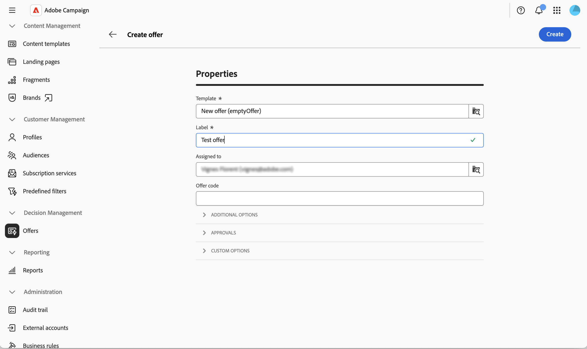

# 创建和发布优惠 {#create-offer}

**选件**&#x200B;是个别建议，具有自己的资格期限、目标筛选器、权重和内容。 优惠是通过&#x200B;**类别**&#x200B;在优惠目录中组织的，通过&#x200B;**优惠空间**&#x200B;呈现给收件人。

在创建选件之前，请确保已配置选件环境并且至少发布了一个选件空间。 在[配置优惠环境](offer-environment.md)和[创建和管理优惠空间](offer-space.md)中了解更多信息。

## 访问优惠目录 {#access}

要浏览和创建选件，请从左侧导航边栏中选择&#x200B;**[!UICONTROL 选件]**。 列表会显示现有选件。 使用搜索字段、文件夹选择器或[查询建模器](../query/query-modeler-overview.md)筛选列表。

{zoomable="yes"}

单击选件名称以将其打开以进行编辑，或者使用选件旁边的三个圆点来&#x200B;**[!UICONTROL 复制]**&#x200B;或&#x200B;**[!UICONTROL 删除]**&#x200B;选件。

## 创建产品建议 {#create}

要创建新选件，请执行以下操作：

1. 从选件列表中，单击&#x200B;**[!UICONTROL 创建选件]**。

1. 选择要从中创建优惠的&#x200B;**[!UICONTROL 模板]**（例如，空白优惠或匿名优惠模板）。

   {zoomable="yes"}

1. 输入&#x200B;**[!UICONTROL 标签]**，并（可选）使用&#x200B;**[!UICONTROL 分配给]**&#x200B;将选件分配给操作员和/或输入&#x200B;**[!UICONTROL 选件代码]**。

1. 展开&#x200B;**[!UICONTROL 其他选项]**&#x200B;以编辑自动生成的&#x200B;**[!UICONTROL 内部名称]**，选择存储选件的&#x200B;**[!UICONTROL 类别]**，或添加说明。 此步骤是可选的。

1. 展开&#x200B;**[!UICONTROL 审批]**&#x200B;以将审批者分配给&#x200B;**[!UICONTROL 资格审批]**&#x200B;和&#x200B;**[!UICONTROL 内容审批]**&#x200B;组。 此步骤是可选的。

1. 展开&#x200B;**[!UICONTROL 自定义选项]**&#x200B;以填写贵组织添加到优惠架构的任何其他字段。 此部分显示的字段因不同的Campaign实例而异。 此步骤是可选的。

1. 单击&#x200B;**[!UICONTROL 创建]**。 此时将显示完整设置屏幕。

   {zoomable="yes"}

### 定义资格 {#eligibility}

此部分允许您控制何时向谁显示选件。 可以使用以下选项：

* **[!UICONTROL 计划]** — 设置可显示优惠的开始和结束日期。

  >[!NOTE]
  >
  >考虑资格期限与父类别的交集：即使优惠自己的计划更广，也仅在父类别也符合资格时显示优惠。

* **[!UICONTROL 目标上的筛选器]** — 单击&#x200B;**[!UICONTROL 创建筛选器]**&#x200B;以打开规则生成器并将选件限制为特定受众。 将筛选器留空以使选件符合整个环境受众的条件。 要重用在平台级别声明的&#x200B;**预定义过滤器**，请参阅[Campaign v8文档](https://experienceleague.adobe.com/docs/campaign/campaign-v8/offers/interaction-predefined-filters.html){target="_blank"}。 预定义过滤器是从客户端控制台创建的。

* **[!UICONTROL 管理优惠权重]** — 单击&#x200B;**[!UICONTROL 显示优惠权重]**，然后单击&#x200B;**[!UICONTROL 添加权重]**，以便在多个优惠同时符合条件时影响优惠的优先级。 每个权重均具有开始日期、结束日期和可选过滤器。

>[!NOTE]
>
>优惠引擎通过降低权重对符合条件的优惠进行排序，并首先返回最高加权建议。 选择逻辑（称为&#x200B;**套利**）还考虑了在父类别和环境上配置的资格规则和权重。 在[Campaign v8文档](https://experienceleague.adobe.com/docs/campaign/campaign-v8/offers/interaction-best-practices.html){target="_blank"}中了解有关套利原则的更多信息。

### 定义内容 {#content}

从选件中，选择&#x200B;**[!UICONTROL Content]**&#x200B;选项卡。 此选项卡定义渲染函数将公开的值。

1. 填写现成的属性 — **[!UICONTROL 标题]**、**[!UICONTROL 目标URL]**、**[!UICONTROL 图像URL]**&#x200B;以及在选件架构中声明的任何自定义属性。

1. 使用[表达式编辑器](../query/expression-editor.md)通过配置文件数据、优惠属性或建议字段个性化值。

1. 对于HTML和文本负载，单击&#x200B;**[!UICONTROL 编辑内容]**&#x200B;以打开内容编辑器。 您可以从头开始设计内容，对自己的HTML进行编码，或导入现有的HTML（可以选择从示例模板开始）。

>[!IMPORTANT]
>
>**[!UICONTROL Content]**&#x200B;部分中可用的属性依赖于[!DNL nms:offer]架构。 要公开自定义属性，请扩展架构并在&#x200B;**[!UICONTROL 选件内容]**&#x200B;部分中选择它们。 在[使用架构](../administration/schemas.md)中了解详情。

## 预览优惠 {#preview}

您可以在提交优惠之前预览优惠。

1. 从选件中，选择&#x200B;**[!UICONTROL 概述]**&#x200B;旁边的&#x200B;**[!UICONTROL 预览]**&#x200B;选项卡。

   {zoomable="yes"}

1. 选择目标配置文件以及应针对其运行预览的优惠空间（如果相关）。

   在选件空间上定义的渲染函数将应用于选件内容，并显示生成的表示形式。

>[!NOTE]
>
>如果预览返回错误或没有内容，请检查优惠空间的渲染功能、优惠的资格规则以及所有必需的内容字段均已填充。

## 批准和部署优惠 {#approve-deploy}

选件在投放中并非立即可用：它们会经历批准和部署周期。

1. 在选件概述中，单击&#x200B;**[!UICONTROL 批准]**。

   {zoomable="yes"}

1. 批准&#x200B;**[!UICONTROL 资格]**&#x200B;和&#x200B;**[!UICONTROL 内容]**。 可以按优惠空间批准内容，因此您可以为一个优惠空间批准内容，而让其他优惠空间处于待处理状态。

1. 获得这两个批准后，单击&#x200B;**[!UICONTROL 部署]**&#x200B;以将选件发布到实时环境。

1. 刷新选件视图以确认&#x200B;**[!UICONTROL 实时]**&#x200B;呈现是最新的。

<!--
>[!NOTE]
>
>Once deployed, the design offer's status resets to **[!UICONTROL Being edited]** — its normal draft status, not a sign that someone is actively editing it. This just means the design offer is ready to accept further changes, which would then need to go through a new approval and deployment cycle. The live representation itself remains untouched until that happens.
-->

>[!CAUTION]
>
>批准优惠的资格和内容是两个不同的操作。 选件可能会被部分批准（例如，仅内容），并且在获得资格批准之前无法交付该选件。

## 监测优惠仪表板 {#dashboard}

选件&#x200B;**[!UICONTROL 概述]**&#x200B;选项卡汇总了&#x200B;**[!UICONTROL 属性]**、**[!UICONTROL 内容]**&#x200B;和&#x200B;**[!UICONTROL 资格]**&#x200B;卡中的选件状态，每个卡上都有一个铅笔图标可跳回版本。 **[!UICONTROL 呈现]**&#x200B;卡会列出优惠链接的每个优惠空间，及其当前设计状态。

{zoomable="yes"}

单击&#x200B;**[!UICONTROL 日志]**&#x200B;以访问部署日志，或单击&#x200B;**···** （**[!UICONTROL 更多]**）菜单以&#x200B;**[!UICONTROL 复制]**&#x200B;或&#x200B;**[!UICONTROL 删除]**&#x200B;选件。

选件处于活动状态后，修改任何设置都会将设计选件切换回可编辑状态。 直到下一个审批和部署周期，实时呈现保持不变。

## 在投放中使用选件 {#use-in-delivery}

选件处于活动状态时，可以从任何以匹配选件空间为目标的投放中进行选择。 在[将优惠添加到您的消息](../msg/offers.md)中了解如何在投放中设置优惠。

有关完整的出站投放集成，包括如何生成引擎调用以及如何将跟踪应用于选件链接，请参阅出站投放](https://experienceleague.adobe.com/docs/campaign/campaign-v8/offers/interaction-send-offers.html){target="_blank"}中的[Campaign v8文档选件。

