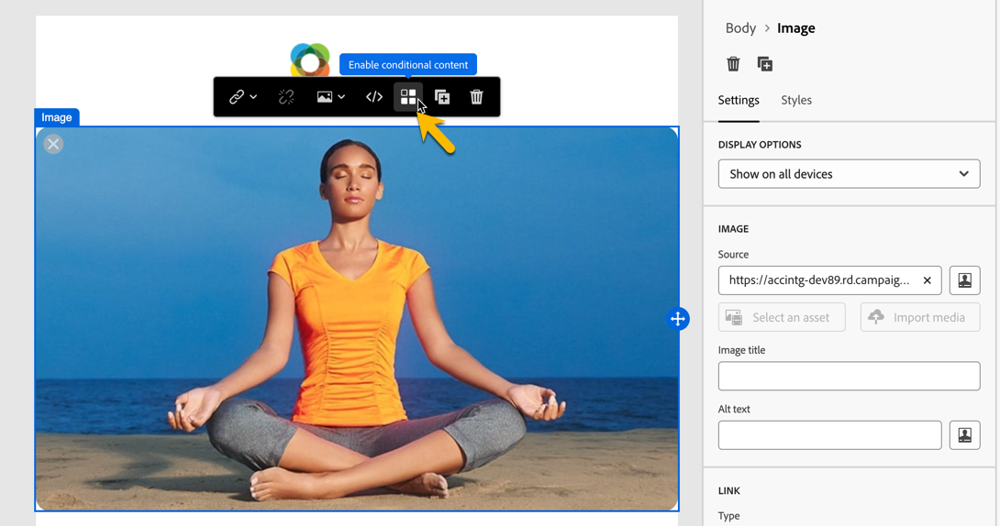

# 构建条件内容 {#add-conditions}

>[!CONTEXTUALHELP]
>id="acw_conditional_content"
>title="添加条件内容"
>abstract="配置条件内容字段以根据收件人的轮廓数据创建高级动态个性化内容。当满足特定条件时，将替换消息内容中的文本块、链接、主题行和/或图像。"

## 条件内容入门 {#gs}

条件内容是一项强大的功能，可根据收件人的配置文件数据进行动态个性化。 它会在满足特定条件时自动替换文本块和图像。 此功能可增强促销活动，并为您的受众提供极具针对性的个性化体验。

通过配置条件内容字段，您可以根据收件人的用户档案创建高级动态个性化。 例如，当满足特定条件时，在消息内容中替换文本块、链接、主题行和图像。 例如，您可以根据Adobe Campaign数据库中“性别”字段的值显示“先生”或“夫人”，或根据收件人的首选语言包含其他链接。

要创建条件内容，请使用特定的帮助程序函数在&#x200B;**表达式编辑器**&#x200B;中配置条件。 此方法适用于所有投放渠道，以及可访问表达式编辑器的任何字段，例如主题行、电子邮件链接和文本/按钮内容组件。 [了解如何访问表达式编辑器](gs-personalization.md#access)。

此外，在设计电子邮件时，请使用专用的&#x200B;**条件内容生成器**&#x200B;为电子邮件正文的某个元素创建多个变体。 [了解如何在电子邮件中创建条件内容](#condition-condition-builder)。

## 在表达式编辑器中创建条件 {#condition-perso-editor}

>[!CONTEXTUALHELP]
>id="acw_personalization_editor_conditions"
>title="条件"
>abstract="此菜单允许您利用助手功能来定义条件内容。"

要使用表达式编辑器定义投放的条件内容，请执行以下步骤。 在此示例中，条件内容是根据收件人的语言（法语或英语）创建的。

1. 打开投放并导航到内容编辑部分。

1. 找到要添加条件内容的字段。 例如，将条件内容添加到短信消息。

1. 单击字段旁边的&#x200B;**[!UICONTROL 打开个性化对话框]**&#x200B;图标以打开表达式编辑器。

   {zoomable="yes"}

1. 在个性化编辑器中，浏览到左侧的&#x200B;**[!UICONTROL 条件]**&#x200B;菜单。

1. 要开始构建条件，请单击&#x200B;**If**&#x200B;函数旁边的“+”图标。 以下行已添加到中央屏幕： `<% if (<FIELD>==<VALUE>) { %>Insert content here<% } %>`

   * 使用个性化字段替换`<FIELD>`，例如收件人的语言： `recipient.language`。
   * 将`<VALUE>`替换为要满足的值，如`'French'`。
   * 将`Insert content here`替换为要显示给符合指定条件的配置文件的内容。

     {zoomable="yes"}{width="800" align="center"}

1. 指定收件人不符合条件时要显示的内容。 使用&#x200B;**else**&#x200B;辅助函数：

   1. 将光标放在表达式结束标记`%>`之前，然后单击`+`Else **函数旁边的**。

   1. 将`Insert content here`替换为要显示给不符合if函数条件的配置文件的内容。

   {zoomable="yes"}{width="800" align="center"}

   使用&#x200B;**else if**&#x200B;辅助函数构建具有多个内容变体的条件。 例如，下面的表达式根据收件人的语言显示消息的三种变体：

   {zoomable="yes"}{width="800" align="center"}

   >[!NOTE]
   >
   >每次添加辅助函数时，函数前后都会自动添加打开(`<%`)和关闭(`%>`)标记。
   >
   >在表达式中添加“Else”辅助函数后的示例：
   >
   >`<% if (<FIELD>==<VALUE>) { %>Insert content here<% } <% else { %> Insert content here<% } %>%>`
   >
   >确保删除这些标记以避免语法错误。 在此示例中，删除&#x200B;**else**&#x200B;函数标记后更正的表达式是：
   >
   >`<% if (<FIELD>==<VALUE>) { %>Insert content here<% } else { %> Insert content here<% } %>`

1. 保存您的内容，并通过模拟您的内容来检查其渲染情况。

## 在电子邮件中创建条件内容 {#condition-condition-builder}

可通过两种方式创建电子邮件中的条件内容：
* 在表达式编辑器中，通过构建包含辅助函数的条件。
* 在设计电子邮件时，可在专用的条件内容生成器中访问。

以下部分提供了有关使用Email Designer的条件内容功能创建条件的分步说明。 [此处](#condition-perso-editor)提供了有关使用表达式编辑器创建条件的详细信息。

在此示例中，将根据收件人的语言创建具有多个变体的电子邮件。 执行以下步骤：

1. 创建或打开电子邮件投放，编辑其内容，然后单击&#x200B;**[!UICONTROL 编辑电子邮件正文]**&#x200B;按钮以打开电子邮件设计工作区。

1. 选择一个内容组件并单击&#x200B;**[!UICONTROL 启用条件内容]**&#x200B;图标。

   {zoomable="yes"}{width="800" align="center"}

1. 屏幕左侧会打开&#x200B;**[!UICONTROL 条件内容]**&#x200B;窗格。 在此窗格中，使用条件创建所选内容组件的多个变体。

1. 配置您的第一个变体。 将鼠标悬停在&#x200B;**[!UICONTROL 条件内容]**&#x200B;窗格中的&#x200B;**[!UICONTROL 变体 — 1]**&#x200B;上，然后单击&#x200B;**[!UICONTROL 添加条件]**&#x200B;按钮。

   {zoomable="yes"}{width="800" align="center"}

1. 查询建模器将打开，允许您通过筛选收件人的配置文件数据来构建条件。 [了解如何使用查询建模器](../query/query-modeler-overview.md)。

   消息第一个变体的条件就绪后，单击&#x200B;**[!UICONTROL 确认]**。 在此示例中，将创建定向语言为“法语”的收件人的规则。

   {zoomable="yes"}{width="800" align="center"}

1. 该规则现在已与变体关联。 为了提高可读性，请单击省略号菜单以重命名变体。

1. 配置在发送消息时如果满足规则应如何显示组件。 在此示例中，如果法语是收件人的首选语言，则以法语显示文本。

   {zoomable="yes"}{width="800" align="center"}

1. 根据内容组件的需要，添加任意数量的变体。 随时在变体之间切换，以检查内容组件将如何根据其条件规则显示。

   >[!NOTE]
   >如果发送消息时未满足变体中定义的任何规则，则内容组件将显示在&#x200B;**[!UICONTROL 条件内容]**&#x200B;窗格的&#x200B;**[!UICONTROL 默认变体]**&#x200B;中定义的内容。

## 对条件内容使用变量 {#variables-conditional}

变量可用于投放中的条件内容。

了解有关[将变量添加到投放](../advanced-settings/delivery-settings.md#variables-delivery)的更多信息。

选择要放置条件内容的元素。

{zoomable="yes"}

要使用变量，请使用&#x200B;**[!UICONTROL 编辑表达式]**&#x200B;按钮配置条件，如下所示。 在此示例中，此图像在变量的值为`launch`时显示。

{zoomable="yes"}

创建值为`reminder`的其他变体，例如，其中显示其他图像。