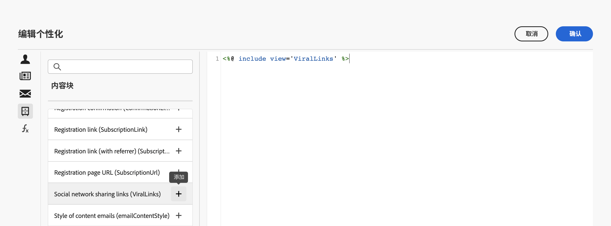

# 内置内容块 {#ootb-content-blocks}

Adobe Campaign提供了一个预配置内容块的列表。 这些内容块是动态的、个性化的，并且具有特定的呈现方式，您可以将其插入到投放中。 例如，您可以添加徽标、问候语消息或指向镜像页面的链接。

要将内容块添加到投放，请执行以下步骤：

1. 打开投放并编辑其内容。

1. 找到要添加内容块的字段，然后单击 **[!UICONTROL 打开个性化对话框]** 图标以打开表达式编辑器。

   

1. 在表达式编辑器中，浏览到 **[!UICONTROL 内容块]** 左侧菜单。

1. 要添加内容块，请将光标放在内容中的所需位置，然后单击“+”按钮以插入该内容块。

   

内置内容块为：

* **[!UICONTROL Purl个性化审批]**
* **[!UICONTROL 默认选择退出横幅]**
* **[!UICONTROL 由 Adobe Campaign 启用]**：插入“由 Adobe Campaign 启用”徽标。
* **[!UICONTROL facebook预输入]**
* **[!UICONTROL 专有名词的格式化函数]**：生成 **[!UICONTROL toSmartCase]** Javascript 函数，它将每个单词的首字母更改为大写形式。
* **[!UICONTROL 问候]**：插入带收件人全名的问候语，后跟一个逗号。示例：“Hello John Doe,”。
* **[!UICONTROL 插入徽标]**：插入在实例设置中定义的徽标。
* **[!UICONTROL 指向镜像页面的链接]**：插入指向[镜像页面](../content/mirror-page.md)的链接。默认格式为：“如果您无法正确查看此邮件，请单击此处”。
* **[!UICONTROL 镜像页面 URL]**：插入镜像页面 URL，以便投放设计人员能够检查链接。
* **[!UICONTROL 通知样式]**
* **[!UICONTROL 单一模式下的优惠接受 URL]**：插入一个 URL，以便将优惠设置为&#x200B;**[!UICONTROL 已接受]**。（如果启用了交互模块，则此块可用）
* **[!UICONTROL 注册确认]**：插入一个用于确认订阅的链接。
* **[!UICONTROL 注册链接]**：插入订阅链接。在实例设置中定义此链接。默认内容为：“单击此处以注册”。
* **[!UICONTROL 注册链接（带反向链接）]**：插入订阅链接，用于识别访客和投放。在实例设置中定义此链接。
* **[!UICONTROL 注册页面 URL]**：插入订阅 URL
* 社交网络共享链接
* **[!UICONTROL 内容电子邮件的样式]**&#x200B;和&#x200B;**[!UICONTROL 通知样式]**：生成使用预定义的 HTML 样式设置电子邮件格式的代码。
* **[!UICONTROL 退订链接]**：插入一个链接，用于退订所有投放（列入阻止列表）。默认关联内容为：“您之所以收到这封邮件，是因为您一直与&#x200B;***您的组织名称***&#x200B;或关联公司有联系。要不再接收来自&#x200B;***您的组织名称***&#x200B;的邮件，请单击此处。”

>[!NOTE]
>
>您可以从Adobe Campaign V8控制台中定义新块，以便优化投放个性化。 [在控制台文档中了解详情](https://experienceleague.adobe.com/docs/campaign-classic/using/sending-messages/personalizing-deliveries/personalization-blocks.html?lang=zh-Hans)
