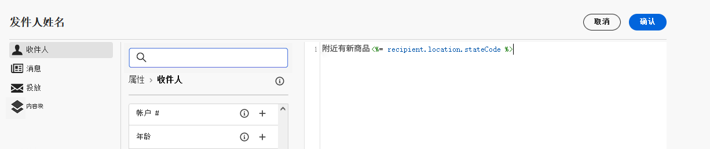
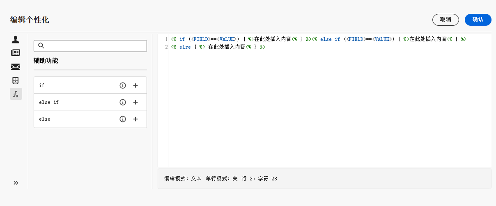
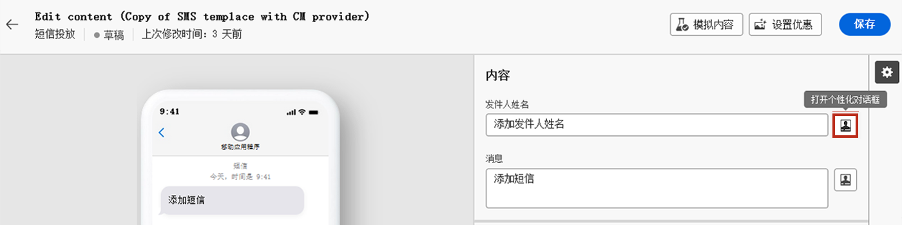
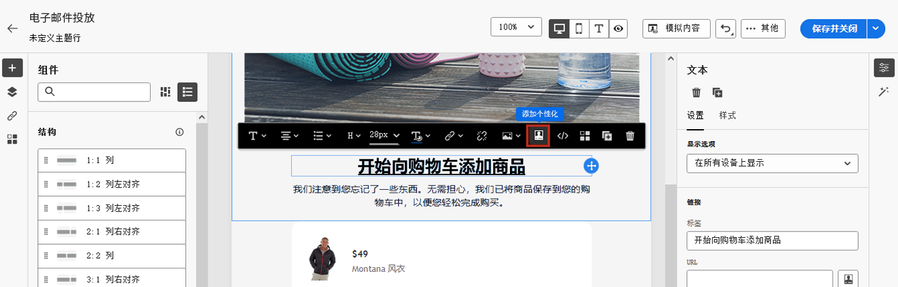
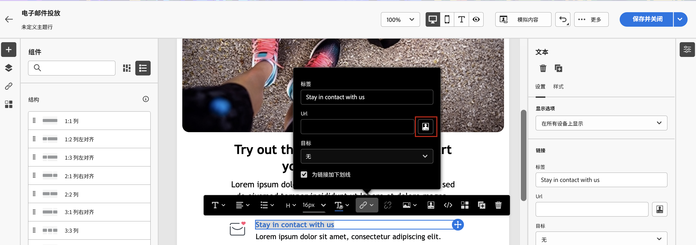

# 如何将内容设置为动态内容？ {#gs-dynamic-content}

>[!CONTEXTUALHELP]
>id="acw_targetdata_personalization_dashboard"
>title="个性化"
>abstract="表达式编辑器让您可以选择、排列、自定义和验证所有数据，为自己的内容创建定制体验。您可以通过利用配置文件数据对发送给每个收件人的邮件进行个性化设置，并创建有条件的内容以使邮件适合每个收件人，并仅显示相关的内容。"

作为一名营销人员，定位那些真正对您的产品感兴趣的客户，并提供有效的相关内容来吸引他们是至关重要的。鉴于您会遇到各种不同的收件人，创建多种营销内容来吸引不同的受众可能会既耗时又浪费。这种时候就是动态内容发挥作用的地方。

Adobe Campaign Web 动态内容功能可让您根据收集到的收件人相关信息来定制内容。通过使用动态内容，您可以确保营销工作更具相关性，避免推广不需要或不必要的产品或服务。这种方法可使您的内容更具吸引力，并使受众更愿意去阅读内容。此外，它使您能够个性化您的内容，让收件人觉得他们收到的信息是由人而不是机器发送的。

## 如何将内容设置为动态内容？ {#make-content-dyn}

您可以通过在 Campaign Web 表达式编辑器中插入 JavaScript 结构来将邮件内容设为动态内容。在发送邮件时，Adobe Campaign 会解释这些表达式，以便将正确的内容投放给每个收件人：

* 通过利用配置文件数据（例如，收件人的名字、兴趣、居住地、购买的产品等），针对每个特定的收件人&#x200B;**个性化您的邮件**。从个性化编辑器，您可以选择数据库中的与收件人、邮件或投放相关的任何可用字段。可将这些个性化属性插入邮件的主题行或正文中。以下语法可在您的内容中插入收件人的城市：&lt;%= recipient.location.city %>。

  {zoomable="yes"}{width="800" align="center"}

* **创建条件内容**，使您的投放适合每个收件人，并根据您获得的给定客户的相关信息，仅向其显示相关内容。这允许您根据条件显示特定的文本块和/或图像。例如，根据收件人的特定服务订阅来调整电子邮件横幅。

  {zoomable="yes"}{width="800" align="center"}

## 访问表达式编辑器 {#access}

Adobe Campaign Web 提供了一个表达式编辑器，可让您选择、排列、自定义和验证所有数据，为自己的内容创建定制体验。在每个带有&#x200B;**[!UICONTROL 打开个性化对话框]**&#x200B;图标的字段（例如主题行字段）或电子邮件链接和文本/按钮内容组件中，表达式编辑器可用于所有渠道。

以下是有关如何根据要设为动态内容的内容来访问表达式编辑器的一些示例：

* *从发件人名称字段访问表达式编辑器*

  {zoomable="yes"}{width="800" align="center"}

* *从电子邮件文本组件访问表达式编辑器*

  {zoomable="yes"}{width="800" align="center"}

* *通过电子邮件中的链接访问表达式编辑器*

  {zoomable="yes"}{width="800" align="center"}

>[!NOTE]
>
>除了表达式编辑器之外，您还可以在设计电子邮件时利用专用的条件内容生成器。[了解如何在电子邮件中生成条件内容](conditions.md)
