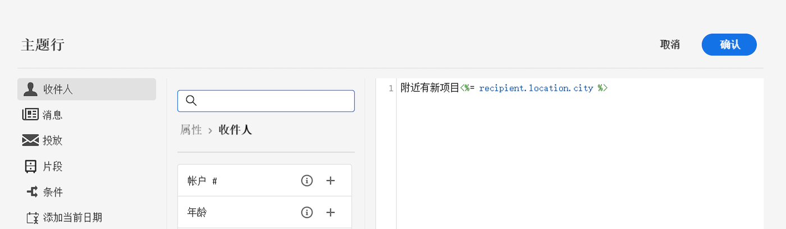
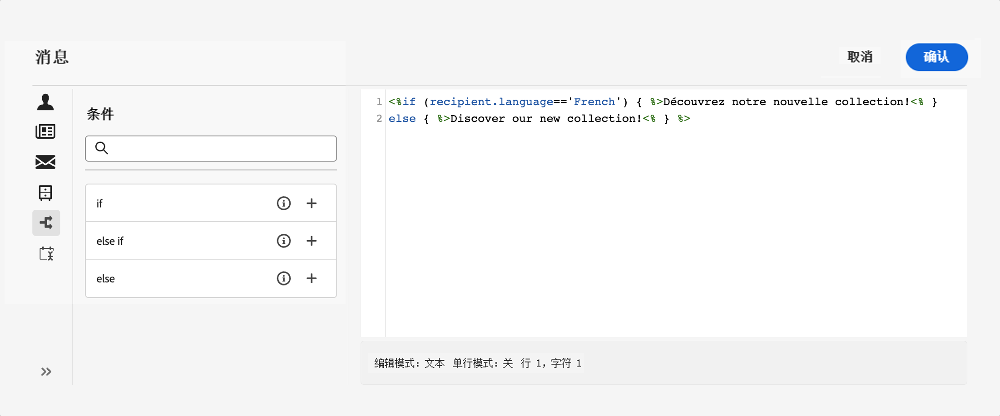

# 动态内容入门

作为营销人员，定位对您的产品真正感兴趣的客户并通过提供有效且相关的内容与他们互动至关重要。 鉴于您遇到的收件人的范围不同，创建多个营销内容以吸引不同的人可能会非常耗时且浪费。 这就是动态内容发挥作用的地方。

通过Adobe Campaign web dynamic content功能，您可以根据所收集的有关收件人的信息自定义内容。 通过使用动态内容，您可以确保营销工作更相关，从而避免营销不需要或不必要的产品或服务。 此方法使您的内容更具吸引力，并增加其被阅读的可能性。 此外，您还可以个性化内容，使收件人感觉他们是在从人员而不是机器接收信息。

## 如何使您的内容成为动态内容？

通过在Campaign Web表达式编辑器中插入JavaScript结构，可以使消息内容成为动态内容。 在发送消息时，Adobe Campaign会解释这些表达式，以便为每个收件人提供正确内容：

* **个性化您的消息** 利用用户档案数据，例如他们的名字、兴趣、居住地、购买的内容等，发送给每个特定收件人。 您可以从与收件人、消息或投放相关的个性化编辑器中选择数据库中可用的任何字段。 可将这些个性化属性插入邮件的主题行或正文中。以下语法可在您的内容中插入收件人的城市：&lt;%= recipient.location.city %>。

  {width="800" align="center"}

* **创建条件内容** 使您的投放适应每个收件人，并根据您拥有的关于给定客户的信息仅显示与其相关的内容。 这允许您根据条件显示特定的文本块和/或图像。 例如，根据收件人对特定服务的订阅调整电子邮件横幅。

  {width="800" align="center"}

* **使用个性化块** 以节省时间并将可轻松重用的个性化内容用于您的消息。 Campaign 附带了一组个性化块，其中包含可插入投放中的特定渲染。例如，您可以添加徽标、问候语消息或指向电子邮件镜像页面的链接。 内容块可通过个性化编辑器中的专用条目使用。

  {width="800" align="center"}

## 访问表达式编辑器 {#access}

Adobe Campaign V8 Web提供了一个表达式编辑器，您可以在其中选择、排列、自定义和验证所有数据，从而为您的内容创建自定义体验。 表达式编辑器适用于所有渠道，在每个字段内使用 **[!UICONTROL 打开个性化对话框]** 图标，例如主题行字段，或电子邮件链接和文本/按钮内容组件。

以下是如何根据要使其成为动态的内容访问表达式编辑器的几个示例：

* *从“发件人名称”字段访问表达式编辑器*

  {width="800" align="center"}

* *从电子邮件文本组件访问表达式编辑器*

  {width="800" align="center"}

* *从电子邮件中的链接访问表达式编辑器*

  {width="800" align="center"}

>[!NOTE]
>
>除了表达式编辑器之外，在设计电子邮件时，您还可以利用专用的条件内容生成器。 [了解如何在电子邮件中构建条件内容](conditions.md)

## 让我们深入探究

现在，您已了解如何使内容生动活泼，接下来该深入了解这些文档部分以开始使用该功能。

<table style="table-layout:fixed"><tr style="border: 0;">
<td>

<a href="personalize.md"><strong>添加个性化内容</strong></a>

</td>
<td>

<a href="conditions.md"><strong>添加条件内容</strong>

</td>
<td>

<a href="content-blocks.md"><strong>添加内置内容块</strong></a>

</td>
</tr></table>
