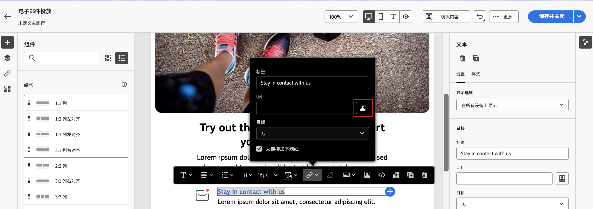

# 个性化您的内容{#add-personalization}

## 个性化邮件的主题行 {#personalize-subject-line}

要在邮件的&#x200B;**[!UICONTROL 主题行]**&#x200B;字段中添加个性化内容，请执行以下步骤：

1. 打开投放并单击 **[!UICONTROL 编辑内容]**.
1. 单击 **[!UICONTROL 打开个性化对话框]** 图标右侧的 **[!UICONTROL 主题行]** 电子邮件字段，或 **[!UICONTROL 标题]** 推送/短信投放的字段。

   {width="600"}

1. 输入主题行或标题，然后选择要添加的个性化属性。

1. 单击&#x200B;**[!UICONTROL 确认]**&#x200B;以进行确认。个性化属性即添加到内容中。

## 个性化您的电子邮件内容 {#personalize-emails}

要个性化电子邮件内容，请在电子邮件设计器中打开邮件，然后：

1. 在文本块内单击。
1. 在上下文工具栏中，选择&#x200B;**[!UICONTROL 添加个性化内容]**。

   

1. 在个性化编辑器中插入收件人姓名并进行确认。

   

   个性化属性将添加到电子邮件内容。

   您可以模拟内容以检查渲染。[了解详情](../preview-test/preview-content.md)

   

1. 要向电子邮件添加内容块，请执行相同的步骤，并从最后一个图标中选择内容块：

   

1. 一旦插入该内容块，即将它添加到电子邮件内容。在投放准备步骤中生成个性化时，将自动使该内容块适应收件人配置文件。

   

## 个性化电子邮件中的链接 {#personalize-links}

要个性化&#x200B;**链接**，请执行以下操作：

1. 选择文本块或图像。
1. 在上下文工具栏中，选择&#x200B;**插入链接**。

   

1. 输入链接标签并使用&#x200B;**插入链接**&#x200B;按钮来个性化链接。

   

1. 使用个性化编辑器来定义和个性化链接，并进行确认。

   

## 个性化您的优惠 {#personalize-offers}

您还可以在将文本类型的内容添加到优惠的表示形式时访问个性化编辑器。在[此章节](../content/offers.md)中了解更多信息。

