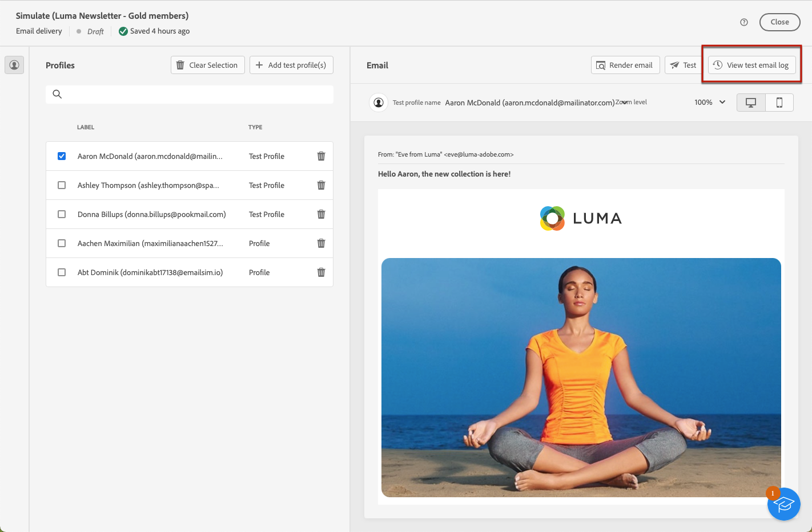

# 发送校样 {#send-test-deliveries}

>[!CONTEXTUALHELP]
>id="acw_email_preview_mode"
>title="预览模式"
>abstract="通过将测试群体包括在主目标中而预览和测试消息。"

>[!CONTEXTUALHELP]
>id="acw_deliveries_additional_proof_target"
>title="其他验证目标"
>abstract="其他验证目标。"

定义消息内容后，您可以通过向测试用户档案发送校样来预览和测试该内容。 如果插入个性化内容，则可以使用测试用户档案数据检查此内容在消息中的显示方式。

要检测消息内容或个性化设置中可能出现的错误，请先向测试用户档案发送校样，然后再将校样发送给目标受众。 每次进行更改时都应发送校样，以验证最新内容。 发送校样是验证营销活动和识别潜在问题的重要步骤。 校样收件人可以检查各种元素，如链接、选择退出链接、图像或镜像页面，并检测渲染、内容、个性化设置和投放配置中的任何错误。

## 使用测试轮廓模拟内容 {#simulate-content-test-deliveries}

>[!CONTEXTUALHELP]
>id="acw_email_preview_option_test_target"
>title="测试群体"
>abstract="选择测试群体模式。"

在发送验证之前，请确保为投放定义目标受众。 [了解详情](../audience/add-audience.md)

要开始测试消息内容，请执行以下操作：

1. 编辑投放的内容。
1. 单击&#x200B;**[!UICONTROL 模拟内容]**&#x200B;按钮。
1. 单击&#x200B;**[!UICONTROL 发送校样]**&#x200B;按钮以发送校样。

   {zoomable="yes"}

1. 选择校样收件人。

   根据消息渠道，校样可以发送给以下类型的收件人：

   * 对于短信和电子邮件，您可以使用[测试用户档案](#test-profiles)，这些用户档案是数据库中的特定附加收件人。 您还可以使用主目标[模式中的](#substitution-profiles)替换，该模式将验证发送到电子邮件测试地址或电话号码，并使用现有配置文件的个性化数据。 这样，您就可以像收件人一样体验消息，从而准确地表示用户档案将收到的内容。

   * 对于推送消息，您可以使用[订阅者](#subscribers)，这些订阅者是添加到数据库中的虚拟订阅者。 它们是在[!DNL Campaign]控制台中创建的。 请参阅[Campaign v8 （客户端控制台）文档](https://experienceleague.adobe.com/docs/campaign/campaign-v8/audience/add-profiles/test-profiles.html?lang=zh-Hans){target="_blank"}以了解详情

   下面提供了每种模式的详细配置。

## 使用测试轮廓 {#test-profiles}

>[!CONTEXTUALHELP]
>id="acw_deliveries_simulate_test_mode"
>title="校对目标"
>abstract="如果要在发送到主要目标之前测试投放，可再上传一个文件作为“校对目标”。"

>[!CONTEXTUALHELP]
>id="acw_deliveries_simulate_test_upload"
>title="上传轮廓"
>abstract="如果要用与您用于主要目标的集合不同的集合测试投放，可再上传一个文件，其中包含其他轮廓。"

>[!CONTEXTUALHELP]
>id="acw_deliveries_simulate_test_sample"
>title="模板文件"
>abstract="文件的格式必须与原始文件相同。 支持的文件格式：txt、csv。最大文件大小：15 MB。使用第一行作为列标题。"

>[!CONTEXTUALHELP]
>id="acw_sms_preview_option_app_target"
>title="将测试轮廓包含在主要受众中"
>abstract="启用此选项还可将最终消息发送给校样收件人。"

测试用户档案是数据库中的其他收件人。 它们是从&#x200B;**[!UICONTROL 客户管理]** > **[!UICONTROL 配置文件]**&#x200B;菜单创建的。 [了解详情](../audience/test-profiles.md#create-test-profiles)

将验证发送到测试用户档案的步骤详述如下。

1. 从投放的内容中，单击&#x200B;**[!UICONTROL 模拟内容]**&#x200B;按钮，然后单击&#x200B;**[!UICONTROL 发送校样]**&#x200B;按钮。

1. 从&#x200B;**[!UICONTROL 模式]**&#x200B;下拉列表中，选择&#x200B;**[!UICONTROL 测试用户档案]**&#x200B;以定向将接收校样或短信投放的虚拟收件人。

   {zoomable="yes"}

1. 如果您已在内容模拟屏幕中选择了用于[预览邮件](preview-content.md)的用户档案，则会预先选择这些用户档案作为验证收件人。 您可以使用&#x200B;**[!UICONTROL 添加测试配置文件]**&#x200B;按钮清除选择和/或添加其他收件人。

1. 在浏览测试用户档案或用户档案列表时，您可以使用过滤器来优化搜索。 例如，您可以定义规则以查找所有状态为&#x200B;**[!UICONTROL 潜在客户]**&#x200B;的测试配置文件。 了解如何使用[查询建模器](../query/query-modeler-overview.md)添加规则。

   {zoomable="yes"}

1. 若要将最终消息发送给验证的收件人，请选择&#x200B;**[!UICONTROL 将测试群体包含在主目标]**&#x200B;中。

   {zoomable="yes"}

1. 选择测试配置文件后，您可以[发送校样](#send-test)。

## 替换用户档案数据 {#substitution-profiles}

使用配置文件替换将验证发送到特定电子邮件地址或电话号码，同时显示[!DNL Adobe Campaign]数据库的现有配置文件中的数据。 仅当定义了投放的受众时，才能选择此模式。

要替换主目标中的用户档案数据，请执行以下步骤：

1. 从投放的内容中，单击&#x200B;**[!UICONTROL 模拟内容]**&#x200B;按钮，然后单击&#x200B;**[!UICONTROL 发送校样]**&#x200B;按钮。

1. 从&#x200B;**[!UICONTROL 模式]**&#x200B;下拉列表中，选择&#x200B;**[!UICONTROL 从主目标]**&#x200B;替换，以在显示现有配置文件中的数据时向特定电子邮件地址或电话号码发送校样。

   >[!CAUTION]
   >
   >如果您尚未为您的投放选择[受众](../audience/about-recipients.md)，则&#x200B;**[!UICONTROL 从主目标]**&#x200B;替代选项将灰显，您将无法选择替代配置文件。

1. 单击&#x200B;**[!UICONTROL 添加地址]**&#x200B;按钮并指定将接收校样的电子邮件地址或电话号码。

   {zoomable="yes"}

   >[!NOTE]
   >
   >您可以输入任何电子邮件地址或电话号码。 这允许您向任何收件人发送验证，即使他们不是[!DNL Adobe Campaign]的用户。

1. 从为投放定义的目标中选择要用作替换的用户档案。 您还可以让[!DNL Adobe Campaign]从目标中选择一个随机配置文件。 所选用户档案中的用户档案数据将显示在验证中。

1. 确认收件人并重复该操作，根据需要添加任意数量的电子邮件地址或电话号码。

   {zoomable="yes"}

1. 若要将最终消息发送给验证的收件人，请选择&#x200B;**[!UICONTROL 将测试群体包含在主目标]**&#x200B;中。

1. 选择替代配置文件后，您可以[发送校样](#send-test)。

## 向应用程序订阅者发送验证 {#subscribers}

在设计推送通知时，只能将验证发送给应用程序订阅者。 要选择它们，请执行以下步骤。

1. 从推送的内容中，单击&#x200B;**[!UICONTROL 模拟内容]**&#x200B;按钮和&#x200B;**[!UICONTROL 发送校样]**&#x200B;按钮。

   {zoomable="yes"}

1. 如果您已在内容模拟屏幕中选择了[预览投放](preview-content.md)的订阅者，则会预先选择这些配置文件作为测试订阅者。

   您可以使用专用按钮清除选择和/或添加其他订阅者。

   {zoomable="yes"}

1. 若要将最终推送通知发送给测试订阅者，请选择&#x200B;**[!UICONTROL 将测试群体包含在主目标]**&#x200B;中。

1. 选择订阅者后，您可以[发送校样](#send-test)。

## 发送证明 {#send-test}

要将校样发送给选定的收件人，请执行以下步骤。

1. 单击&#x200B;**[!UICONTROL 发送校样]**&#x200B;按钮。

1. 确认发送。

   {zoomable="yes"}

1. 发送所需数量的校样，直到您完成投放内容为止。

完成后，您可以准备投放并将其发送到主目标。 请在以下专用部分中了解具体操作步骤：

* [发送电子邮件](../monitor/prepare-send.md)
* [发送推送通知](../push/send-push.md#send-push)
* [发送短信投放](../sms/send-sms.md#send-sms)

## 访问已发送的校样 {#access-test-deliveries}

发送校样后，您可以从&#x200B;**[!UICONTROL 模拟内容]**&#x200B;屏幕访问其日志。

这些日志允许您访问为所选投放发送的所有校样，并可视化与其发送相关的特定统计信息。 [了解如何监控投放日志](../monitor/delivery-logs.md)

{zoomable="yes"}

您还可以从[投放列表](../msg/gs-messages.md)访问已发送的校样，就像任何投放一样。

{zoomable="yes"}