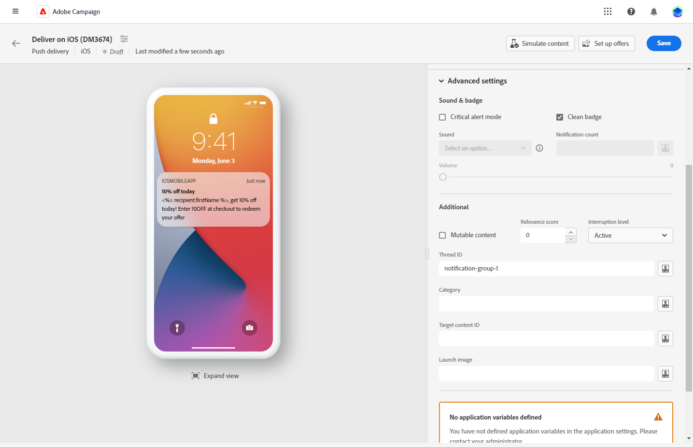

# 设计推送投放 {#content-push}

>[!CONTEXTUALHELP]
>id="acw_deliveries_push_android_content"
>title="推送 Android 内容"
>abstract="定义推送 Android 内容。"

>[!CONTEXTUALHELP]
>id="acw_deliveries_push_ios_content"
>title="推送 iOS 内容"
>abstract="定义推送 iOS 内容。"

## 消息 {#push-message}

>[!BEGINTABS]

>[!TAB Android]

使用Firebase Cloud Messaging，您可以选择两种类型的消息：

* 此 **[!UICONTROL 数据消息]e** 由客户端应用程序处理。 这些消息直接发送到移动设备应用程序，后者在设备上生成并显示Android通知。 数据消息仅包含您的自定义应用程序变量。

  要定义内容、个性化数据并添加动态内容，请单击 **[!UICONTROL 消息]** 字段并使用表达式编辑器。 您可以访问此编辑器以自定义消息，在 **[!UICONTROL 应用程序变量]** 菜单，则会自动添加应用程序变量。 这些变量允许您定义通知行为。 例如，您可以配置在用户激活通知时显示的特定应用程序屏幕。

  

* 此 **[!UICONTROL 通知消息]**，由FCM SDK自动处理。 FCM会代表客户端应用程序在用户的设备上自动显示消息。 通知消息包含预定义的一组参数和选项，但仍可以使用自定义应用程序变量进一步个性化。

  要撰写消息，请单击 **[!UICONTROL 标题]** 和 **[!UICONTROL 正文]** 字段。 使用表达式编辑器定义内容、个性化数据和添加动态内容。

  要进一步个性化推送通知，您可以选择要添加到推送通知的图像、要在用户档案的设备上显示的通知图标及其颜色。

  

>[!TAB iOS]

要撰写消息，请单击 **[!UICONTROL 标题]** 和 **[!UICONTROL 正文]** 字段。 使用表达式编辑器定义内容、个性化数据和添加动态内容。

您可以添加 **[!UICONTROL 字幕]**，iOS通知有效负载的字幕参数的值。 请参阅此章节。

静默推送模式允许将“静默”通知发送到移动应用程序。 用户未意识到通知的到达。 它将直接传输到应用程序。

>[!ENDTABS]

## 高级设置 {#push-advanced}

>[!BEGINTABS]

>[!TAB Android]

| 参数 | 说明 |
|---------|---------|
| **[!UICONTROL 声音]** | 设置设备收到通知时播放的声音。 |
| **[!UICONTROL 通知次数]** | 设置直接显示在应用程序图标上的新未读信息数量。 这允许用户快速查看待处理通知的数量。 |
| **[!UICONTROL 渠道 ID]** | 设置通知的渠道ID。 在收到任何使用此渠道ID的通知之前，应用程序必须使用此渠道ID创建一个渠道。 |
| **[!UICONTROL 点击操作]** | 定义与用户单击您的通知关联的操作。 这会确定用户与通知交互时的行为，例如打开特定屏幕或在应用程序中执行特定操作。 |
| **[!UICONTROL 标记]** | 设置用于替换通知抽屉中现有通知的标识符。 这有助于防止累积多个通知，并确保只显示最新的相关通知。 |
| **[!UICONTROL 优先级]** | 设置通知的优先级，可以是默认、最小、低或高。 优先级决定了通知的重要性和紧迫性，会影响通知的显示方式以及它是否可以绕过某些系统设置。 有关更多信息，请参阅 [FCM文档](https://firebase.google.com/docs/reference/fcm/rest/v1/projects.messages#notificationpriority). |
| **[!UICONTROL 可见性]** | 设置通知的可见性级别，可以是公共、私有或机密。 可见性级别确定通知内容在锁屏和其他敏感区域上显示的程度。 欲了解更多信息，请参见 [FCM文档](https://firebase.google.com/docs/reference/fcm/rest/v1/projects.messages#visibility). |
| **[!UICONTROL 粘性]** | 激活后，通知仍保持可见，即使用户单击它后也是如此。  如果停用，则当用户与通知交互时，会自动取消通知。 粘性行为允许重要通知在屏幕上保留更长时间。 |
| **[!UICONTROL 应用程序变量]** | 允许您定义通知行为。 这些变量是完全可自定义的，并且包含在发送到移动设备的消息有效负荷中。 |

>[!TAB iOS]

| 参数 | 说明 |
|---------|---------|
| **[!UICONTROL 严重警报模式]** | 启用此选项可向通知添加声音，即使用户的手机设置为焦点模式或iPhone处于静音状态也是如此。 这可确保用户注意到重要警报。 |
| **[!UICONTROL 清理徽章]** | 启用此选项可刷新应用程序图标上显示的标记值。 它确保徽章准确反映新的未读信息的数量。 |
| **[!UICONTROL 通知次数]** | 设置一个数字，该数字将直接显示在应用程序图标上，指示新的未读信息数量。 这可为用户提供快速的可视化参考。 |
| **[!UICONTROL 容量]** | 音量从0到100。 |
| **[!UICONTROL 可变内容]** | 启用此选项可允许移动应用程序下载与通知关联的媒体内容。 有关更多信息，请参阅 [Apple 开发人员文档](https://developer.apple.com/library/content/documentation/NetworkingInternet/Conceptual/RemoteNotificationsPG/ModifyingNotifications.html)。 |
| **[!UICONTROL 相关性分数]** | 将相关性得分设置为0到100，以优先考虑通知摘要中的通知顺序。 分数越高，说明通知越重要。 |
| **[!UICONTROL 中断级别]** | <ul> <li>**[!UICONTROL 活动]**：默认情况下，系统会立即显示通知，打开屏幕并播放声音。 通知不会突破焦点模式。</li><li>**[!UICONTROL 被动]**：系统会将通知添加到通知列表，而不会打开屏幕或播放声音。 通知不会突破焦点模式。</li><li>**[!UICONTROL 时效性]**：系统立即显示通知，打开屏幕，可以播放声音并突破聚焦模式。 此级别不需要Apple的特殊权限。</li> <li>**[!UICONTROL 关键]**：系统立即显示通知，在屏幕上亮起，并绕过静音开关或聚焦模式。 请注意，此级别需要Apple的特殊权限。</ul> |
| **[!UICONTROL Thread-id]** | 用于将相关通知分组在一起的标识符。 具有相同线程ID的通知在通知列表中作为单个会话或线程组织。 |
| **[!UICONTROL 类别]** | 指定与通知关联的类别ID的名称。 这样可显示操作按钮，使用户无需打开应用程序即可直接从通知执行各种任务。 |
| **[!UICONTROL 目标内容 ID]** | 用于在打开通知时定向哪个应用程序窗口的标识符。 |
| **[!UICONTROL 启动图像]** | 指定用户选择从通知中启动应用程序时要显示的启动图像文件的名称。 将显示选定的图像，而不是应用程序的常规启动屏幕。 |
| **[!UICONTROL 应用程序变量]** | 允许您定义通知行为。 这些变量是完全可自定义的，并且包含在发送到移动设备的消息有效负荷中。 |

>[!ENDTABS]

<!--Sounds must be included in the application and defined when the service is created. Refer to this section.-->

