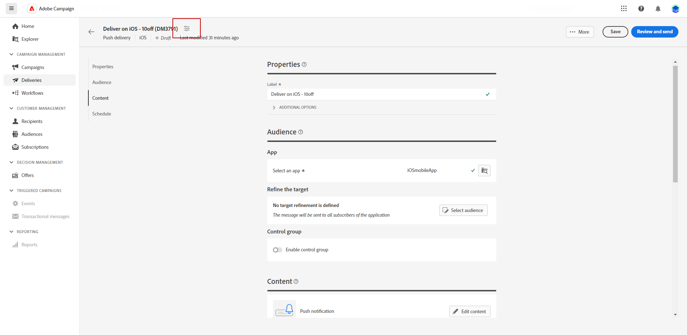

# 创建推送通知投放 {#create-push}

>[!CONTEXTUALHELP]
>id="acw_push_notification_template"
>title="推送通知模板"
>abstract="选择推送通知模板以开始推送投放。通过投放模板，可轻松地在营销活动和投放中重用自定义内容和设置。"
>additional-url="https://experienceleague.adobe.com/en/docs/campaign-web/v8/start/delivery-template" text="使用投放模板"

>[!CONTEXTUALHELP]
>id="acw_deliveries_push_properties"
>title="推送投放属性"
>abstract="定义您的推送投放属性。输入推送的标签并使用&#x200B;**其他选项**&#x200B;配置内部名称、投放文件夹和代码。您还可以输入自定义描述。"

您可以创建独立的推送通知投放，也可以在活动工作流的上下文中创建推送通知。 以下步骤详细介绍了独立（一次性）推送投放的过程。 如果您在营销活动工作流的上下文中工作，有关创建步骤的详情，请参阅[此部分](../workflows/activities/channels.md#create-a-delivery-in-a-campaign-workflow)。

## 创建推送投放 {#create-push-delivery}

要创建新的独立推送投放，请执行以下步骤：

1. 浏览到左边栏上的&#x200B;**[!UICONTROL 投放]**&#x200B;菜单，然后单击&#x200B;**[!UICONTROL 创建投放]**&#x200B;按钮。

1. 在&#x200B;**[!UICONTROL 渠道]**&#x200B;部分下，选择&#x200B;**推送通知**&#x200B;作为渠道，并根据选择的设备操作系统选择一个模板：Android或iOS。 [了解有关模板的更多信息](../msg/delivery-template.md)

1. 单击&#x200B;**[!UICONTROL 创建投放]**&#x200B;按钮以进行确认。

   {zoomable="yes"}

## 配置投放设置 {#configure-push-settings}

按如下所述配置您的投放设置：

1. 输入投放的&#x200B;**[!UICONTROL 标签]**。 默认情况下，使用所选模板的标签设置标签。 它应进行更新。

1. 根据需要浏览&#x200B;**[!UICONTROL 其他选项]**&#x200B;下拉列表以自定义选项。 如果您的投放基于扩展架构，则特定&#x200B;**自定义选项**&#x200B;字段可用。

   +++根据您的要求配置以下设置。
   * **[!UICONTROL 内部名称]**：为投放分配一个唯一标识符。
   * **[!UICONTROL 文件夹]**：将投放存储在特定文件夹中。
   * **[!UICONTROL 投放代码]**：使用您自己的命名惯例整理投放。
   * **[!UICONTROL 描述]**：提供投放的描述。
   * **[!UICONTROL 性质]**：指定投放的性质以进行分类。
   +++

1. 您可以将推送通知配置为多语言投放，以根据用户档案的首选语言发送消息。 [了解详情](../msg/multilingual.md)。

## 选择您的投放受众 {#create-audience-push}

>[!CONTEXTUALHELP]
>id="acw_deliveries_push_audience"
>title="定义推送通知受众"
>abstract="要定义消息的受众，您必须首先选择与推送投放相关联的应用程序。默认情况下，将您的推送通知发送到应用程序的所有订阅者。可通过单击&#x200B;**选择受众**&#x200B;按钮而细化到特定受众。如果需要，可添加对照组以衡量投放的影响力。"
>additional-url="https://experienceleague.adobe.com/docs/campaign-web/v8/audiences/target-audiences/control-group.html?lang=zh-hans" text="设置对照组"

您必须先选择应用程序，然后优化推送通知受众，如下所述：

1. 从&#x200B;**[!UICONTROL 受众]**&#x200B;部分中，选择要用于此投放的应用程序。 默认情况下，将您的推送通知发送到应用程序的所有订阅者。您可以通过单击&#x200B;**[!UICONTROL 选择受众]**&#x200B;按钮来优化为特定受众。

   {zoomable="yes"}

1. 选择现有受众，或创建自己的受众，以优化推送投放的目标群体。 对于推送通知，默认[目标维度](../audience/about-recipients.md#targeting-dimensions)为链接到收件人表的&#x200B;**订阅者应用程序** (nms:appSubscriptionRcp)。

   了解如何在[此页面](../audience/add-audience.md)中选择现有受众。

   了解如何在[此页面](../audience/one-time-audience.md)中创建新受众。

1. 打开&#x200B;**[!UICONTROL 启用控制组]**&#x200B;选项，设置控制组以测量传递的影响。 消息不会发送到该控制组，因此您可以将收到消息的群体的行为与未收到消息的联系人的行为进行比较。 [了解详情](../audience/control-group.md)。

## 定义推送通知内容 {#create-content-push}

要定义通知的内容，请单击&#x200B;**[!UICONTROL 编辑内容]**。 [了解详情](content-push.md)。

{zoomable="yes"}

在此屏幕中，您还可以[模拟您的内容](../preview-test/preview-test.md)和[设置选件](../msg/offers.md)。

## 计划投放发送 {#schedule-push}

在工作流上下文中发送投放时，必须使用&#x200B;**调度程序**&#x200B;活动。 在[此页面](../workflows/activities/scheduler.md)中了解详情。 以下步骤仅适用于独立投放。

要将独立推送投放计划为特定日期和时间，请执行以下步骤：

1. 浏览到投放属性的&#x200B;**[!UICONTROL 计划]**&#x200B;部分。

1. 使用&#x200B;**[!UICONTROL 启用计划]**&#x200B;切换来激活它。

1. 设置所需的发送日期和时间。

启动投放后，系统会在您为收件人定义的确切日期和时间自动发送消息。

{zoomable="yes"}

在[本节](../msg/gs-deliveries.md#gs-schedule)中了解有关投放计划的更多信息。

## “交付”高级设置 {#adv-push}

单击&#x200B;**[!UICONTROL 配置投放设置]**&#x200B;可访问与投放模板相关的高级选项。 [了解详情](../advanced-settings/delivery-settings.md)。

{zoomable="yes"}