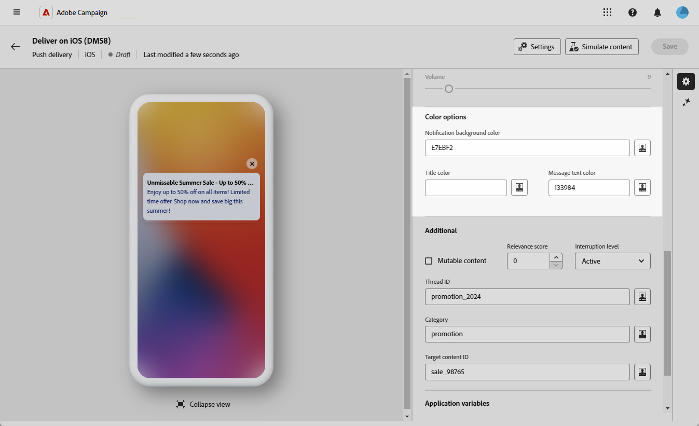

# 设计 iOS 富推送投放 {#rich-push}

>[!IMPORTANT]
>
>在设计富推送通知之前，您首先需要配置V2连接器。 有关详细过程，请参阅[此页面](https://experienceleague.adobe.com/en/docs/campaign-classic/using/sending-messages/sending-push-notifications/configure-the-mobile-app/configuring-the-mobile-application)。

## 定义通知的内容 {#push-message}

创建推送投放后，您可以使用以下模板之一定义其内容：

* **默认**&#x200B;允许您发送带有简单图标和随附图像的通知。

* **基本**&#x200B;可以在通知中包含文本、图像和按钮。

* 通过&#x200B;**轮播**，您可以发送包含用户可以轻扫的文本和多个图像的通知。

* **计时器**&#x200B;在通知中包含实时倒计时器。

浏览以下选项卡，详细了解如何个性化这些模板。

>[!BEGINTABS]

>[!TAB 默认值]

1. 从&#x200B;**[!UICONTROL 模板]**&#x200B;下拉列表中，选择&#x200B;**[!UICONTROL 默认值]**。

   

1. 在&#x200B;**[!UICONTROL 标题]**&#x200B;字段中，输入要显示在通知中心可用通知列表中的标题标签。

   此字段允许您定义iOS通知有效负载的&#x200B;**title**&#x200B;参数的值。

1. 或者，添加与iOS通知有效负载的&#x200B;**subtitle**&#x200B;参数相对应的&#x200B;**[!UICONTROL Subtitle]**。

1. 在&#x200B;**[!UICONTROL 消息]**&#x200B;字段中输入消息的内容。

1. 使用表达式编辑器定义内容、个性化数据和添加动态内容。 [了解详情](../personalization/personalize.md)

   

1. 若要进一步个性化您的推送通知，您可以选择一个&#x200B;**[!UICONTROL 启动图像]** URL以添加到您的推送通知中。

1. 从&#x200B;**[!UICONTROL 高级设置]**&#x200B;下拉列表中，导航到&#x200B;**[!UICONTROL 声音和徽章]**&#x200B;选项卡，以自定义通知的其他设置，如声音和徽章选项。 [了解详情](#sound-badge)

   

1. 要进一步自定义，请探索可用于推送通知的&#x200B;**[!UICONTROL 其他]**&#x200B;选项。 [了解详情](#push-advanced)

   

1. 从&#x200B;**[!UICONTROL 应用程序变量]**&#x200B;菜单中，自动添加您的&#x200B;**[!UICONTROL 应用程序变量]**。 它们允许您定义通知行为，例如，您可以配置在用户激活通知时显示的特定应用程序屏幕。

定义消息内容后，您可以使用测试订阅者来预览和测试消息。

>[!TAB 基本]

1. 从&#x200B;**[!UICONTROL 模板]**&#x200B;下拉列表中，选择&#x200B;**[!UICONTROL 基本]**。

   

1. 若要撰写邮件，请在&#x200B;**[!UICONTROL 标题]**、**[!UICONTROL 扩展标题]**、**[!UICONTROL 邮件]**&#x200B;和&#x200B;**[!UICONTROL 扩展邮件]**&#x200B;字段中输入您的文本。

   在展开通知时，显示&#x200B;**[!UICONTROL 展开的消息]**&#x200B;时，折叠的视图中会显示&#x200B;**[!UICONTROL 消息]**&#x200B;文本。

   

1. 使用表达式编辑器定义内容、个性化数据和添加动态内容。 [了解详情](../personalization/personalize.md)

1. 或者，添加与iOS通知有效负载的&#x200B;**subtitle**&#x200B;参数相对应的&#x200B;**[!UICONTROL Subtitle]**。

1. 添加定义与用户点击您的通知相关联的&#x200B;**[!UICONTROL 点击操作]**&#x200B;的URL。 这会确定用户与通知交互时的行为，例如打开特定屏幕或在应用程序中执行特定操作。

1. 若要进一步个性化您的推送通知，您可以选择一个&#x200B;**[!UICONTROL 启动图像]** URL以添加到您的推送通知中。

1. 从&#x200B;**[!UICONTROL 高级设置]**&#x200B;下拉列表中，导航到&#x200B;**[!UICONTROL 声音和徽章]**&#x200B;选项卡，以自定义通知的其他设置，如声音和徽章选项。 [了解详情](#sound-badge)

   

1. 在&#x200B;**[!UICONTROL 颜色选项]**&#x200B;菜单中，输入&#x200B;**[!UICONTROL 通知背景颜色]**、**[!UICONTROL 通知背景颜色]**&#x200B;和&#x200B;**[!UICONTROL 消息文本颜色]**&#x200B;的十六进制颜色代码。

   

1. 要进一步自定义，请探索可用于推送通知的&#x200B;**[!UICONTROL 其他]**&#x200B;选项。 [了解详情](#push-advanced)

1. 从&#x200B;**[!UICONTROL 应用程序变量]**&#x200B;菜单中，自动添加您的&#x200B;**[!UICONTROL 应用程序变量]**。 它们允许您定义通知行为，例如，您可以配置在用户激活通知时显示的特定应用程序屏幕。

定义消息内容后，您可以使用测试订阅者来预览和测试消息。

>[!TAB 轮播]

1. 从&#x200B;**[!UICONTROL 模板]**&#x200B;下拉列表中，选择&#x200B;**[!UICONTROL 轮播]**。

   

1. 若要撰写邮件，请在&#x200B;**[!UICONTROL 标题]**、**[!UICONTROL 扩展标题]**、**[!UICONTROL 邮件]**&#x200B;和&#x200B;**[!UICONTROL 扩展邮件]**&#x200B;字段中输入您的文本。

   在展开通知时，显示&#x200B;**[!UICONTROL 展开的消息]**&#x200B;时，折叠的视图中会显示&#x200B;**[!UICONTROL 消息]**&#x200B;文本。

   

1. 使用表达式编辑器定义内容、个性化数据和添加动态内容。 [了解详情](../personalization/personalize.md)

1. 或者，添加与iOS通知有效负载的&#x200B;**subtitle**&#x200B;参数相对应的&#x200B;**[!UICONTROL Subtitle]**。

1. 添加定义与用户点击您的通知相关联的&#x200B;**[!UICONTROL 点击操作]**&#x200B;的URL。 这会确定用户与通知交互时的行为，例如打开特定屏幕或在应用程序中执行特定操作。

1. 选择&#x200B;**[!UICONTROL 轮播]**&#x200B;的运行方式：

   * **[!UICONTROL 自动]**：将图像作为幻灯片自动循环，以预定义的间隔转换。
   * **[!UICONTROL 手动]**：允许用户在幻灯片之间手动滑动以浏览图像。

1. 单击&#x200B;**[!UICONTROL 添加图像]**&#x200B;并输入您的&#x200B;**[!UICONTROL 图像]** URL、**[!UICONTROL 文本]**&#x200B;和&#x200B;**[!UICONTROL 操作URI]**。

   确保您至少包含三个图像，最多包含五个图像。

   

1. 使用向下和向上箭头处理图像的顺序。

1. 从&#x200B;**[!UICONTROL 高级设置]**&#x200B;下拉列表中，导航到&#x200B;**[!UICONTROL 声音和徽章]**&#x200B;选项卡，以自定义通知的其他设置，如声音和徽章选项。 [了解详情](#sound-badge)

1. 在&#x200B;**[!UICONTROL 颜色选项]**&#x200B;菜单中，输入&#x200B;**[!UICONTROL 通知背景颜色]**、**[!UICONTROL 通知背景颜色]**&#x200B;和&#x200B;**[!UICONTROL 消息文本颜色]**&#x200B;的十六进制颜色代码。

   

1. 要进一步自定义，请探索可用于推送通知的&#x200B;**[!UICONTROL 其他]**&#x200B;选项。 [了解详情](#push-advanced)

1. 从&#x200B;**[!UICONTROL 应用程序变量]**&#x200B;菜单中，自动添加您的&#x200B;**[!UICONTROL 应用程序变量]**。 它们允许您定义通知行为，例如，您可以配置在用户激活通知时显示的特定应用程序屏幕。

定义消息内容后，您可以使用测试订阅者来预览和测试消息。

>[!TAB 计时器]

1. 从&#x200B;**[!UICONTROL 通知类型]**&#x200B;下拉列表中选择&#x200B;**[!UICONTROL 计时器]**。

   

1. 若要撰写邮件，请在&#x200B;**[!UICONTROL 标题]**、**[!UICONTROL 扩展标题]**、**[!UICONTROL 邮件]**&#x200B;和&#x200B;**[!UICONTROL 扩展邮件]**&#x200B;字段中输入您的文本。

   在展开通知时，显示&#x200B;**[!UICONTROL 展开的消息]**&#x200B;时，折叠的视图中会显示&#x200B;**[!UICONTROL 消息]**&#x200B;文本。

   

1. 使用表达式编辑器定义内容、个性化数据和添加动态内容。 [了解详情](../personalization/personalize.md)

1. 或者，添加与iOS通知有效负载的&#x200B;**subtitle**&#x200B;参数相对应的&#x200B;**[!UICONTROL Subtitle]**。

1. 添加定义与用户点击您的通知相关联的&#x200B;**[!UICONTROL 点击操作]**&#x200B;的URL。 这会确定用户与通知交互时的行为，例如打开特定屏幕或在应用程序中执行特定操作。

1. 若要进一步个性化您的推送通知，您可以选择一个&#x200B;**[!UICONTROL 启动图像]** URL以添加到您的推送通知中。

1. 将您的&#x200B;**[!UICONTROL 计时器持续时间]**&#x200B;设置为特定纪元时间戳（以秒为单位）或&#x200B;**[!UICONTROL 计时器结束时间戳]**。

   

1. 在&#x200B;**[!UICONTROL 替代标题]**、**[!UICONTROL 替代消息]**&#x200B;和&#x200B;**[!UICONTROL 替代启动图像]**&#x200B;字段中输入计时器过期后显示的文本和图像。

   

1. 从&#x200B;**[!UICONTROL 高级设置]**&#x200B;下拉列表中，导航到&#x200B;**[!UICONTROL 声音和徽章]**&#x200B;选项卡，以自定义通知的其他设置，如声音和徽章选项。 [了解详情](#sound-badge)

1. 在&#x200B;**[!UICONTROL 颜色选项]**&#x200B;菜单中，输入&#x200B;**[!UICONTROL 通知背景颜色]**、**[!UICONTROL 通知背景颜色]**&#x200B;和&#x200B;**[!UICONTROL 消息文本颜色]**&#x200B;的十六进制颜色代码。

1. 要进一步自定义，请探索可用于推送通知的&#x200B;**[!UICONTROL 其他]**&#x200B;选项。 [了解详情](#push-advanced)

1. 从&#x200B;**[!UICONTROL 应用程序变量]**&#x200B;菜单中，自动添加您的&#x200B;**[!UICONTROL 应用程序变量]**。 它们允许您定义通知行为，例如，您可以配置在用户激活通知时显示的特定应用程序屏幕。

定义消息内容后，您可以使用测试订阅者来预览和测试消息。

>[!ENDTABS]

## 推送通知高级设置 {#push-advanced}

### 声音和徽章选项 {#sound-badge}

| 参数 | 说明 |
|---------|---------|
| **[!UICONTROL 严重警报模式]** | 启用此选项后，即使用户的手机设置为焦点模式或iPhone处于静音状态，也可以向通知添加声音。 |
| **[!UICONTROL 清理徽章]** | 启用此选项以刷新标记值。 |
| **[!UICONTROL 声音]** | 设置设备收到通知时播放的声音。 |
| **[!UICONTROL 通知计数]** | 设置一个数字，该数字将用于直接在应用程序图标上显示新未读信息的数量。 |
| **[!UICONTROL 卷]** | 将音量从0设置为100。 声音必须包含在应用程序中，并在创建服务时定义。 |

### 颜色选项 {#color}

| 参数 | 说明 |
|---------|---------|
| **[!UICONTROL 通知背景颜色]** | 使用十六进制颜色代码设置通知背景的颜色。 |
| **[!UICONTROL 标题颜色]** | 使用十六进制颜色代码设置标题的颜色。 |
| **[!UICONTROL 消息文本颜色]** | 使用十六进制颜色代码设置文本的颜色。 |

### 高级选项 {#notification-options}

| 参数 | 说明 |
|---------|---------|
| **[!UICONTROL 可变内容]** | 启用此选项可允许移动应用程序下载媒体内容。 |
| **[!UICONTROL 相关性得分]** | 将相关性得分从0设置为100。 系统使用此选项对通知摘要中的通知进行排序。 |
| **[!UICONTROL 中断级别]** | <ul><li>活动：默认设置为，系统立即显示通知，在屏幕上亮起，并可播放声音。 通知不会突破焦点模式。</li><li>被动：系统将通知添加到通知列表，而不打开屏幕或播放声音。 通知不会突破焦点模式。</li><li> 时效性：系统立即显示通知，在屏幕上亮起，可以播放声音并突破焦点模式。 此级别不需要Apple的特殊权限。</li><li>严重：系统立即显示通知，在屏幕上亮起，并绕过静音开关或聚焦模式。 请注意，此级别需要Apple的特殊权限。</li></ul> |
| **[!UICONTROL 线程ID]** | 设置用于将相关通知分组在一起的标识符。 |
| **[!UICONTROL 类别]** | 设置将显示操作按钮的类别ID的名称。 这些通知为用户提供了一种更快的方式，无需在应用程序中打开或导航即可响应通知执行不同任务。 |
| **[!UICONTROL 目标内容ID]** | 设置标识符，用于在打开通知时定向要前转的应用程序窗口。 |

