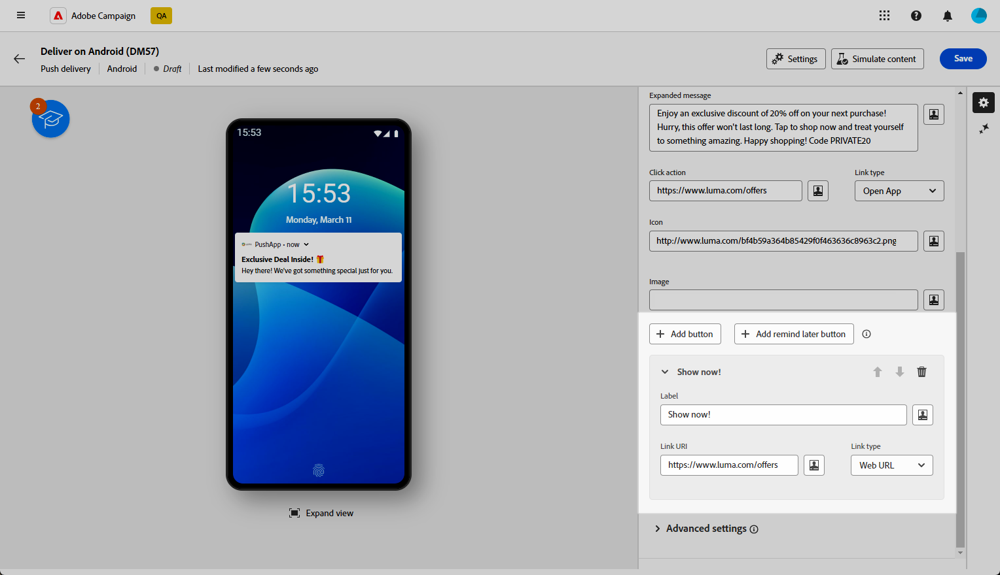

# 设计 Android 富推送投放 {#rich-push}

>[!CONTEXTUALHELP]
>id="acw_deliveries_push_remind_later"
>title="稍后提醒按钮"
>abstract="**稍后提醒**&#x200B;按钮提供了计划提醒的选项。时间戳字段需要一个表示 epoch 的值（以秒为单位）。"

>[!AVAILABILITY]
>
>此功能位于&#x200B;**有限可用性** (LA)。

使用Firebase Cloud Messaging，您可以选择两种类型的消息：

* **[!UICONTROL 数据消息]**&#x200B;由客户端应用程序处理。 这些消息将直接发送到移动设备应用程序，后者在设备上生成并显示Android通知。 数据消息仅包含您的自定义应用程序变量。

* **[!UICONTROL 通知消息]**，由FCM SDK自动处理。 FCM会代表客户端应用程序在用户设备上自动显示消息。 通知消息包含预定义的一组参数和选项，但仍可以使用自定义应用程序变量进一步个性化。

{zoomable="yes"}

## 定义通知的内容 {#push-message}

创建推送投放后，即可定义其内容。 提供了三个模板：

* **默认模板**&#x200B;允许您发送带有简单图标和随附图像的通知。

* **基本模板**&#x200B;可以在通知中包含文本、图像和按钮。

* **轮播模板**&#x200B;允许您发送包含用户可以轻扫的文本和多个图像的通知。

浏览以下选项卡，详细了解如何个性化这些模板。

>[!BEGINTABS]

>[!TAB 默认模板]

1. 从&#x200B;**[!UICONTROL 模板]**&#x200B;下拉列表中，选择&#x200B;**[!UICONTROL 默认值]**。

   

1. 若要撰写邮件，请在&#x200B;**[!UICONTROL 标题]**&#x200B;和&#x200B;**[!UICONTROL 邮件]**&#x200B;字段中输入您的文本。

   

1. 使用表达式编辑器定义内容、个性化数据和添加动态内容。 [了解详情](../personalization/personalize.md)

1. 定义与用户单击您的通知相关联的&#x200B;**[!UICONTROL 单击操作]**。 这会确定用户与通知交互时的行为，例如打开特定屏幕或在应用程序中执行特定操作。

1. 若要进一步个性化您的推送通知，您可以选择要添加到推送通知的&#x200B;**[!UICONTROL 图像]** URL，以及要在用户档案设备上显示的通知的&#x200B;**[!UICONTROL 图标]**。

   

1. 配置推送通知的&#x200B;**[!UICONTROL 高级设置]**。 [了解详情](#push-advanced)

定义消息内容后，您可以使用测试订阅者来预览和测试消息。

>[!TAB 基本模板]

1. 从&#x200B;**[!UICONTROL 模板]**&#x200B;下拉列表中，选择&#x200B;**[!UICONTROL 基本]**。

   

1. 若要撰写邮件，请在&#x200B;**[!UICONTROL 标题]**、**[!UICONTROL 邮件]**&#x200B;和&#x200B;**[!UICONTROL 扩展邮件]**&#x200B;字段中输入您的文本。

   在展开通知时，显示&#x200B;**[!UICONTROL 展开的消息]**&#x200B;时，折叠的视图中会显示&#x200B;**[!UICONTROL 消息]**&#x200B;文本。

   

1. 使用表达式编辑器定义内容、个性化数据和添加动态内容。 [了解详情](../personalization/personalize.md)

1. 添加定义与用户点击您的通知相关联的&#x200B;**[!UICONTROL 点击操作]**&#x200B;的URL。 这会确定用户与通知交互时的行为，例如打开特定屏幕或在应用程序中执行特定操作。

1. 选择添加到&#x200B;**[!UICONTROL 点击操作]**&#x200B;字段的URL的&#x200B;**[!UICONTROL 链接类型]**：

   * **[!UICONTROL Web URL]**： Web URL可将用户指引到在线内容。 单击后，它们将提示设备的默认Web浏览器打开并导航到指定的URL。

   * **[!UICONTROL 深层链接]**：深层链接是指引导用户访问应用程序内特定部分的URL，即使应用程序已关闭也是如此。 单击时，会显示一个对话框，允许用户从能够处理链接的各种应用程序中进行选择。

   * **[!UICONTROL 打开应用程序]**：打开应用程序URL允许您直接连接到应用程序中的内容。 它使您的应用程序能够绕过消除歧义对话框，将自身确立为特定类型链接的默认处理程序。

   有关如何处理Android应用程序链接的更多信息，请参阅[Android开发人员文档](https://developer.android.com/training/app-links)。

   

1. 若要进一步个性化您的推送通知，您可以选择要添加到推送通知的&#x200B;**[!UICONTROL 图像]** URL，以及要在用户档案设备上显示的通知的&#x200B;**[!UICONTROL 图标]**。

1. 单击&#x200B;**[!UICONTROL 添加按钮]**&#x200B;并填写以下字段：

   * **[!UICONTROL 标签]**：按钮上显示的文本。
   * **[!UICONTROL 链接URI]**：指定单击该按钮时要执行的URI。
   * **[!UICONTROL 链接类型]**：链接类型&#x200B;**[!UICONTROL Web URL]**、**[!UICONTROL 深层链接]**&#x200B;或&#x200B;**[!UICONTROL 打开应用程序]**。

   您可以选择在推送通知中最多包含三个按钮。 如果您选择&#x200B;**[!UICONTROL 稍后提醒按钮]**，则最多只能包含两个按钮。

   

1. 单击&#x200B;**[!UICONTROL 稍后添加提醒]**&#x200B;按钮，将稍后提醒选项添加到推送通知中。 输入&#x200B;**[!UICONTROL 标签]**&#x200B;和&#x200B;**[!UICONTROL 时间戳]**。

   时间戳字段需要一个表示纪元的值（以秒为单位）。

   

1. 配置推送通知的&#x200B;**[!UICONTROL 高级设置]**。 [了解详情](#push-advanced)

定义消息内容后，您可以使用测试订阅者来预览和测试消息。

>[!TAB 轮播模板]

1. 从&#x200B;**[!UICONTROL 模板]**&#x200B;下拉列表中，选择&#x200B;**[!UICONTROL 轮播]**。

   

1. 若要撰写邮件，请在&#x200B;**[!UICONTROL 标题]**、**[!UICONTROL 邮件]**&#x200B;和&#x200B;**[!UICONTROL 扩展邮件]**&#x200B;字段中输入您的文本。

   在展开通知时，显示&#x200B;**[!UICONTROL 展开的消息]**&#x200B;时，折叠的视图中会显示&#x200B;**[!UICONTROL 消息]**&#x200B;文本。

   

1. 使用表达式编辑器定义内容、个性化数据和添加动态内容。 [了解详情](../personalization/personalize.md)

1. 添加定义与用户点击您的通知相关联的&#x200B;**[!UICONTROL 点击操作]**&#x200B;的URL。 这会确定用户与通知交互时的行为，例如打开特定屏幕或在应用程序中执行特定操作。

1. 选择添加到&#x200B;**[!UICONTROL 点击操作]**&#x200B;字段的URL的&#x200B;**[!UICONTROL 链接类型]**：

   * **[!UICONTROL Web UR]**L： Web URL可将用户指引到在线内容。 单击后，它们将提示设备的默认Web浏览器打开并导航到指定的URL。

   * **[!UICONTROL 深层链接]**：深层链接是指引导用户访问应用程序内特定部分的URL，即使应用程序已关闭也是如此。 单击时，会显示一个对话框，允许用户从能够处理链接的各种应用程序中进行选择。

   * **[!UICONTROL 打开应用程序]**：打开应用程序URL允许您直接连接到应用程序中的内容。 它使您的应用程序能够绕过消除歧义对话框，将自身确立为特定类型链接的默认处理程序。

   有关如何处理Android应用程序链接的更多信息，请参阅[Android开发人员文档](https://developer.android.com/training/app-links)。

   

1. 若要进一步个性化推送通知，您可以选择通知的&#x200B;**[!UICONTROL 图标]**&#x200B;显示在用户档案的设备上。

1. 选择&#x200B;**[!UICONTROL 轮播]**&#x200B;的运行方式：

   * **[!UICONTROL 自动]**：将图像作为幻灯片自动循环，以预定义的间隔转换。
   * **[!UICONTROL 手动]**：允许用户在幻灯片之间手动滑动以浏览图像。

     启用&#x200B;**[!UICONTROL 幻灯片]**&#x200B;选项，在主幻灯片旁包含上一张和下一张图像的预览。

1. 单击&#x200B;**[!UICONTROL 添加图像]**&#x200B;并输入图像URL和文本。

   确保您至少包含三个图像，最多包含五个图像。

   

1. 使用向下和向上箭头处理图像的顺序。

1. 配置推送通知的&#x200B;**[!UICONTROL 高级设置]**。 [了解详情](#push-advanced)

定义消息内容后，您可以使用测试订阅者来预览和测试消息。

>[!ENDTABS]

## 推送通知高级设置 {#push-advanced}

{zoomable="yes"}

| 参数 | 说明 |
|---------|---------|
| **[!UICONTROL 图标颜色]** | 使用十六进制颜色代码设置图标的颜色。 |
| **[!UICONTROL 标题颜色]** | 使用十六进制颜色代码设置标题的颜色。 |
| **[!UICONTROL 消息文本颜色]** | 使用十六进制颜色代码设置消息文本的颜色。 |
| **[!UICONTROL 通知背景颜色]** | 使用十六进制颜色代码设置通知背景的颜色。 |
| **[!UICONTROL 声音]** | 设置设备收到通知时播放的声音。 |
| **[!UICONTROL 通知计数]** | 设置直接在应用程序图标上显示的新未读信息数。 这样用户即可迅速了解待处理通知的数量。 |
| **[!UICONTROL 渠道ID]** | 设置通知的渠道ID。 在收到任何具有此渠道ID的通知之前，应用程序必须创建具有此渠道ID的渠道。 |
| **[!UICONTROL 标记]** | 设置用于替换通知抽屉中现有通知的标识符。 这有助于防止累积多个通知，并确保只显示最新的相关通知。 |
| **[!UICONTROL 优先级]** | 设置通知的优先级，可以是默认、最小、低或高。 优先级决定了通知的重要性和紧迫性，会影响通知的显示方式以及它是否可以绕过某些系统设置。 有关详细信息，请参阅[FCM文档](https://firebase.google.com/docs/reference/fcm/rest/v1/projects.messages#notificationpriority)。 |
| **[!UICONTROL 可见性]** | 设置通知的可见性级别，可以是公共、私有或机密。 可见性级别确定通知内容在锁屏界面和其他敏感区域上显示的程度。 有关详细信息，请参阅[FCM文档](https://firebase.google.com/docs/reference/fcm/rest/v1/projects.messages#visibility)。 |
| **[!UICONTROL 粘性通知]** | 激活后，通知仍保持可见，即使用户单击它也是如此。  如果停用，则当用户与通知交互时，该通知将自动取消。 粘性行为允许重要通知在屏幕上保留较长时间。 |
| **[!UICONTROL 应用程序变量]** | 允许您定义通知行为。 可完全自定义这些变量，并将其纳入发送到移动设备的消息负载。 |
