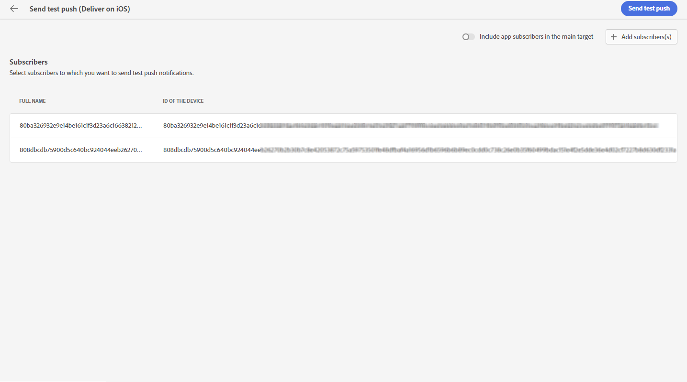
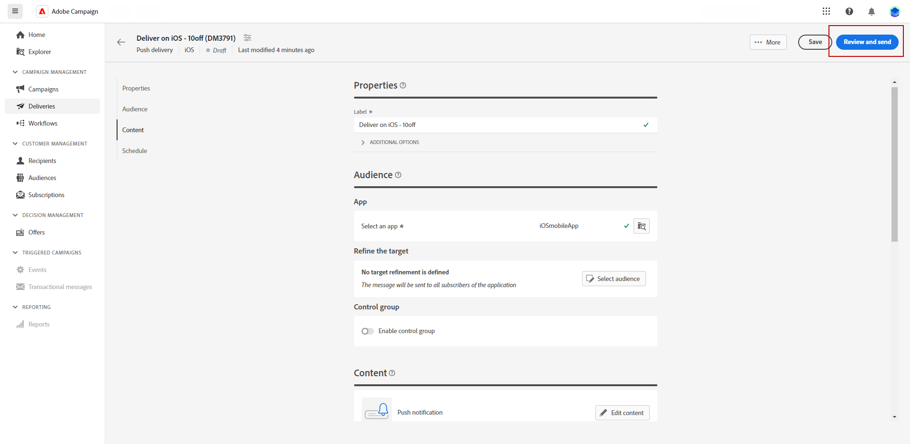

# 预览并发送推送通知投放 {#send-push-delivery}

## 预览推送通知投放 {#preview-push}

定义消息内容后，您可以利用测试订阅者来预览和测试消息。 如果您已包含个性化内容，则可以使用测试用户档案数据检查此内容在消息中的显示方式。 这样，您就可以确保正确呈现消息，并正确合并个性化元素。

预览短信投放的主要步骤如下。 有关如何预览投放的更多详细信息，请参阅 [本节](../preview-test/preview-content.md).

1. 在投放内容页面中，使用 **[!UICONTROL 模拟内容]** 以预览您的个性化内容。

   

1. 单击 **[!UICONTROL 添加订阅者]** 选择一个或多个用户档案，以在推送通知内容中预览其数据。

   <!--Once your test subscribers are selected, click **[!UICONTROL Select]**.
    -->

1. 在右侧窗格中，您将找到推送通知的预览，其中个性化元素会动态替换为所选配置文件中的数据。

   

您现在可以检查推送通知并将其发送给受众。

## 测试您的推送通知投放 {#test-push}

使用 **Adobe Campaign**，您能够在将推送通知发送给主受众之前对其进行测试。 此步骤对于验证投放和识别任何问题都非常重要。
测试收件人可以查看链接、图像和个性化设置等元素，确保最佳性能并检测任何错误。 此过程可帮助您在联系主受众之前优化推送通知。

 了解如何在中发送测试推送通知 [本节](../preview-test/test-deliveries.md#subscribers).

## 发送推送通知投放 {#send-push}

1. 个性化推送通知内容后，单击 **[!UICONTROL 查看并发送]** 来自您的 **[!UICONTROL 投放]** 页面。

   

1. 单击**[!UICONTROL 准备]**并监控提供的进度和统计数据。

   如果发生任何错误，请参阅日志菜单以了解有关失败的详细信息。

   

1. 通过单击 **[!UICONTROL 发送]** 以继续进行最终发送过程。

1. 通过单击 **[!UICONTROL 发送]** 或 **[!UICONTROL 按计划发送]** 按钮。

   

发送投放后，您可以从投放页面跟踪KPI（关键绩效指标）数据，并从 **[!UICONTROL 日志]** 菜单。

您现在可以使用内置报告开始衡量消息的影响。 [了解详情](../reporting/push-report.md)
