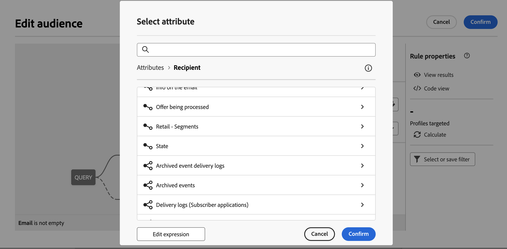

# 构建您的第一个查询 {#build-query}

要开始构建查询，请从您选择的位置访问查询建模器，具体取决于您要执行的操作。 此时将打开查询建模器，并显示一个空白画布。 单击 **+** 按钮以配置查询的第一个节点。

可添加两种类型的元素：

* **筛选组件** （自定义条件、选择受众、预定义过滤器）允许您构建自己的规则，选择受众或预定义过滤器以细化查询。 [了解如何使用筛选组件](#filtering)

  例如：

  *订阅“体育”新闻稿的收件人*. *居住在纽约的收件人*， *居住在旧金山的收件人*

* **组操作员** (AND、OR、EXCEPT)允许您根据自己的需要，将图中的过滤组件组合在一起。 [了解如何使用操作员](#filtering)

  例如：

  *订阅“体育”新闻稿的收件人&#x200B;**和**住在纽约的人&#x200B;**或者**旧金山*.

## 添加筛选组件 {#filtering}

通过筛选组件，您可以使用以下内容优化查询：

* **自定义完成情况**：通过使用数据库和高级表达式的属性构建您自己的条件来筛选查询。
* **受众**：使用现有受众筛选查询。
* **预定义过滤器**：使用现有的预定义过滤器过滤查询。

### 配置自定义条件

>[!CONTEXTUALHELP]
>id="acw_orchestration_querymodeler_customcondition"
>title="自定义条件"
>abstract="自定义条件"

要使用自定义条件筛选查询，请执行以下步骤：

1. 单击 **+** 按钮，然后选择 **[!UICONTROL 自定义完成情况]**. 自定义条件属性窗格将在右侧打开。

1. 在 **属性** 字段，从数据库中选择要用于创建条件的属性。 属性列表包含Campaign数据库中的所有属性，包括链接到表的属性。

   

   >[!NOTE]
   >
   >使用编辑表达式按钮，您可以利用Campaign Web表达式编辑器，使用数据库和帮助程序函数中的字段手动定义表达式。

1. 从下拉列表中选择要应用的运算符。 可以使用各种运算符。 请注意，下拉列表中可用的运算符取决于属性的数据类型。

   +++可用运算符列表

   | 操作员 | 用途 | 示例 |
   |  ---  |  ---  |  ---  |
   | 等于 | 返回与在第二个“值”列中输入的数据相同的结果。 | 姓氏(@lastName)等于“Jones”，将仅返回姓氏为Jones的收件人。 |
   | 不等于 | 返回与输入值不相同的所有值。 | 等于“英语”的语言(@language) |
   | 大于 | 返回大于输入值的值。 | 年龄(@age)大于50</strong>，将返回所有大于“50”的值，如“51”、“52”等。 |
   | 小于 | 返回小于输入值的值。 | 创建日期(@created)早于“DaysAgo(100)”</strong>，将返回之前100天创建的所有收件人。 |
   | 大于或等于 | 返回所有等于或大于输入值的值。 | 年龄(@age)大于或等于“30”</strong>，将返回所有30岁或以上的收件人。 |
   | 小于或等于 | 返回等于或小于输入值的所有值。 | 年龄(@age)小于或等于“60”</strong>，将返回所有60岁或以下的收件人。 |
   | 包含在 | 返回指定值中包含的结果。 这些值必须以逗号分隔。 | 出生日期(@birthDate)包含在“12/10/1979,12/10/1984”中，将返回这些日期之间出生的收件人。 |
   | 不在 | 其工作方式与包含在运算符中类似。 在本例中，我们要根据输入的值排除收件人。 | 出生日期(@birthDate)未列入`12/10/1979,12/10/1984`。 与上一个示例不同，不会返回这些日期内出生的收件人。 |
   | 为空 | 在这种情况下，我们要查找的结果与第二个“值”列中的空值匹配。 | Mobile (@mobilePhone)为空，则会返回所有没有手机号码的收件人。 |
   | 不为空 | 与Is empty运算符相反。 无需在第二个“值”列中输入数据。 | 电子邮件(@email)不为空。 |
   | 开始于 | 返回以输入值开头的结果。 | 帐户# (@account)以“32010”开头。 |
   | 开头不是 | 返回不以输入值开头的结果 | 帐户# (@account)不以“20”开头 |
   | 包含 | 返回至少包含输入值的结果。 | 电子邮件域(@domain)包含“mail”</strong>，将返回包含“mail”的所有域名。 因此，也会返回“gmail.com”域。 |
   | 不包含 | 返回不包含输入值的结果。 | 电子邮件域(@domain)不包含“vo”</strong>. 在这种情况下，将不返回包含“vo”的域名。 “voila.fr”域名将不会显示在结果中。 |
   | 类似 | Like与Contains运算符非常相似。 利用该运算符，可在值中插入%通配符。 | 姓氏(@lastName)，如“Jon%s”。 在本例中，如果操作员忘记了“n”和“s”之间缺少的字母，则使用通配符作为“绝招”来查找名称“Jones”。 |
   | 不相似 | Like与Contains运算符非常相似。 利用该运算符，可在值中插入%通配符。 | 姓氏(@lastName)不像“Smi%h”。 在此，将不会返回姓氏为“Smi%h”的收件人。 |

+++

1. 在 **值** 字段，定义预期值。 您还可以利用Campaign Web表达式编辑器，使用数据库和帮助程序函数中的字段手动定义表达式。 要执行此操作，请单击 **编辑表达式** 按钮。

   *返回所有年龄为21岁或以上的用户档案的查询示例：*

   

**远程表上的自定义条件（1-1和1-N链接）**

自定义条件允许您查询链接到收件人表的远程表。

对于 **1-1链接** 使用其他数据库资源，直接从目标表中选择值。

+++查询示例

在此，查询将定向其国家或地区包含在给定值（英国和美国）中的收件人

+++

对于 **1-N链接** 使用另一个数据库资源，可以在该第二个资源的字段上定义子条件。

例如，您可以在用户档案购买中选择存在运算符，以定向存在购买的所有用户档案。 完成后，为叫客过渡添加自定义条件，并创建过滤器以满足您的需求。

+++查询示例

在本例中，查询将定向购买与BrewMaster产品相关的收件人，购买总额至少为100$。

+++

### 选择受众

>[!CONTEXTUALHELP]
>id="acw_orchestration_querymodeler_selectaudience"
>title="选择受众"
>abstract="选择受众"

要使用现有受众筛选查询，请执行以下步骤：

1. 单击 **+** 按钮，然后选择 **[!UICONTROL 选择受众]**.

1. 此 **选择受众** “属性”窗格将在右侧打开。 选择要用于筛选查询的受众。

   *查询示例返回属于“节日观看者”受众的所有用户档案：*

   

### 使用预定义过滤器

>[!CONTEXTUALHELP]
>id="acw_orchestration_querymodeler_predefinedfilter"
>title="预定义过滤器"
>abstract="预定义过滤器"

要使用预定义过滤器过滤查询，请执行以下步骤：

1. 单击 **+** 按钮，然后选择 **[!UICONTROL 预定义过滤器]**.

1. 此 **预定义过滤器** “属性”窗格将在右侧打开。 从自定义筛选器列表或收藏夹中选择一个预定义筛选器。

   *返回与“不活跃客户”预定义过滤器对应的所有用户档案的查询示例：*

   

## 将过滤组件与运算符相结合 {#operators}

>[!CONTEXTUALHELP]
>id="acw_orchestration_querymodeler_group"
>title="组"
>abstract="组"

每次将新的筛选组件添加到查询时，它都会通过AND运算符自动链接到另一个组件。 这意味着来自这两个筛选组件的结果将合并到查询结果中。

在此示例中，我们在第二个过渡中添加了新的受众类型筛选组件。 该组件链接到带有AND运算符的预定义过滤器类型条件，这意味着查询结果包括被“Madridians”预定义过滤器定位且属于“Discount hunters”受众的收件人。

要更改用于将筛选条件链接在一起的运算符，请单击该运算符，然后在右侧打开的“组”窗格中选择所需的运算符。

可用的运算符包括：

* **AND（交集）**：组合与叫客过渡中所有筛选组件匹配的结果。
* **OR（并集）**：包括与叫客过渡中的至少一个筛选组件匹配的结果。
* **排除（排除）**：排除与叫客过渡中所有筛选组件匹配的结果。

## 检查并验证您的查询

>[!CONTEXTUALHELP]
>id="acw_orchestration_querymodeler_ruleproperties"
>title="规则属性"
>abstract="规则属性"

在画布中构建查询后，您可以使用 **规则属性** 窗格位于右侧。 可用的操作包括：

* **查看结果：** 显示查询生成的数据。
* **代码视图**：显示SQL中查询的基于代码的版本。
* **计算**：更新和显示您的查询所定向的记录数。
* **选择或保存筛选器**：选择要在画布中使用的现有预定义过滤器，或将查询另存为预定义过滤器以供将来重用。 [了解如何使用预定义过滤器](../get-started/predefined-filters.md)

  >[!IMPORTANT]
  >
  >从规则属性窗格中选择一个预定义过滤器，将画布中构建的查询替换为所选过滤器。
