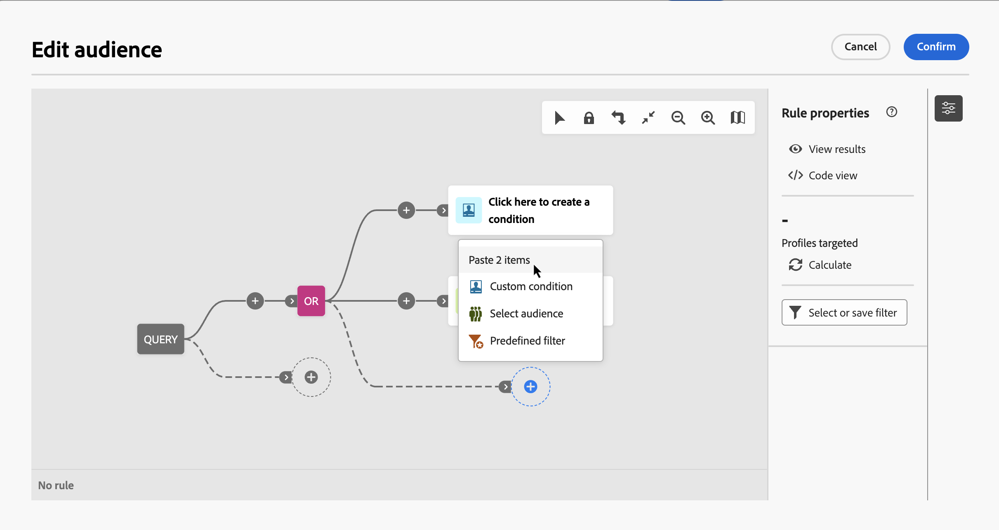
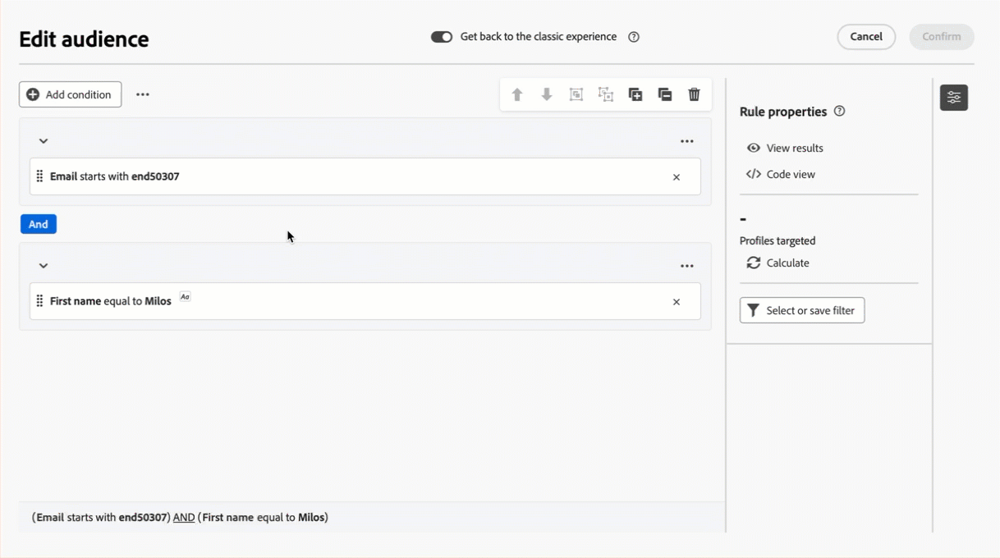
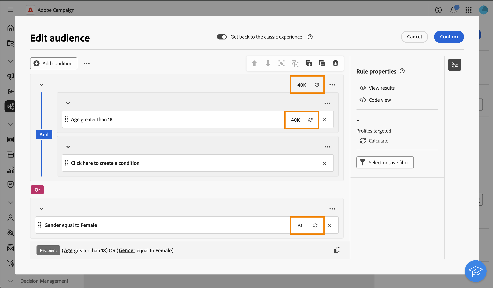

# 生成您的第一个查询 {#build-query}

要开始构建查询，请从您选择的位置访问查询建模器，具体取决于您要执行的操作。 此时将打开查询建模器，并显示一个空白画布。 单击&#x200B;**+**&#x200B;按钮配置查询的第一个节点。

>[!IMPORTANT]
>
>提供了全新的查询建模器界面。 新的规则生成器简化了界面，让您能够更轻松地构建查询。 要切换到此体验，请按右上角的切换按钮。 您可以随时返回经典查询建模器，只需返回切换开关以禁用新界面即可。 您可以应用与这个新界面中的查询建模器相同的原则。
>&#x200B;>{zoomable="yes"}切换的图像

可添加两种类型的元素：

* **筛选组件**（自定义条件、选择受众、预定义过滤器）允许您构建自己的规则、选择受众或使用预定义过滤器来优化查询。 它们会添加到查询的开头和点状过渡中。 [了解如何使用筛选组件](#filtering)

  示例：*订阅“体育”新闻通讯的收件人*、*在纽约的收件人*、*旧金山的收件人*

>[!BEGINTABS]

>[!TAB 经典查询建模器]

{zoomable="yes"}

>[!TAB 新规则生成器]

{zoomable="yes"}

>[!ENDTABS]

* **组操作员** ( AND、OR、EXCEPT)允许您对图中的筛选组件进行分组。 它们会添加到现有过渡中，然后是筛选组件。 [了解如何使用操作员](#filtering)

  示例： *超级VIP **和** VIP的收件人，用于奖励&#x200B;**OR** VIP演示，**EXCEPT**&#x200B;名21岁及以上45岁的收件人。

>[!BEGINTABS]

>[!TAB 经典查询建模器]

{zoomable="yes"}

>[!TAB 新规则生成器]

{zoomable="yes"}

>[!ENDTABS]

## 查询中的值分布 {#distribution-values-query}

值分布根据当前查询参数显示表中字段的每个值的百分比。 了解查询中值的分布有助于优化分段。

要访问此选项，请在查询中单击属性选择按钮，如下所示。 然后，单击选定属性旁边的&#x200B;**[!UICONTROL 信息]**&#x200B;图标。 您可以访问&#x200B;**[!UICONTROL 值分布]**&#x200B;按钮。

{zoomable="yes"}

>[!NOTE]
>
>* 对于具有许多值的字段，仅显示前20个值。 在这种情况下，通知&#x200B;**[!UICONTROL 部分加载]**&#x200B;会警告您。
>* 在每个属性选取器中都可以访问&#x200B;**[!UICONTROL 值分布]**&#x200B;选项。 [了解如何选择属性](../get-started/attributes.md)
>* 您可以使用&#x200B;**[ !A高级筛选器]**&#x200B;对结果添加条件。 [在此处了解详情](../get-started/work-with-folders.md#filter-the-values)。

## 添加筛选组件 {#filtering}

通过筛选组件，您可以使用以下内容优化查询：

* **[自定义条件](#custom-condition)**：通过使用数据库和高级表达式中的属性构建您自己的条件来筛选查询。
* **[受众](#audiences)**：使用现有受众筛选查询。
* **[预定义筛选器](#predefined-filters)**：使用现有的预定义筛选器筛选查询。

### 配置自定义条件 {#custom-condition}

>[!CONTEXTUALHELP]
>id="acw_orchestration_querymodeler_customcondition"
>title="自定义条件"
>abstract="自定义条件是筛选组件，它们使您可通过从数据库和高级表达式构建您自己的带属性条件而筛选您的查询。"

要使用自定义条件筛选查询，请执行以下步骤：

1. 单击所需节点上的&#x200B;**+**&#x200B;按钮，然后选择&#x200B;**[!UICONTROL 自定义条件]**。 自定义条件属性窗格将在右侧打开。

1. 在&#x200B;**属性**&#x200B;字段中，从数据库中选择要用于创建条件的属性。 属性列表包含campaign数据库中的所有属性，包括链接表中的属性。 [了解如何选择属性并将其添加到收藏夹](../get-started/attributes.md)

   {zoomable="yes"}

   >[!NOTE]
   >
   >通过&#x200B;**编辑表达式**&#x200B;按钮，您可以使用Campaign Web表达式编辑器使用数据库和帮助程序函数中的字段手动定义表达式。 [了解如何编辑表达式](expression-editor.md)

1. 从下拉列表中选择要应用的运算符。 可以使用各种运算符。 请注意，下拉列表中可用的运算符取决于属性的数据类型。

   +++可用运算符列表

   | 操作员 | 用途 | 示例 |
   |---|---|---|
   | 等于 | 返回与在第二个“值”列中输入的数据相同的结果。 | 等于“Jones”的姓氏(@lastName)将仅返回姓氏为Jones的收件人。 |
   | 不等于 | 返回与输入值不相同的所有值。 | 语言(@language)不等于“英语”。 |
   | 大于 | 返回大于输入值的值。 | 年龄(@age)大于50将返回所有大于“50”的值，如“51”、“52”。 |
   | 小于 | 返回小于输入值的值。 | “DaysAgo(100)”之前的创建日期(@created)将返回所有在100天内创建的收件人。 |
   | 大于或等于 | 返回所有等于或大于输入值的值。 | 年龄(@age)大于或等于“30”将返回所有30岁或以上的收件人。 |
   | 小于或等于 | 返回等于或小于输入值的所有值。 | 年龄(@age)小于或等于“60”将返回所有60岁或以下的收件人。 |
   | 包含在 | 返回指定值中包含的结果。 这些值必须以逗号分隔。 | 出生日期(@birthDate)包含在“12/10/1979,12/10/1984”中，将返回这些日期之间出生的收件人。 |
   | 不在 | 其工作方式与包含在运算符中类似。 在本例中，将根据输入的值排除收件人。 | 出生日期(@birthDate)未列入`12/10/1979,12/10/1984`。 将不会返回在这些日期中出生的收件人。 |
   | 为空 | 返回与第二个“值”列中的空值匹配的结果。 | Mobile (@mobilePhone)为空，则会返回所有没有手机号码的收件人。 |
   | 不为空 | 与Is empty运算符相反。 无需在第二个“值”列中输入数据。 | 电子邮件(@email)不为空。 |
   | 开始于 | 返回以输入值开头的结果。 | 帐户# (@account)以“32010”开头。 |
   | 开头不是 | 返回不以输入值开头的结果。 | 帐户# (@account)不以“20”开头。 |
   | 包含 | 返回至少包含输入值的结果。 | 包含“mail”的电子邮件域(@domain)将返回包含“mail”的所有域名，如“gmail.com”。 |
   | 不包含 | 返回不包含输入值的结果。 | 电子邮件域(@domain)不包含“vo”。 包含“vo”的域名（如“voila.fr”）将不会显示在结果中。 |
   | 类似 | 与Contains运算符类似，它允许您在值中插入%通配符。 | 姓氏(@lastName)，如“Jon%s”。 通配符用作“小丑”，可查找诸如“Jones”之类的姓名。 |
   | 不相似 | 与Contains运算符类似，它允许您在值中插入%通配符。 | 姓氏(@lastName)不像“Smi%h”。 不会返回姓氏为“Smith”的收件人。 |

   +++

1. 在&#x200B;**值**&#x200B;字段中，定义预期值。 您还可以使用Campaign Web表达式编辑器，使用数据库和帮助程序函数中的字段手动定义表达式。 为此，请单击&#x200B;**编辑表达式**&#x200B;按钮。 [了解如何编辑表达式](expression-editor.md)

   *返回所有年龄为21岁或以上的用户档案的查询示例：*

>[!BEGINTABS]

>[!TAB 经典查询建模器]

{zoomable="yes"}

>[!TAB 新规则生成器]

{zoomable="yes"}

>[!ENDTABS]

对于日期类型属性，使用&#x200B;**[!UICONTROL 预设]**&#x200B;选项可以获得预定义的值。

>[!BEGINTABS]

>[!TAB 经典查询建模器]

{zoomable="yes"}

>[!TAB 新规则生成器]

{zoomable="yes"}

>[!ENDTABS]

#### 链接表（1-1和1-N链接）上的自定义条件{#links}

自定义条件允许您查询链接到规则当前使用的表的表。 这包括具有1-1基数链接的表，或集合表（1-N链接）。

对于&#x200B;**1-1链接**，导航到链接表，选择所需属性并定义预期值。

您还可以直接选择&#x200B;**值**&#x200B;选取器中的表链接并进行确认。 在这种情况下，需要使用专用选取器来选择对所选表可用的值，如下面的示例所示。

+++查询示例

在本例中，查询的目标品牌标签为“正在运行”。

1. 在&#x200B;**Brand**&#x200B;表中导航并选择&#x200B;**标签**&#x200B;属性。

   {zoomable="yes"}{width="85%" align="center"}

1. 定义属性的预期值。

   {zoomable="yes"}{width="85%" align="center"}

以下是一个直接选择表链接的查询示例。 必须从专用选取器中选择此表的可用值。

{zoomable="yes"}{width="85%" align="center"}

+++ 

对于&#x200B;**1-N链接**，您可以定义子条件来优化查询，如下面的示例所示。

+++查询示例

在本例中，查询将定向购买与BrewMaster产品相关的收件人，购买总额至少为100$。

1. 选择&#x200B;**购买**&#x200B;表并进行确认。

   {zoomable="yes"}{width="50%" align="center"}

1. 将添加叫客过渡，从而允许您创建子条件。

   {zoomable="yes"}{width="85%" align="center"}

1. 选择&#x200B;**价格**&#x200B;属性，目标购买金额不少于1000$

   {zoomable="yes"}{width="85%" align="center"}

1. 根据您的需要添加子条件。 在此，我们添加了条件来定向购买BrewMaster产品的用户档案。

   {zoomable="yes"}{width="85%" align="center"}

+++ 

#### 使用聚合数据 {#aggregate}

自定义条件允许您执行聚合操作。 要实现此目的，需要直接从集合表中选择属性：

1. 在所需的集合表中导航，并选择要对其执行聚合操作的属性。

   {zoomable="yes"}{width="85%" align="center"}

1. 在属性窗格中，打开&#x200B;**聚合数据**&#x200B;选项并选择所需的聚合函数。

>[!BEGINTABS]

>[!TAB 经典查询建模器]

{zoomable="yes"}{width="85%" align="center"}

>[!TAB 新规则生成器]

{zoomable="yes"}{width="85%" align="center"}

>[!ENDTABS]

### 选择受众 {#audiences}

>[!CONTEXTUALHELP]
>id="acw_orchestration_querymodeler_selectaudience"
>title="选择受众"
>abstract="通过使用&#x200B;**选择受众**&#x200B;选项，您可以选择想要用来过滤查询的受众。"

要使用现有受众筛选查询，请执行以下步骤：

>[!BEGINTABS]

>[!TAB 经典查询建模器]

1. 单击所需节点上的&#x200B;**+**&#x200B;按钮，然后选择&#x200B;**[!UICONTROL 选择受众]**。

1. 将在右侧打开&#x200B;**选择受众**&#x200B;属性窗格。 选择要用于筛选查询的受众。

   *返回属于“节日出席者”受众的所有用户档案的查询示例：*

   {zoomable="yes"}

>[!TAB 新规则生成器]

1. 单击“**添加条件**”按钮旁边的“**[!UICONTROL 展开]**”按钮，然后选择“**[!UICONTROL 选择受众]**”。

1. 将在右侧打开&#x200B;**选择受众**&#x200B;属性窗格。 选择要用于筛选查询的受众。

   *返回属于“Coffee Works”受众的所有用户档案的查询示例：*

   {zoomable="yes"}

>[!ENDTABS]

### 使用预定义过滤器 {#predefined-filters}

>[!CONTEXTUALHELP]
>id="acw_orchestration_querymodeler_predefinedfilter"
>title="预定义过滤器"
>abstract="通过使用&#x200B;**预定义过滤器**&#x200B;选项，您可以从自定义过滤器列表或收藏夹中选择一个预定义过滤器。"

要使用预定义过滤器过滤查询，请执行以下步骤：

>[!BEGINTABS]

>[!TAB 经典查询建模器]

1. 单击所需节点上的&#x200B;**+**&#x200B;按钮，然后选择&#x200B;**[!UICONTROL 预定义过滤器]**。

1. 将在右侧打开&#x200B;**预定义过滤器**&#x200B;属性窗格。 从自定义筛选器列表或收藏夹中选择一个预定义筛选器。

   *查询示例返回与“非活动客户”预定义筛选器对应的所有用户档案：*

   {zoomable="yes"}

>[!TAB 新规则生成器]

1. 单击“**添加条件**”按钮旁边的“**[!UICONTROL 展开]**”按钮，然后选择“**[!UICONTROL 预定义过滤器]**”。

1. 将在右侧打开&#x200B;**预定义过滤器**&#x200B;属性窗格。 从自定义筛选器列表或收藏夹中选择一个预定义筛选器。

   *查询示例返回与“非活动客户”预定义筛选器对应的所有用户档案：*

   {zoomable="yes"}

>[!ENDTABS]

### 复制粘贴组件 {#copy}

查询建模器允许您复制一个或多个筛选组件并将它们粘贴到过渡的末尾。 可以在当前查询画布中或实例中的任何画布中执行此操作。

>[!NOTE]
>
>只要您在实例中工作，复制的选定内容就会保留。 如果您注销并重新登录，则您的选择将不再可用于粘贴。

>[!IMPORTANT]
>
>目前无法复制和粘贴新规则生成器体验中的组件。 若要执行以下步骤，请单击顶部的&#x200B;**[!UICONTROL 返回经典体验]**&#x200B;切换开关以使用经典查询建模器。

要复制并粘贴筛选组件，请执行以下步骤：

1. 在查询画布中单击要复制的筛选组件，以选择该组件。 要选择多个组件，请使用位于画布右上角的工具栏中提供的多选工具。

1. 单击组件属性窗格或屏幕底部的蓝色功能区中的&#x200B;**[!UICONTROL 复制]**&#x200B;按钮（如果已选择多个组件）。

   | 复制单个组件 | 复制多个组件 |
   |  ---  |  ---  |
   | {zoomable="yes"}{width="200" align="center" zoomable="yes"} | {zoomable="yes"}{width="200" align="center" zoomable="yes"} |

1. 要粘贴组件，请单击所需过渡末尾的+按钮，然后选择&#x200B;**粘贴n个项目**。

   {zoomable="yes"}

## 拖放组件 {#drag-and-drop}

>[!IMPORTANT]
>
>此功能仅适用于新的规则生成器体验。

将组件添加到查询时，可以使用拖放功能上下移动组件。

在每个组件的左侧，您可以单击圆点并按住圆点，以根据要放置和分组组件的位置来上下拖动组件。

{zoomable="yes"}

## 将过滤组件与运算符相结合 {#operators}

>[!CONTEXTUALHELP]
>id="acw_orchestration_querymodeler_group"
>title="组"
>abstract="在此窗格中，您可以更改用于链接筛选条件的运算符。"

每次将新的筛选组件添加到查询时，它都会通过&#x200B;**AND**&#x200B;运算符自动链接到另一个组件。 这意味着来自两个过滤组件的结果将组合在一起。

在此示例中，我们在第二个过渡中添加了新的受众类型筛选组件。 该组件链接到带有&#x200B;**AND**&#x200B;运算符的预定义过滤器条件，这意味着查询结果包含受“新闻稿订阅者 — 马德里”预定义过滤器定向并属于“购买者（所有时间）”受众的收件人。

>[!BEGINTABS]

>[!TAB 经典查询建模器]

{zoomable="yes"}

若要更改用于将筛选条件链接在一起的运算符，请单击该运算符，然后在右侧打开的&#x200B;**组**&#x200B;窗格中选择所需的运算符。

可用的运算符包括：

* **AND （交集）**：将匹配出站过渡中所有筛选组件的结果组合在一起。
* **OR （并集）**：包含与叫客过渡中至少一个筛选组件匹配的结果。
* **EXCEPT （排除）**：排除与叫客过渡中所有筛选组件匹配的结果。

{zoomable="yes"}

此外，通过将组件分组到同一组中并将它们链接在一起，可以创建中间组件组。 这样一来，默认情况下，将放入AND运算符，然后您可以将其更改为所需的运算符。

>[!TAB 新规则生成器]

{zoomable="yes"}

要更改用于将筛选条件链接在一起的运算符，请单击该运算符，它将更改为OR、EXCEPT，然后返回到AND，并选择所需的运算符。

可用的运算符包括：

* **AND （交集）**：将匹配出站过渡中所有筛选组件的结果组合在一起。
* **OR （并集）**：包含与叫客过渡中至少一个筛选组件匹配的结果。
* **EXCEPT （排除）**：排除与叫客过渡中所有筛选组件匹配的结果。

{zoomable="yes"}

>[!ENDTABS]

在下面的示例中，我们创建了一个中间组，以包含“要奖励的VIP”或“超级VIP”受众的结果。

>[!BEGINTABS]

>[!TAB 经典查询建模器]

{zoomable="yes"}

>[!TAB 新规则生成器]

{zoomable="yes"}

>[!ENDTABS]

## 检查并验证您的查询

>[!CONTEXTUALHELP]
>id="acw_orchestration_querymodeler_ruleproperties"
>title="规则属性"
>abstract="在画布中生成查询后，即可使用位于右侧的&#x200B;**规则属性**&#x200B;窗格检查该查询。 通过此窗格，可显示所得的数据、检索该查询的某个 SQL 代码版本以及检查目标记录的数量。 使用&#x200B;**选择或保存过滤器**&#x200B;按钮将您的查询另存为预定义的过滤器，或将画布内容替换为某个现有的过滤器。"

在画布中构建查询后，可以使用右侧的&#x200B;**规则属性**&#x200B;窗格对其进行检查。在构建查询以创建受众时，将显示此窗格。 可用的操作包括：

* **查看结果：**&#x200B;显示查询产生的数据。
* **代码视图**：显示SQL中查询的基于代码的版本。
* **计算**：更新并显示查询所定向的记录数。
* **选择或保存筛选器**：选择要在画布中使用的现有预定义筛选器，或将查询另存为预定义筛选器以供将来重用。 [了解如何使用预定义过滤器](../get-started/predefined-filters.md)

  >[!IMPORTANT]
  >
  >从规则属性窗格中选择一个预定义过滤器，将画布中构建的查询替换为所选过滤器。

使用新的规则生成器体验时，您可以直接显示每个条件和组的目标群体：

* 单击所需条件或组上的&#x200B;**计算条件**&#x200B;图标以计算和显示查询所定向的记录数。
* 单击结果编号可查看记录的详细列表。

{zoomable="yes"}

查询就绪后，单击右上角的&#x200B;**[!UICONTROL 确认]**&#x200B;按钮进行保存。

>[!BEGINTABS]

>[!TAB 经典查询建模器]

您可以随时通过打开查询来修改查询。 请记住，打开现有查询时，它以简化视图显示，没有&#x200B;**+**&#x200B;按钮。 要向查询添加新元素，请在画布上选择一个组件或运算符以显示&#x200B;**+**&#x200B;按钮。

{zoomable="yes"}

>[!TAB 新规则生成器]

您可以随时通过打开查询来修改查询，为此，请单击左上角的&#x200B;**[!UICONTROL 添加条件]**&#x200B;按钮。

{zoomable="yes"}

>[!ENDTABS]
