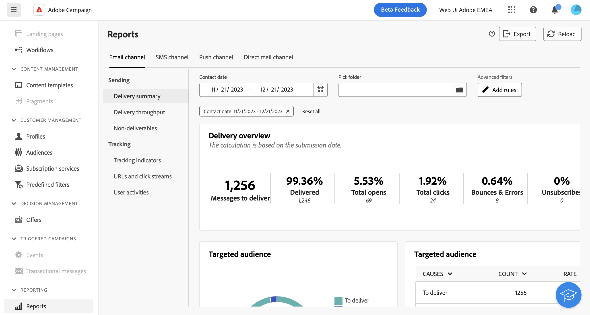

# 使用查询建模器 {#segment-builder}

>[!CONTEXTUALHELP]
>id="acw_homepage_card5"
>title="新的查询建模器"
>abstract="Adobe Campaign Web 具有一个查询建模器，可简化筛选数据库的过程，以根据各种条件选择特定目标。这包括高级表达式和运算符的使用。查询建模器适用于您需要通过定义规则来过滤数据的每个上下文。"

>[!CONTEXTUALHELP]
>id="acw_orchestration_querymodeler_querymessage"
>title="查询建模器"
>abstract="为收件人或数据库中的任何其他定位维度定义过滤条件。利用 Adobe Experience Platform 受众进一步细化目标受众，并最大限度地提高营销活动的影响力。"

Adobe Campaign Web 具有一个查询建模器，可简化筛选数据库的过程，以根据各种条件选择特定目标。这包括使用高级表达式和运算符。

## 访问查询建模器

查询建模器适用于您需要通过定义规则来过滤数据的每个上下文。

| 使用情况 | 示例 |
|  ---  |  ---  |
| **定义受众**：指定要在消息或工作流中定位的群体，并根据您的需求轻松创建新受众。 | {width="200" align="center" zoomable="yes"} |
| **自定义工作流活动**：在工作流活动（如拆分和协调）中应用规则以满足您的特定要求。 | {width="200" align="center" zoomable="yes"} |
| **预定义过滤器**：创建预定义过滤器，这些过滤器在各种过滤操作期间用作快捷键，无论您是使用数据列表还是构成投放的受众。 | {width="200" align="center" zoomable="yes"} |
| **过滤报表数据**：添加规则以筛选报表中显示的数据。 | {width="200" align="center" zoomable="yes"} |
| **自定义列表**：创建自定义规则以过滤在列表（如收件人、投放列表等）中显示的数据。 | {width="200" align="center" zoomable="yes"} |

<!--**Dynamize content**: make your content dynamic by creating conditions that define which content should be displayed to different recipients, ensuring personalized and relevant messaging.

+++Example

 +++
-->

## 查询建模器接口 {#interface}

查询建模器提供了一个中央画布，您可以在其中添加和组合构建查询的不同组件。

在右侧，“规则属性”窗格提供有关查询的信息。 它允许您执行各种操作来检查查询并确保查询符合您的需求。 了解如何检查和验证您的查询

