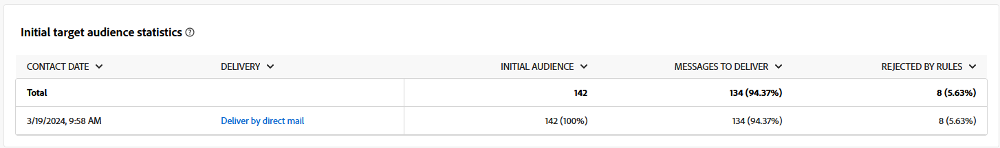
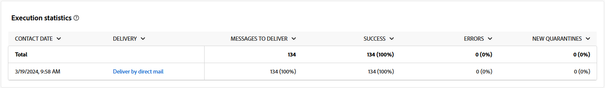

# 直邮渠道的营销活动报表 {#campaign-reports-direct-mail}

每个营销活动报告都分为不同的小组件，其中详细说明了营销活动的成功和错误。 对于直邮渠道，下文详细介绍了报表和量度。 在[此页面](campaign-reports.md)中了解如何访问您的营销活动报告。

## 投放摘要 {#delivery-summary-direct}

### 投放概述 {#delivery-overview-direct}

>[!CONTEXTUALHELP]
>id="acw_campaign_reporting_delivery_overview_direct_mail"
>title="投放概述"
>abstract=" **投放概览**&#x200B;提供了关键绩效指标 (KPI)，可深入了解访客与每次直邮投放的互动情况。这些量度概述如下。"

**[!UICONTROL 投放概述]**&#x200B;提供了关键绩效指标(KPI)，可深入分析访客与每个直邮投放的交互情况。 这些量度概述如下。

{zoomable="yes"}{align="center"}

+++了解有关投放概述量度的更多信息。

* **[!UICONTROL 要投放的邮件]**：投放准备期间处理的邮件总数。

* **[!UICONTROL 已投放]**：成功发送的邮件数与已发送的邮件总数相关。

* **[!UICONTROL 错误]**：投放和自动返回处理期间累计的错误总数与已发送消息的总数之比。

* **[!UICONTROL 总点击次数]**：在投放中至少点击一次的不同收件人的总数。

+++

### 初始目标受众统计信息 {#delivery-summary-direct-initial-target}

>[!CONTEXTUALHELP]
>id="acw_campaign_reporting_target_audience_direct_mail"
>title="初始目标受众统计信息"
>abstract="收件人数据和消息信息会显示在&#x200B;**初始目标受众统计**&#x200B;表中，其反映了投放准备分析。"

**[!UICONTROL 初始目标受众统计信息]**&#x200B;表显示与收件人相关的数据。 量度在投放准备期间计算并显示：初始受众、要发送的消息数、排除的收件人数。

{zoomable="yes"}

+++了解有关初始目标受众统计量度的更多信息。

* **[!UICONTROL 初始受众]**：目标收件人的总数。

* **[!UICONTROL 要投放的邮件]**：投放准备后要投放的邮件总数。

* **[!UICONTROL 被规则拒绝]**：应用规则时分析期间忽略的地址总数：地址缺失、被隔离、阻止列表时忽略等等。

+++

### 执行统计信息 {#delivery-summary-direct-exec-stats}

>[!CONTEXTUALHELP]
>id="acw_campaign_reporting_execution_statistics_direct_mail"
>title="投放统计信息"
>abstract="**执行统计信息**&#x200B;表格详述直邮投放是否成功和发生的错误。"

**[!UICONTROL 执行统计信息]**&#x200B;表提供了每个直邮投放成功的明细，详述指标如下。

+++了解有关投放统计量度的更多信息。

* **[!UICONTROL 要投放的邮件]**：投放准备后要投放的邮件总数。

* **[!UICONTROL 成功]**：已成功处理的邮件数与要传递的邮件数相关。

* **[!UICONTROL 错误]**：投放和自动回弹处理期间累计的错误总数与要投放的消息数相关。

* **[!UICONTROL 新隔离]**：在投放失败（用户未知，域无效）后隔离的地址总数与要投放的消息数相关。

+++

### 生成的点击流 {#click-streams}

>[!CONTEXTUALHELP]
>id="acw_campaign_reporting_clicks_direct_mail"
>title="生成的点击流"
>abstract="**生成的点击流**&#x200B;表显示有关接收者与投放如何互动的可用数据。"

{zoomable="yes"}{align="center"}

**生成的点击流**&#x200B;表说明了阻止从目标配置文件中排除的用户配置文件接收消息的原因。

+++了解有关生成的点击流度量的更多信息。

* **[!UICONTROL 唯一点击次数]**：在投放中至少点击一次的不同收件人的总数。

* **[!UICONTROL 总点击次数]**：投放中链接的点击总数。

* **[!UICONTROL 反应性]**：已点击投放的目标收件人数量与已打开投放的目标收件人的估计数量之比。

+++
