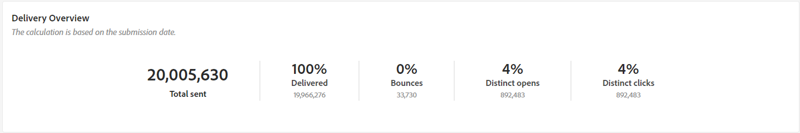
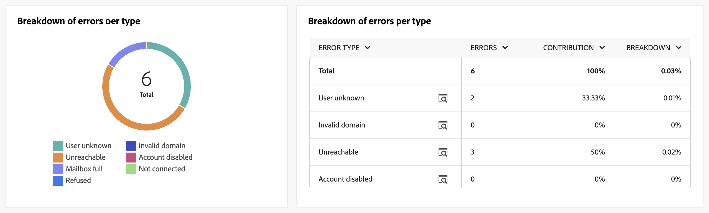

# 电子邮件渠道的营销活动报表 {#campaign-reports-email-channel}

每个营销活动报告都分为不同的小组件，其中详细说明了营销活动的成功和错误。 对于电子邮件渠道，报告和量度详述如下。 在[此页面](campaign-reports.md)中了解如何访问您的营销活动报告。

## 投放摘要 {#delivery-summary-email}

>[!CONTEXTUALHELP]
>id="acw_campaign_reporting_deliveries_overview"
>title="投放概述"
>abstract="**投放概述**&#x200B;提供详述访客如何与电子邮件投放互动的关键绩效指标 (KPI)。"

### 投放概述 {#delivery-summary-email-ovv}

**[!UICONTROL 投放概述]**&#x200B;报告提供了关键绩效指标(KPI)，这些指标提供有关访客如何参与电子邮件投放的详细信息。 指标详见下文。

{zoomable="yes"}

+++了解有关电子邮件促销活动报告指标的更多信息。

* **[!UICONTROL 要投放的邮件]**：投放准备期间处理的邮件总数。

* **[!UICONTROL 已投放]**：成功发送的邮件数与已发送的邮件总数相关。

* **[!UICONTROL 跳出次数]**：投放和自动返回处理期间累计的错误总数与已发送消息的总数之比。

* **[!UICONTROL 总打开次数]**：至少打开过一次邮件的目标收件人总数。

* **[!UICONTROL 总点击次数]**：在投放中至少点击一次的不同收件人的总数。

+++

### 初始目标受众统计信息 {#delivery-summary-email-initial-target}

>[!CONTEXTUALHELP]
>id="acw_campaign_reporting_deliveries_target"
>title="初始目标受众统计信息"
>abstract="初始目标受众统计数据表显示有关您的收件人的数据。"

**[!UICONTROL 初始目标受众统计信息]**&#x200B;表显示与收件人相关的数据。 指标详见下文。

{zoomable="yes"}

+++了解有关电子邮件促销活动报告指标的更多信息。

* **[!UICONTROL 初始受众]**：目标收件人的总数。

* **[!UICONTROL 要投放的邮件]**：投放准备后要投放的邮件总数。

* **[!UICONTROL 被规则拒绝]**：应用规则时分析期间忽略的地址总数：地址缺失、被隔离、阻止列表时忽略等等。

+++

### 执行统计信息 {#delivery-summary-email-exec-stats}

>[!CONTEXTUALHELP]
>id="acw_campaign_reporting_email_exec_stats"
>title="执行统计信息"
>abstract="**执行统计信息**&#x200B;表详述投放是否成功：要投放的消息数、成功数、错误数和新隔离数。"

**[!UICONTROL 执行统计信息]**&#x200B;表详细说明了您的交付是否成功。 指标详见下文。

{zoomable="yes"}

+++了解有关电子邮件促销活动报告指标的更多信息。

* **[!UICONTROL 要投放的邮件]**：投放准备后要投放的邮件总数。

* **[!UICONTROL 成功]**：已成功处理的邮件数与要传递的邮件数相关。

* **[!UICONTROL 错误]**：投放和自动回弹处理期间累计的错误总数与要投放的消息数相关。

* **[!UICONTROL 新隔离]**：在投放失败（用户未知，域无效）后隔离的地址总数与要投放的消息数相关。

  电子邮件错误类型列在[Adobe Campaign v8 （客户端控制台）文档](https://experienceleague.adobe.com/docs/campaign/campaign-v8/send/failures/delivery-failures.html#email-error-types){target="_blank"}中。

+++

### 反应统计信息 {#delivery-summary-email-reaction-stats}

>[!CONTEXTUALHELP]
>id="acw_campaign_reporting_email_reaction_stats"
>title="反应统计信息"
>abstract="**反应统计信息**&#x200B;表显示投放的接收者活动的可用数据：打开次数、订阅数、退订数、镜像页面链接点击次数。"

**[!UICONTROL 反应统计信息]**&#x200B;表包含投放的收件人活动的可用数据。 指标详见下文。

{zoomable="yes"}

+++了解有关电子邮件促销活动报告指标的更多信息。

* **[!UICONTROL 独特打开次数]**：至少打开过一次邮件的目标收件人总数。

* **[!UICONTROL 总打开次数]**：此域中至少打开过一次邮件的不同目标收件人的数量。

* **[!UICONTROL 取消订阅]**：在相关时间段内点击取消订阅的收件人数量。

* **[!UICONTROL 镜像页面]**：点击镜像页面链接的收件人数量。

* **[!UICONTROL 转发]**：点击后转发电子邮件的收件人数量。
+++

### 生成的点击流 {#delivery-summary-email-click-streams}

>[!CONTEXTUALHELP]
>id="acw_campaign_reporting_email_click_streams"
>title="生成的点击流"
>abstract="**生成的点击流**&#x200B;表显示有关接收者与投放如何互动的可用数据。"

**[!UICONTROL 生成的点击流]**&#x200B;表显示与收件人与投放交互方式相关的数据。 指标详见下文。

{zoomable="yes"}

+++了解有关电子邮件促销活动报告指标的更多信息。

* **[!UICONTROL 独特点击次数]**：在投放中至少点击一次的独特收件人总数。

* **[!UICONTROL 总点击次数]**：投放中链接的点击总数。

* **[!UICONTROL 反应性]**：已点击投放的目标收件人数量与已打开投放的目标收件人的估计数量之比。

+++

## 投放失败 {#non-deliverables-email}

### 按类型细分错误 {#delivery-summary-email-breakdown-per-type}

>[!CONTEXTUALHELP]
>id="acw_campaign_reporting_error_type"
>title="按类型细分错误"
>abstract="**按类型细分错误**&#x200B;图表包含遇到的每种错误类型的可用数据：用户未知、邮箱已满、域无效等。"

每个类型&#x200B;**表和图形的**&#x200B;错误划分包含每个域类型可能遇到的错误的可用数据。 指标详见下文。

此报告中显示的错误会触发隔离过程。 有关隔离管理的更多信息，请参阅[Campaign v8 （客户端控制台）文档](https://experienceleague.adobe.com/docs/campaign/campaign-v8/campaigns/send/failures/delivery-failures.html){target="_blank"}。

{zoomable="yes"}

+++了解有关电子邮件促销活动报告指标的更多信息。

* **[!UICONTROL 用户未知]**：在投放期间生成错误类型以指示电子邮件地址无效。

* **[!UICONTROL 无效域]**：发送投放时生成的错误类型，指示电子邮件地址的域错误或不存在。

* **[!UICONTROL 邮箱已满]**：在五次传递尝试后生成的错误类型表示收件人的收件箱包含太多邮件。

* **[!UICONTROL 帐户已禁用]**：发送投放时生成错误类型以指示地址不再存在。

* **[!UICONTROL 已拒绝]**：当地址被IAP（Internet访问提供程序）拒绝时生成的错误类型，例如在应用安全规则（反垃圾邮件软件）之后。

* **[!UICONTROL 不可访问]**：消息分发字符串中出现的错误类型：SMTP中继上的事件、域名暂时不可访问等

* **[!UICONTROL 未连接]**：错误类型表示收件人的手机在发送时关闭或与网络断开。

+++

### 按域细分错误 {#delivery-summary-email-breakdown-per-domain}

>[!CONTEXTUALHELP]
>id="acw_campaign_reporting_error_domain"
>title="按域细分错误"
>abstract="**按域细分错误**&#x200B;图表显示遇到的每种错误类型的可用数据（按域细分）。"

每个域&#x200B;**表和图形的**&#x200B;[!UICONTROL &#x200B;错误划分包含每个域可能遇到的错误的可用数据。 指标与上面详述的每种类型&#x200B;]&#x200B;**表和图表的**&#x200B;错误划分共同。

## 跟踪指标 {#tracking-indicators-email}

### 投放统计信息 {#delivery-summary-email-statistics}

>[!CONTEXTUALHELP]
>id="acw_delivery_campaign_delivery_statistics_summary"
>title="投放统计信息"
>abstract="**投放统计信息**&#x200B;图表详述投放是否成功和发生的错误。"

**[!UICONTROL 投放统计数据]**&#x200B;量度提供关键绩效指标(KPI)，用于提供关于已发送电子邮件可用数据的详细信息。 指标详见下文。

{zoomable="yes"}

+++了解有关电子邮件促销活动报告指标的更多信息。

* **[!UICONTROL 要传递的邮件数]**：已成功处理的邮件数与要传递的邮件数相关。

* **[!UICONTROL 独特打开次数]**：至少打开过一次邮件的目标收件人总数。

* **[!UICONTROL 总打开次数]**：此域中至少打开过一次邮件的不同目标收件人的数量。

* **[!UICONTROL 点击选择退出链接]**：点击取消订阅链接的次数。

* **[!UICONTROL 镜像链接的点击次数]**：镜像页面链接的点击次数。

* **[!UICONTROL 转发数量估计]**：目标收件人转发的电子邮件数量估计。
+++

### 打开和点进率 {#delivery-summary-open-rate}

>[!CONTEXTUALHELP]
>id="acw_campaign_reporting_open_clickthrough"
>title="打开和点进率"
>abstract="**打开和点进率**&#x200B;表显示有关接收者与投放互动的数据。"

**[!UICONTROL 打开和点进率]**&#x200B;表显示与收件人相关的数据。 指标详见下文。

{zoomable="yes"}

+++ 了解有关电子邮件促销活动报表量度的更多信息。

* **[!UICONTROL 已发送]**：已发送的邮件总数。

* **[!UICONTROL 投诉]**：此域中被收件人报告为不受欢迎的邮件数量和百分比。

* **[!UICONTROL 独特打开次数]**：此域中至少打开过一次邮件的不同目标收件人的数量和百分比。

* **[!UICONTROL 唯一点击次数]**：至少一次点击同一投放的不同目标收件人的数量和百分比。

* **[!UICONTROL 原始反应性]**：与至少打开一次投放的收件人数量相比，至少点击一次投放的收件人数量的百分比。

+++

## URL 和点击流 {#url-email}

>[!CONTEXTUALHELP]
>id="acw_campaign_reporting_urls_clickstreams"
>title="URL 和点击流"
>abstract="**URL 和点击流**&#x200B;报告提供详述投放期间点击次数最多的 URL 的关键绩效指标 (KPI)。"

**[!UICONTROL URL和点击流]**&#x200B;报表提供了关键绩效指标(KPI)，这些指标提供了有关投放期间点击次数最多的URL的详细信息。 指标详见下文。

{zoomable="yes"}

+++ 了解有关电子邮件促销活动报表量度的更多信息。

* **[!UICONTROL 反应性]**：已点击投放的目标收件人数量与已打开投放的目标收件人的估计数量之比。

* **[!UICONTROL 唯一点击次数]**：在投放中至少点击一次的不同收件人的总数。

* **[!UICONTROL 总点击次数]**：投放中链接的点击总数。

* **[!UICONTROL 平台平均值]**：计算每个速率（反应性、非重复点击和累计点击）下显示的平均速率，用于计算过去六个月发送的投放数量。 只考虑具有相同类型和相同渠道的投放。 排除验证。

+++

### 访问量排名前 10 的链接 {#top10-campaign-report-email}

>[!CONTEXTUALHELP]
>id="acw_campaign_reporting_urls_clickstreams_top10"
>title="访问量排名前 10 的链接"
>abstract="**访问量排名前 10 的链接**&#x200B;图表包含每个链接的接收者行为的可用数据。"

**[!UICONTROL 前10个访问次数最多的链接]**&#x200B;图形和表包含每个链接的收件人行为的可用数据。 指标详见下文。

{zoomable="yes"}

+++了解有关电子邮件促销活动报告指标的更多信息。

* **[!UICONTROL 点击次数]**：投放中链接的点击总数。

* **[!UICONTROL 百分比]**：与投放交互的用户百分比。

+++

### 点击次数随时间变化的细分 {#campaign-report-email-breakdown-clicks}

>[!CONTEXTUALHELP]
>id="acw_delivery_campaign_urls_click_breakdown"
>title="点击次数随时间变化的细分"
>abstract="**点击次数随时间变化的细分**&#x200B;图表显示每个链接的接收者行为的可用数据。"

**[!UICONTROL 随时间变化的点击细分]**&#x200B;图形包含每个链接的收件人行为的可用数据。

{zoomable="yes"}

## 用户活动 {#user-activities-email}

>[!CONTEXTUALHELP]
>id="acw_campaign_reporting_user_activities"
>title="用户活动"
>abstract="**用户活动**&#x200B;图以图表形式显示打开次数和点击次数的细分。"

**[!UICONTROL 用户活动]**&#x200B;报告以图表形式显示打开数和点击数的细分。 此报告的量度详述如下。

{zoomable="yes"}{align="center"}

+++了解有关电子邮件投放报告指标的更多信息。

* **[!UICONTROL 点击次数]**：投放中链接的点击总数。

* **[!UICONTROL 打开次数]**：此域中至少打开过一次邮件的不同目标收件人的数量。

+++