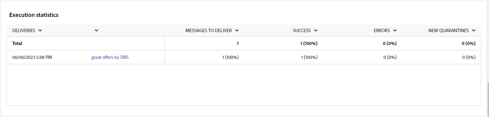

# 短信渠道的营销活动报告 {#campaign-reports-sms-channel}

每个营销活动报告都分为不同的小组件，其中详细说明了营销活动的成功和错误。 对于短信渠道，下文将详细介绍相关报表和量度。 了解如何在中访问您的营销活动报告 [此页面](campaign-reports.md).

## 投放摘要 {#delivery-summary-sms}

>[!CONTEXTUALHELP]
>id="acw_campaign_reporting_sms_deliveries_overview"
>title="投放概述"
>abstract="**投放概述**&#x200B;报告提供详述访客如何与短信投放互动的关键绩效指标 (KPI)。"

此 **[!UICONTROL 投放概述]** 报告提供关键绩效指标(KPI)，提供关于访客如何参与短信投放的详细信息。 指标详见下文。

{zoomable=&quot;yes&quot;}

+++了解有关短信营销活动报告指标的更多信息。

* **[!UICONTROL 发送总数]**：投放准备期间处理的消息总数。

* **[!UICONTROL 已投放]**：成功发送的消息数，与已发送消息的总数相关。

* **[!UICONTROL 错误]**：投放和自动返回处理期间累计的错误总数与已发送消息总数相关。

* **[!UICONTROL 不同点击次数]**：在投放中至少点击一次的不同收件人的总数。

+++

### 初始目标受众统计信息 {#delivery-summary-sms-initial-target}

>[!CONTEXTUALHELP]
>id="acw_campaign_reporting_sms_target"
>title="初始目标受众统计信息"
>abstract="**初始目标受众统计信息**&#x200B;表显示有关您的收件人的数据"

此 **[!UICONTROL 初始目标受众统计信息]** 表格会显示与收件人相关的数据。 指标详见下文。

{zoomable=&quot;yes&quot;}

+++了解有关短信营销活动报告指标的更多信息。

* **[!UICONTROL 初始受众]**：定向收件人总数。

* **[!UICONTROL 要投放的消息]**：投放准备后要投放的消息总数。

* **[!UICONTROL 被规则拒绝]**：应用规则时分析期间忽略的地址总数：地址缺失、隔离、阻止列表等。

+++

### 执行统计信息 {#delivery-summary-sms-exec-stats}

>[!CONTEXTUALHELP]
>id="acw_campaign_reporting_sms_exec_stats"
>title="执行统计信息"
>abstract="**执行统计信息**&#x200B;表详述投放是否成功：要投放的消息数、成功数、错误数和新隔离数。"

此 **[!UICONTROL 执行统计信息]** 表详细说明了您的交付是否成功。 指标详见下文。

{zoomable=&quot;yes&quot;}

+++了解有关短信营销活动报告指标的更多信息。

* **[!UICONTROL 要投放的消息]**：投放准备后要投放的消息总数。

* **[!UICONTROL 成功]**：成功处理的消息数与要投放的消息数相关。

* **[!UICONTROL 错误]**：投放和自动回弹处理期间累计的错误总数，与要投放的消息数量相关。

* **[!UICONTROL 新隔离]**：在失败的投放（用户未知、域无效）后隔离的地址总数，与要投放的消息数相关。

  短信错误类型列在 [Adobe Campaign v8（客户端控制台）文档](https://experienceleague.adobe.com/docs/campaign/campaign-v8/send/failures/delivery-failures.html#sms-quarantines){target="_blank"}.

+++

### 生成的点击流 {#delivery-summary-sms-click-streams}

>[!CONTEXTUALHELP]
>id="acw_campaign_reporting_sms_click_streams"
>title="生成的点击流"
>abstract="**生成的点击流**&#x200B;表显示有关接收者与投放如何互动的可用数据。"

此 **[!UICONTROL 生成的点击流]** 该表显示了与收件人与投放的交互方式相关的数据。 指标详见下文。

{zoomable=&quot;yes&quot;}

+++了解有关短信营销活动报告指标的更多信息。

* **[!UICONTROL 不同点击次数]**：在投放中至少点击一次的不同收件人的总数。

* **[!UICONTROL 点击次数]**：投放中链接的点击总数。

* **[!UICONTROL 反应性]**：已点击投放的目标收件人数量与已打开投放的目标收件人的估计数量之间的比率。

+++
