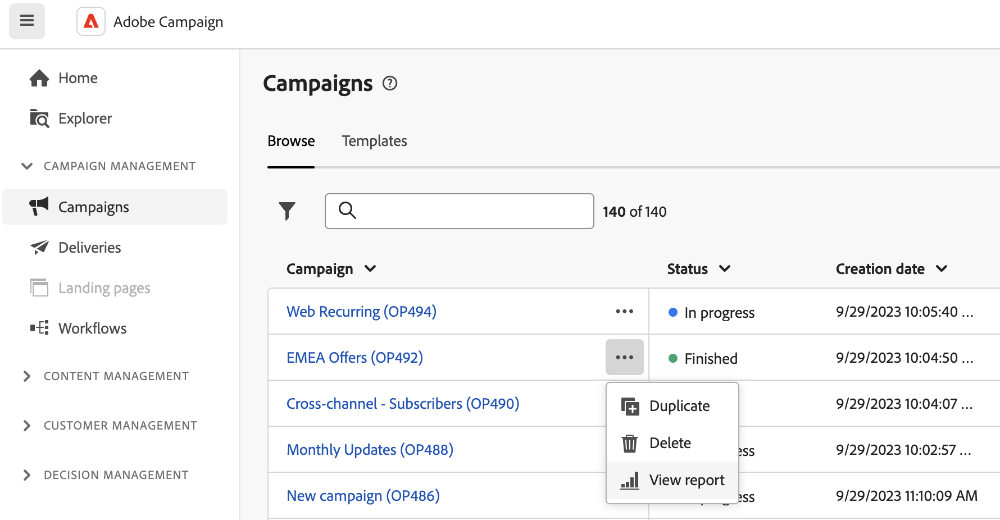

# 营销活动报告入门 {#campaign-reports}

<!-- CAN BE REMOVED___
>[!CONTEXTUALHELP]
>id="acw_campaign_reporting_sending"
>title="Reporting Sending"
>abstract="The Sending tab within your report provides in-depth insights into your visitors' interactions with your deliveries and any potential errors they may have encountered."

>[!CONTEXTUALHELP]
>id="acw_campaign_reporting_tracking"
>title="Reporting tracking"
>abstract="The Tracking tab within your report offers valuable data, including recipient behavior per link, breakdown of opens and clicks, as well as detailed information about the most frequently clicked URLs during a delivery."
-->

要访问您的促销活动报表，请单击 **报表** 活动仪表板中的按钮。

或者，您可以使用三个点 **更多操作** 按钮，如下所示：

{width="50%" align="left" zoomable="yes"}

营销活动报告分为多个构件，每个构件详细描述营销活动的成功和错误。

以下页面提供了每个渠道的报表和相关量度的完整列表：

* [电子邮件渠道](campaign-reports-email.md)
* [短信渠道](campaign-reports-sms.md)
* [推送渠道](campaign-reports-push.md)
