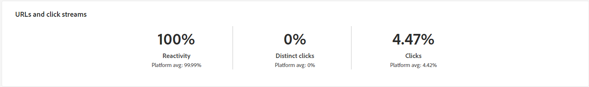

# 营销活动报表 {#campaign-reports}

营销活动报告分为多个小部件，用于详细描述营销活动的成功和错误。

此时将显示营销活动报告页面，其中包含以下选项卡：

* [电子邮件渠道](#email-channel)
* [短信渠道](#sms-channel)
* [推送渠道](#push-channel)

要访问Campaign报表，请在营销活动信息板中单击“报表” 。

## 电子邮件渠道 {#email-channel}

### 投放摘要 {#delivery-summary-email}

* **[!UICONTROL 投放概述]** 提供关键绩效指标(KPI)，用于提供有关访客如何参与电子邮件投放的详细信息。

  

  +++了解有关电子邮件促销活动报告指标的更多信息。

   * **[!UICONTROL 发送总数]**：投放分析期间处理的消息总数。

   * **[!UICONTROL 已投放]**：成功发送的消息数，与已发送消息的总数相关。

   * **[!UICONTROL 跳出次数]**：投放和自动返回处理期间累计的错误总数与已发送消息的总数相关。

   * **[!UICONTROL 不同打开次数]**：至少打开过一次消息的目标收件人总数。

   * **[!UICONTROL 不同点击次数]**：在投放中至少点击一次的不同收件人的总数。

+++

* **[!UICONTROL 初始目标受众统计数据]** 表格显示与收件人相关的数据：

  

  +++了解有关电子邮件促销活动报告指标的更多信息。

   * **[!UICONTROL 初始受众]**：目标收件人的总数。

   * **[!UICONTROL 要投放的消息]**：投放分析后要投放的消息总数。

   * **[!UICONTROL 被规则拒绝]**：应用规则时在分析期间忽略的地址总数：地址缺失、隔离、阻止列表时等。

+++

* **[!UICONTROL 执行统计信息]** 表详细说明了您的交付是否成功。

  

  +++了解有关电子邮件促销活动报告指标的更多信息。

   * **[!UICONTROL 要投放的消息]**：投放分析后要投放的消息总数。

   * **[!UICONTROL 成功]**：成功处理的消息数与要投放的消息数相关。

   * **[!UICONTROL 错误]**：投放和自动回弹处理期间累计的错误总数，与要投放的消息数量相关。

   * **[!UICONTROL 新隔离]**：在投放失败（用户未知，域无效）后隔离的地址总数，与要投放的消息数量相关。

+++

* **[!UICONTROL 反应统计信息]** 表包含投放的收件人活动的可用数据。

  

  +++了解有关电子邮件促销活动报告指标的更多信息。

   * **[!UICONTROL 不同打开次数]**：至少打开过一次消息的目标收件人总数。

   * **[!UICONTROL 打开次数]**：此域中至少打开过一次邮件的不同定向收件人的数量。

   * **[!UICONTROL 取消订阅]**：在相关时段点击取消订阅的收件人数量。

   * **[!UICONTROL 镜像页面]**：单击镜像页面链接的收件人数量。

   * **[!UICONTROL 转发]**：点击后转发电子邮件的收件人数量。
+++

* **[!UICONTROL 生成的点击流]** 表格显示与收件人与投放的交互方式相关的数据。

  

  +++了解有关电子邮件促销活动报告指标的更多信息。

   * **[!UICONTROL 不同点击次数]**：在投放中至少点击一次的不同收件人的总数。

   * **[!UICONTROL 点击次数]**：投放中链接的点击总数。

   * **[!UICONTROL 反应性]**：已单击投放的目标收件人数量与已打开投放的目标收件人估计数量的比率。

+++

### 不可投放 {#non-deliverables-email}

* **[!UICONTROL 每种类型的错误细分]** 和 **[!UICONTROL 每个域的错误细分]** 表和图形包含每个域可能遇到的错误的可用数据。

  

  +++了解有关电子邮件促销活动报告指标的更多信息。

   * **[!UICONTROL 错误]**：投放和自动回弹处理期间累计的错误总数，与要投放的消息数量相关。

   * **[!UICONTROL 贡献]**：

   * **[!UICONTROL 细分]**:

+++

### 跟踪指标 {#tracking-indicators-email}

* **[!UICONTROL 投放统计数据]** 提供关键绩效指标(KPI)，用于提供关于已发送电子邮件可用数据的详细信息。

  

  +++了解有关电子邮件促销活动报告指标的更多信息。

   * **[!UICONTROL 成功]**：成功处理的消息数与要投放的消息数相关。

   * **[!UICONTROL 不同打开次数]**：至少打开过一次消息的目标收件人总数。

   * **[!UICONTROL 打开次数]**：此域中至少打开过一次邮件的不同定向收件人的数量。

   * **[!UICONTROL 选择退出链接的点击量]**：取消订阅链接的点击次数。

   * **[!UICONTROL 单击镜像链接]**：单击指向镜像页面的链接的次数。

   * **[!UICONTROL 转发数量估计]**：目标收件人转发的电子邮件数量的估计。
+++

* **[!UICONTROL 初始目标受众统计数据]** 表格显示与收件人相关的数据。

  

  +++了解有关电子邮件促销活动报告指标的更多信息。

   * **[!UICONTROL 已发送]**：已发送的消息总数。

   * **[!UICONTROL 投诉]**：此域被收件人报告为不受欢迎的消息数。

   * **[!UICONTROL 打开次数]**：此域中至少打开过一次邮件的不同定向收件人的数量。

   * **[!UICONTROL 点击次数]**：在同一个投放中至少点击一次的不同目标收件人的数量。

   * **[!UICONTROL 原始反应性]**：与至少打开一次投放的收件人人数相比，至少点击一次投放的收件人人数的百分比。
+++

### URL 和点击流 {#url-email}

* **[!UICONTROL URL和点击流]** 提供关键绩效指标(KPI)，用于提供有关投放期间点击次数最多的URL的详细信息。

  

  +++了解有关电子邮件促销活动报告指标的更多信息。

   * **[!UICONTROL 反应性]**：已单击投放的目标收件人数量与已打开投放的目标收件人估计数量的比率。

   * **[!UICONTROL 不同点击次数]**：在投放中至少点击一次的不同收件人的总数。

   * **[!UICONTROL 点击次数]**：投放中链接的点击总数。

+++

* **[!UICONTROL 前10个访问次数最多的链接]** 图和表包含每个链接的收件人行为的可用数据。

  

  +++了解有关电子邮件促销活动报告指标的更多信息。

   * **[!UICONTROL 点击次数]**：投放中链接的点击总数。

   * **[!UICONTROL 百分比]**：与投放交互的用户百分比。

+++

* **[!UICONTROL 一段时间内点击量的细分]** 图形包含每个链接的收件人行为的可用数据。

  

### 用户活动 {#user-activities-email}

* **[!UICONTROL 用户活动]** 以图表的形式显示打开次数和点击次数的细分。

  

  +++了解有关电子邮件促销活动报告指标的更多信息。

   * **[!UICONTROL 点击次数]**：投放中链接的点击总数。

   * **[!UICONTROL 打开次数]**：此域中至少打开过一次邮件的不同定向收件人的数量。

+++

## 短信渠道 {#sms-channel}

### 投放摘要 {#delivery-summary-sms}

* **[!UICONTROL 投放概述]** 提供关键绩效指标(KPI)，用于提供有关访客如何参与短信投放的详细信息。

  +++了解有关短信营销活动报告量度的更多信息。

   * **[!UICONTROL 发送总数]**：投放分析期间处理的消息总数。

   * **[!UICONTROL 已投放]**：成功发送的消息数，与已发送消息的总数相关。

   * **[!UICONTROL 错误]**：投放和自动返回处理期间累计的错误总数与已发送消息的总数相关。

   * **[!UICONTROL 不同点击次数]**：在投放中至少点击一次的不同收件人的总数。

+++

* **[!UICONTROL 初始目标受众统计数据]** 表格显示与收件人相关的数据：

  +++了解有关短信营销活动报告量度的更多信息。

   * **[!UICONTROL 初始受众]**：目标收件人的总数。

   * **[!UICONTROL 要投放的消息]**：投放分析后要投放的消息总数。

   * **[!UICONTROL 被规则拒绝]**：应用规则时在分析期间忽略的地址总数：地址缺失、隔离、阻止列表时等。

+++

* **[!UICONTROL 执行统计信息]** 表详细说明了您的交付是否成功：

  +++了解有关短信营销活动报告量度的更多信息。

   * **[!UICONTROL 要投放的消息]**：投放分析后要投放的消息总数。

   * **[!UICONTROL 成功]**：成功处理的消息数与要投放的消息数相关。

   * **[!UICONTROL 错误]**：投放和自动回弹处理期间累计的错误总数，与要投放的消息数量相关。

   * **[!UICONTROL 新隔离]**：在投放失败（用户未知，域无效）后隔离的地址总数，与要投放的消息数量相关。

+++

* **[!UICONTROL 生成的点击流]** 表格显示与收件人与投放的交互方式相关的数据：

  +++了解有关短信营销活动报告量度的更多信息。

   * **[!UICONTROL 不同点击次数]**：在投放中至少点击一次的不同收件人的总数。

   * **[!UICONTROL 点击次数]**：投放中链接的点击总数。

   * **[!UICONTROL 反应性]**：已单击投放的目标收件人数量与已打开投放的目标收件人估计数量的比率。

+++

## 推送渠道 {#push-channel}

### 投放摘要 {#delivery-summary-push}

* **[!UICONTROL 投放概述]** 提供关键绩效指标(KPI)，用于提供有关访客如何参与推送通知投放的详细信息。

  +++了解有关推送营销活动报告量度的更多信息。

   * **[!UICONTROL 发送总数]**：投放分析期间处理的消息总数。

   * **[!UICONTROL 已投放]**：成功发送的消息数，与已发送消息的总数相关。

   * **[!UICONTROL 错误]**：投放和自动返回处理期间累计的错误总数与已发送消息的总数相关。

   * **[!UICONTROL 不同点击次数]**：在投放中至少点击一次的不同收件人的总数。

+++

* **[!UICONTROL 初始目标受众统计数据]** 表格显示与收件人相关的数据：

  +++了解有关推送营销活动报告量度的更多信息。

   * **[!UICONTROL 初始受众]**：目标收件人的总数。

   * **[!UICONTROL 要投放的消息]**：投放分析后要投放的消息总数。

   * **[!UICONTROL 被规则拒绝]**：应用规则时在分析期间忽略的地址总数：地址缺失、隔离、阻止列表时等。

+++

* **[!UICONTROL 执行统计信息]** 表详细说明了您的交付是否成功：

  +++了解有关推送营销活动报告量度的更多信息。

   * **[!UICONTROL 要投放的消息]**：投放分析后要投放的消息总数。

   * **[!UICONTROL 成功]**：成功处理的消息数与要投放的消息数相关。

   * **[!UICONTROL 错误]**：投放和自动回弹处理期间累计的错误总数，与要投放的消息数量相关。

   * **[!UICONTROL 新隔离]**：在投放失败（用户未知，域无效）后隔离的地址总数，与要投放的消息数量相关。

+++

* **[!UICONTROL 生成的点击流]** 表格显示与收件人与投放的交互方式相关的数据：

  +++了解有关推送营销活动报告量度的更多信息。

   * **[!UICONTROL 不同点击次数]**：在投放中至少点击一次的不同收件人的总数。

   * **[!UICONTROL 点击次数]**：投放中链接的点击总数。

   * **[!UICONTROL 反应性]**：已单击投放的目标收件人数量与已打开投放的目标收件人估计数量的比率。

+++
