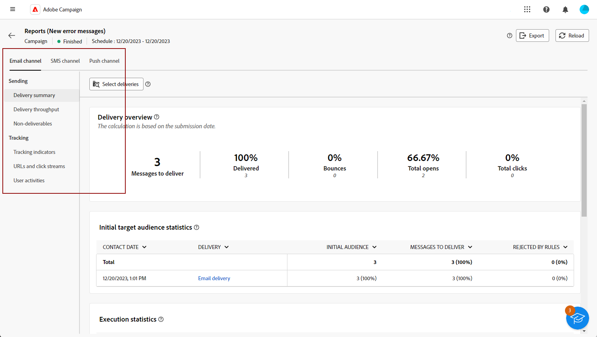

# 营销活动报告入门 {#campaign-reports}

**营销活动报告**&#x200B;提供了您的&#x200B;**营销活动**&#x200B;的全面概述，其中包含与所包含的不同投放相关的所有信息。 这些报表提供了每个渠道每次投放性能的详细分析，包括成功率、受众参与度和其他关键量度。 它们可帮助您评估活动的整体效率和影响。

以下页面上提供了每个渠道的报表和相关量度的完整列表：

* [电子邮件营销活动渠道](campaign-reports-email.md)
* [短信营销活动渠道](campaign-reports-sms.md)
* [推送活动渠道](campaign-reports-push.md)
* [直邮营销活动渠道](campaign-reports-direct-mail.md)

## 管理您的报表仪表板 {#manage-reports}

要访问和管理营销活动报表，请执行以下步骤：

1. 导航到&#x200B;**[!UICONTROL 营销活动]**&#x200B;菜单，然后单击营销活动仪表板上的&#x200B;**报告**&#x200B;按钮。

   {zoomable="yes"}

   或者，使用促销活动列表中促销活动名称旁边的三个圆点&#x200B;**更多操作**&#x200B;按钮，然后选择&#x200B;**[!UICONTROL 查看报告]**。

   {zoomable="yes"}

1. 从左侧菜单中，从列表中选择一个报表，并浏览各个选项卡以显示每个渠道的数据。

   {zoomable="yes"}

1. 在仪表板中，单击&#x200B;**[!UICONTROL 选择投放]**，以定向营销活动中包含的特定投放。

1. 在&#x200B;**[!UICONTROL 投放吞吐量]**&#x200B;菜单中，选择&#x200B;**开始**&#x200B;和&#x200B;**[!UICONTROL 结束时间]**&#x200B;以关注特定数据。

   {zoomable="yes"}

1. 从&#x200B;**[!UICONTROL Pick folder]**&#x200B;字段中，选择是定位特定文件夹中的投放还是营销活动。

   您还可以选择&#x200B;**[!UICONTROL 添加规则]**&#x200B;来构建查询，以便更好地筛选报表数据。 [了解如何使用查询建模器](../query/query-modeler-overview.md)

   {zoomable="yes"}

1. 从&#x200B;**[!UICONTROL URL中并单击流]**，选择&#x200B;**[!UICONTROL 热门访问链接]**&#x200B;或&#x200B;**[!UICONTROL 时段]**。

   **[!UICONTROL 查看方式]**&#x200B;选项允许按URL、标签或类别进行筛选。