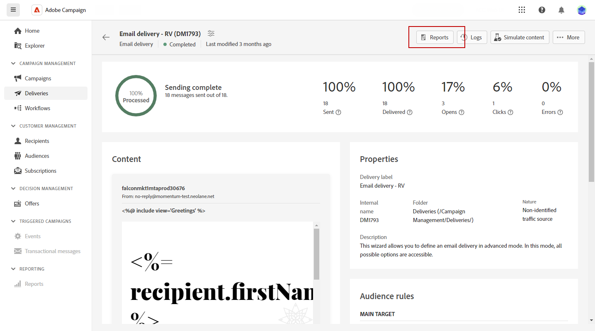

# 访问投放报告 {#reports}

Adobe Campaign 提供了多种类型的报告，可供每次投放使用。这些报告可让您在内置仪表板中衡量和可视化邮件的影响和效果。

要显示报告，请执行以下步骤：

1. 要为特定投放生成报告，请导航至 **[!UICONTROL 投放]** 菜单，然后选择要报告的投放。

1. 来自您的 **[!UICONTROL 投放]** 仪表板，单击 **[!UICONTROL 报表]**.

   

1. 在左侧菜单中，从列表中选择一个报告。

   

1. 如果您的投放是循环投放，则可以通过单击来选择要报告的特定投放 **[!UICONTROL 选择投放]**.

   您还可以通过选择 **[!UICONTROL 联系日期]**.

   
