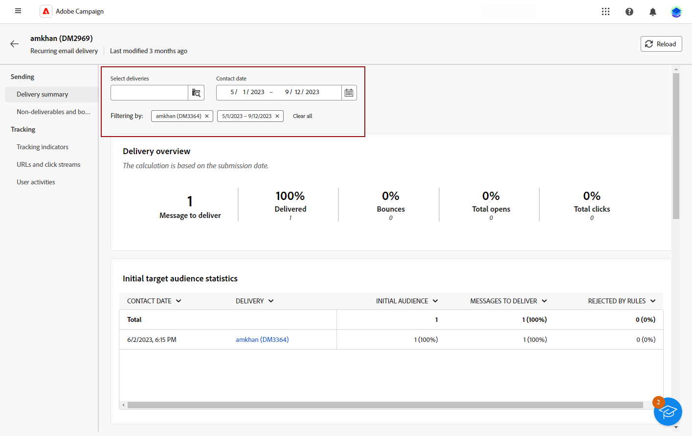

# 投放报告入门 {#reports}

>[!CONTEXTUALHELP]
>id="acw_campaign_reporting_deliveries_selection"
>title="投放的汇总报告"
>abstract="选择至少两个投放以供显示汇总数据报告。"

>[!CONTEXTUALHELP]
>id="acw_reporting_email_exportation"
>title="导出"
>abstract="单击“**导出**”按钮，将这些量度导出为 PDF 或 CSV 格式以便共享或打印。"

此 **投放报告** 提供专门针对您的环境的深入见解和数据 **投放** 在每个渠道中。 这些报告提供有关个别投放的业绩、有效性和成果的详细信息，使您能够全面了解情况。

以下页面提供了每个渠道的报表和相关量度的完整列表：

* [电子邮件投放报告](email-report.md)
* [短信投放报告](sms-report.md)
* [推送投放报告](push-report.md)

## 管理您的报表仪表板 {#manage-reports}

Adobe Campaign 提供了多种类型的报告，可供每次投放使用。这些报告可让您在内置仪表板中衡量和可视化邮件的影响和效果。

要显示和管理报表，请执行以下步骤：

1. 要为特定投放生成报告，请导航至 **[!UICONTROL 投放]** 菜单，然后选择要报告的投放。

1. 来自您的 **[!UICONTROL 投放]** 仪表板，单击 **[!UICONTROL 报表]**.

   

   或者，您可以使用三个点 **更多操作** 按钮，然后选择 **[!UICONTROL 查看报告]**.

   

1. 在左侧菜单中，从列表中选择一个报告。

   

1. 如果您的投放是定期投放，请通过单击 **[!UICONTROL 选择投放]**.

   您还可以通过选择 **[!UICONTROL 联系日期]**.

   

1. 从 **[!UICONTROL URL和点击流]**，您还可以选择 **[!UICONTROL 热门访问链接]** 或 **[!UICONTROL 时间段]**.

   此 **[!UICONTROL 查看方式]** 利用选项，可按URL、标签或类别进行过滤。

   

## 导出报告 {#export-reports}

您可以轻松地将其他报表导出为PDF或CSV格式，这允许您共享、处理或打印这些报表。

1. 在报表中，单击 **[!UICONTROL 导出]** 并选择 **[!UICONTROL 导出为PDF文件]** 或 **[!UICONTROL 导出为CSV文件]**.

   

1. 找到要保存文件的文件夹，根据需要重命名它，然后单击 **[!UICONTROL 保存]**.

您的报表现在可以在PDF或CSV文件中查看或共享。

