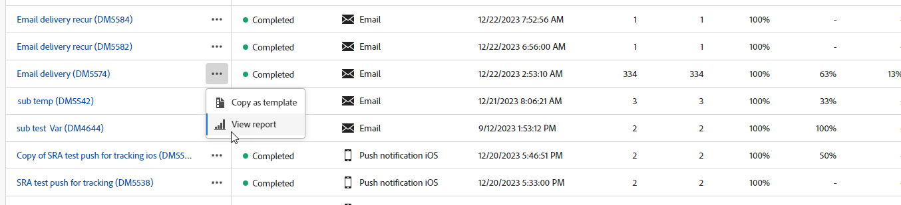

# 投放报告入门 {#reports}

>[!CONTEXTUALHELP]
>id="acw_campaign_reporting_deliveries_selection"
>title="投放的汇总报告"
>abstract="选择至少两个投放以供显示汇总数据报告。"

**投放报告**&#x200B;提供专门针对您在每个渠道上的&#x200B;**投放**&#x200B;的深入见解和数据。这些报告提供有关个别投放的效果、有效性和成果的详细信息，使您能够全面了解情况。

以下页面提供了每个渠道的报表和相关量度的完整列表：

* [电子邮件投放报告](email-report.md)
* [短信投放报告](sms-report.md)
* [推送投放报告](push-report.md)
* [直邮投放报告](direct-mail.md)

## 管理您的报表仪表板 {#manage-reports}

Adobe Campaign 提供了多种类型的报告，可供每次投放使用。这些报告可让您在内置仪表板中衡量和可视化邮件的影响和效果。

要显示和管理报表，请执行以下步骤：

1. 要为特定投放生成报告，请导航到&#x200B;**[!UICONTROL 投放]**&#x200B;菜单，然后选择要报告的投放。

1. 在您的&#x200B;**[!UICONTROL 投放]**&#x200B;仪表板中，单击&#x200B;**[!UICONTROL 报表]**。

   {zoomable="yes"}

   或者，您可以使用投放列表中投放名称旁边的三个圆点&#x200B;**更多操作**&#x200B;按钮，然后选择&#x200B;**[!UICONTROL 查看报告]**。

   {zoomable="yes"}

1. 在左侧菜单中，从列表中选择一个报告。

   {zoomable="yes"}

1. 如果您的投放是定期投放，请单击&#x200B;**[!UICONTROL 选择投放]**，以选择要报告的特定投放。

   您还可以通过选择&#x200B;**[!UICONTROL 联系日期]**&#x200B;将时间段应用于报表。

   {zoomable="yes"}

1. 从&#x200B;**[!UICONTROL URL并单击流]**&#x200B;中，您还可以选择&#x200B;**[!UICONTROL 热门访问链接]**&#x200B;或&#x200B;**[!UICONTROL 时段]**。

   通过&#x200B;**[!UICONTROL 查看方式]**&#x200B;选项，可按URL、标签或类别进行筛选。

   {zoomable="yes"}
