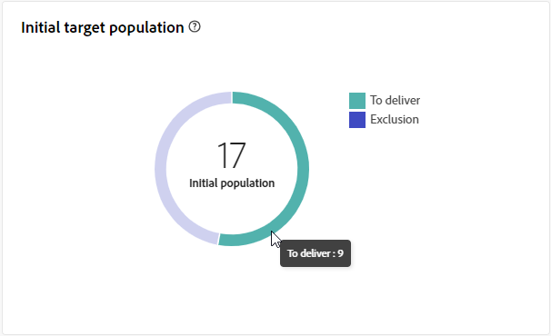

# 外部投放报告 {#direct-mail-report}

**外部投放报告**&#x200B;提供了特定于外部投放的综合分析和数据。 它包括有关单个交付的绩效、效果和结果的详细信息，并提供完整的概述。

直邮上下文中介绍了以下报表。 此外，它还适用于呼叫中心和自定义外部渠道。

## 投放摘要 {#delivery-summary-direct-mail}

### 投放概述 {#delivery-overview-direct-mail}

>[!CONTEXTUALHELP]
>id="acw_delivery_reporting_delivery_overview_direct_mail"
>title="投放概述"
>abstract="**投放概述**&#x200B;提供了关键绩效指标 (KPI)，可深入洞察访客与每次直邮投放的互动情况。这些量度概述如下。"

**[!UICONTROL 投放概述]**&#x200B;提供了有关访客与每个直邮投放交互的详细分析，展示了关键绩效指标(KPI)。 这些量度概述如下。

{zoomable="yes"}{align="center"}

+++了解有关投放概述量度的更多信息。

* **[!UICONTROL 要投放的邮件]**：投放准备期间处理的邮件总数。
* **[!UICONTROL 目标]**：符合直邮消息目标用户档案资格的用户档案数。
* **[!UICONTROL 排除]**：从不会接收直邮邮件的目标用户档案中排除的用户档案数。
+++

### 初始目标群体 {#direct-mail-delivery-targeted-population}

>[!CONTEXTUALHELP]
>id="acw_delivery_reporting_initial_target_direct_mail"
>title="初始目标群体"
>abstract="**初始目标群体**&#x200B;图表按投放准备的结果显示与接收者和消息相关的数据。"

**[!UICONTROL 初始目标群体]**&#x200B;图形显示与收件人相关的数据。 量度在投放准备期间进行计算，包括初始受众、要发送的消息数和排除的收件人数。

{zoomable="yes"}

将鼠标悬停在图表的一部分上以显示确切数字。

{zoomable="yes"}

+++了解有关直邮投放报告指标的更多信息。

* **[!UICONTROL 初始受众]**：目标收件人的总数。
* **[!UICONTROL 要投放的邮件]**：投放准备后要投放的邮件总数。
* **[!UICONTROL 排除项]**：从目标群体中排除的收件人总数。
+++

### 投放统计信息 {#direct-mail-delivery-stats}

>[!CONTEXTUALHELP]
>id="acw_delivery_reporting_delivery_statistics_summary_direct_mail"
>title="投放统计信息"
>abstract="**投放统计信息**&#x200B;图表详述直邮投放是否成功和发生的错误。"

**[!UICONTROL 投放统计信息]**&#x200B;图形提供了投放性能的概述，提供了用于衡量成功和效率的详细量度。

{zoomable="yes"}

+++了解有关直邮营销活动报告指标的更多信息。

* **[!UICONTROL 已发送邮件]**：准备传递后要传递的邮件总数。
* **[!UICONTROL 成功]**：成功处理的邮件数与要传递的邮件数相比较。
* **[!UICONTROL 错误]**：与要投放的消息数相比，在投放和自动回弹处理期间累计的错误总数。
* **[!UICONTROL 新隔离]**：与要投放的消息数量相比，在投放失败后隔离的地址总数（例如，用户未知、无效域）。
+++

### 排除的原因 {#direct-mail-delivery-exclusions}

>[!CONTEXTUALHELP]
>id="acw_delivery_reporting_causes_exclusion_direct_mail"
>title="投放排除原因"
>abstract=" **排除原因**&#x200B;图表显示了准备投放期间遭到拒绝的邮件的分布情况，并按每项规则进行分类。"

**[!UICONTROL 排除原因]**&#x200B;图形提供了在投放准备期间拒绝消息的原因细目。 此划分按各种规则组织，提供了排除报文的详细因素视图。 有关排除规则的详情，请参见[Campaign v8 （控制台）文档](https://experienceleague.adobe.com/docs/campaign/campaign-v8/send/failures/delivery-failures.html#email-error-types){_blank}。

{zoomable="yes"}{align="center" zoomable="yes"}

+++详细了解排除量度的原因。

* **[!UICONTROL 隔离中的地址]**：将地址置于隔离中时生成错误类型。
* **[!UICONTROL 未指定地址]**：地址不存在时生成错误类型。
* **[!UICONTROL 质量地址错误]**：当邮政地址质量等级太低时生成错误类型。
* **[!UICONTROL 地址]**：在传递期间列入阻止列表列入阻止列表收件者时产生的错误类型。
* **[!UICONTROL 双精度]**：由于非唯一键值而排除收件人时生成的错误类型。
* **[!UICONTROL 控制组]**：收件人的地址是控制组的一部分。
* **[!UICONTROL 目标大小受限]**：已达到收件人的最大投放大小。
+++

### 排除项 {#direct-mail-exclusions}

>[!CONTEXTUALHELP]
>id="acw_delivery_reporting_exclusions_direct_mail"
>title="排除项"
>abstract=" **[!UICONTROL 排除项]**&#x200B;表格按规则显示在传送投放过程中遭到拒绝的邮件的细分。"

**[!UICONTROL 排除项]**&#x200B;表提供了在投放准备期间被拒绝的消息的详细细分，这些消息按特定规则分类。 此划分可让您清楚地了解消息排除背后的原因。

{zoomable="yes"}{align="center" zoomable="yes"}

可用的量度与上面描述的[排除原因](#direct-mail-delivery-exclusions)的量度相同。