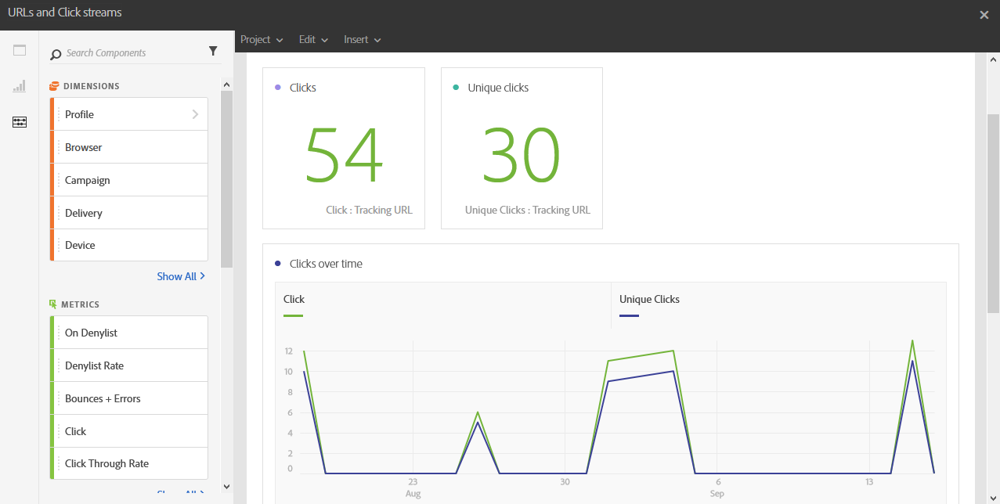

# URL 和点击流{#urls-and-click-streams}

**URL和点击流**&#x200B;显示投放期间点击次数最多的URL，如果它们链接到营销活动或项目，则显示多个投放。

每个表格都由摘要数字和图表表示。 您可以更改详细信息在其各自可视化图表设置中的显示方式。

**访问次数最多的链接**&#x200B;表包含每个投放的收件人行为的可用数据，例如：

* **Click**：内容在投放中被点击的次数。
* **唯一点击次数**：点击投放中内容的收件人数量。
