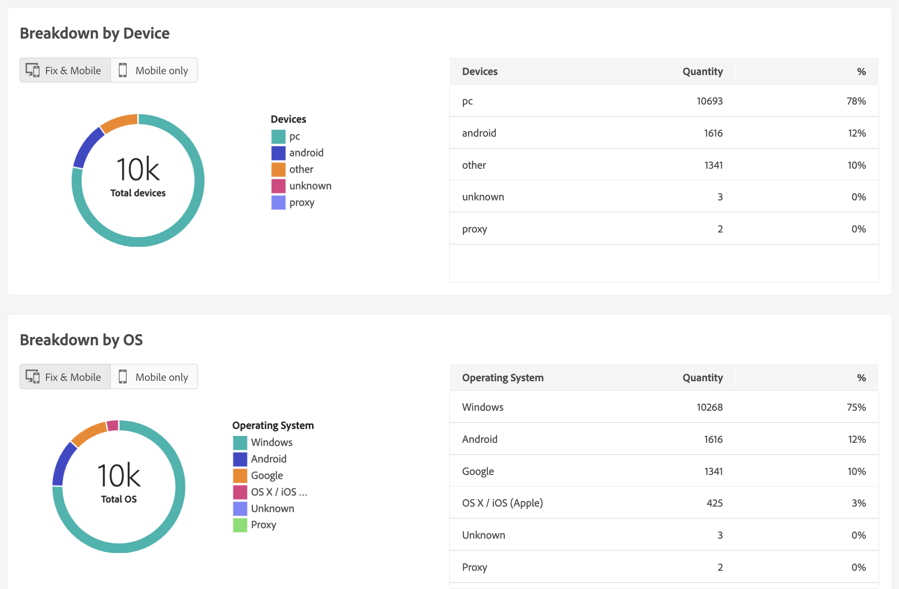

# 电子邮件投放报告 {#email-report}

## 发送

* **投放摘要**：此报告提供有关投放的所有主要信息。目标人群、排除原因、投放统计数据。

   

* **投放吞吐量**：此报告包含有关给定时段内的投放吞吐量的信息。用于衡量邮件传送速度的标准是每小时发送的邮件数和邮件大小（以位/秒为单位）。在下面的示例中，第一个图表用蓝色显示成功投放，用橙色显示错误投放的数量。

   

* **广播统计数据**：此报告按互联网域显示所有已处理和发送的邮件、硬退回邮件和软退回邮件、打开的邮件、点击的邮件和退订邮件的细分。

   

* **不可投放和退回邮件**：此报告按互联网域显示不可投放和退回邮件的细分。

   

## 跟踪

* **跟踪指标**：此报告结合了用于跟踪收件人在收到投放后的行为的关键指标。它提供了对投放和接收统计数据、打开率和点进率、生成的点击流、Web 跟踪以及与社交网络共享的活动的访问权限。

   

* **网址和点击流**：此报告显示投放后访问的页面的列表。

   

* **用户活动**：此报告以图表形式显示每半小时、每小时或每天的打开次数和点击次数的细分。

   

* **跟踪统计数据**：此报告提供有关打开次数和点击次数的统计数据。

   

* **打开的细分**：此报告按操作系统、设备和浏览器显示相关时段内的打开细分。为每个类别使用了两个图表。第一个图表显示有关计算机和移动设备上的打开的统计数据。第二个图表显示仅与移动设备上的打开有关的统计数据。

   

## 热门点击

此报告显示邮件内容（HTML 和/或文本）以及每个链接的点击百分比。个性化块退订链接、镜像页面链接和优惠链接将计入总累计点击次数，但不会显示在报告中。

