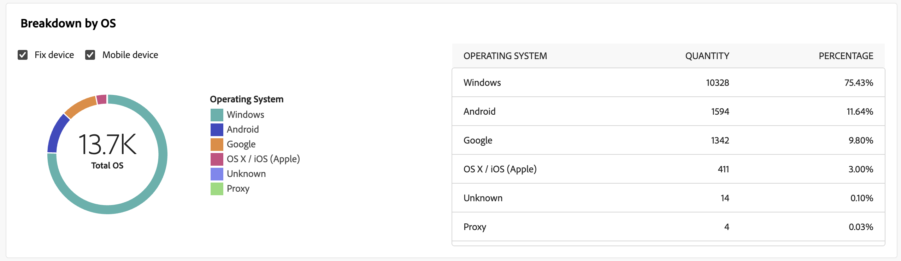

# 电子邮件投放报告 {#email-report}

此 **电子邮件投放报告** 提供特定于电子邮件渠道的综合见解和数据。 它提供有关个人投放的绩效、效力和结果的详细信息，使您能够全面了解情况。

## 投放摘要 {#delivery-summary-email}

>[!CONTEXTUALHELP]
>id="acw_delivery_reporting_sending_email"
>title="报告发送"
>abstract="利用报告中的&#x200B;**发送**&#x200B;选项卡，可深入了解访客与投放之间的交互及访客可能遇到的任何潜在错误。"

### 初始目标群体 {#email-delivery-targeted-population}

>[!CONTEXTUALHELP]
>id="acw_delivery_reporting_initial_target"
>title="初始目标群体"
>abstract="此 **初始目标人群** 图形根据投放准备的结果显示与收件人和消息相关的数据。"

此 **[!UICONTROL 初始目标人群]** 图形显示与收件人相关的数据。 量度在投放准备期间计算并显示：初始受众、要发送的消息数、排除的收件人数。

{width="50%" align="left" zoomable="yes"}

将鼠标悬停在图形的一部分上以显示确切数字。

{width="50%" align="left" zoomable="yes"}

+++了解有关电子邮件投放报告指标的更多信息。

* **[!UICONTROL 初始受众]**：定向收件人总数。

* **[!UICONTROL 投放]**：投放准备后要投放的消息总数。

* **[!UICONTROL 排除项]**：从目标群体中排除的收件人总数。
+++

### 投放统计信息 {#email-delivery-stats}

>[!CONTEXTUALHELP]
>id="acw_delivery_reporting_delivery_statistics_summary"
>title="投放统计信息"
>abstract="此 **投放统计信息** 图表详细说明了交付的成功以及发生的错误。"

此 **[!UICONTROL 投放统计信息]** 图表详细说明了您的交付是否成功。 指标详见下文。

{width="50%" align="left" zoomable="yes"}

+++了解有关电子邮件促销活动报告指标的更多信息。

* **[!UICONTROL 消息已发送]**：投放准备后要投放的消息总数。

* **[!UICONTROL 成功]**：成功处理的消息数与要投放的消息数相关。

* **[!UICONTROL 错误]**：投放和自动回弹处理期间累计的错误总数，与要投放的消息数量相关。

* **[!UICONTROL 新隔离]**：在失败的投放（用户未知、域无效）后隔离的地址总数，与要投放的消息数相关。

+++

### 排除的原因  {#email-delivery-exclusions}

>[!CONTEXTUALHELP]
>id="acw_delivery_reporting_exclusion"
>title="投放统计信息"
>abstract="此 **排除的原因** 图形和表格显示了投放准备期间拒绝的消息按规则细分。"

此 **[!UICONTROL 排除的原因]** 图形和表格显示了投放准备期间拒绝的消息按规则细分。 有关排除规则的详情，请参见 [Campaign v8（控制台）文档](https://experienceleague.adobe.com/docs/campaign/campaign-v8/send/failures/delivery-failures.html#email-error-types){_blank}.

{align="center" zoomable="yes"}

+++了解有关电子邮件投放报告指标的更多信息。

* **[!UICONTROL 用户未知]**：投放期间生成的错误类型，指示电子邮件地址无效。

* **[!UICONTROL 无效域]**：发送投放时生成的错误类型，指示电子邮件地址的域错误或不存在。

* **[!UICONTROL 邮箱已满]**：在尝试投放五次后生成的错误类型，旨在指示收件人的收件箱中包含的消息过多。

* **[!UICONTROL 帐户已禁用]**：发送投放时生成的错误类型，指示地址不再存在。

* **[!UICONTROL 已拒绝]**：当IAP（互联网访问提供商）拒绝地址时生成的错误类型，例如，应用安全规则（反垃圾邮件软件）之后。

* **[!UICONTROL 不可到达]**：消息分发字符串中发生的错误类型：SMTP中继上的事件、域名暂时不可访问等

* **[!UICONTROL 未连接]**：错误类型，指示收件人的手机在发送时关闭或与网络断开连接。

+++

## 投放吞吐量 {#delivery-throughtput}

>[!CONTEXTUALHELP]
>id="acw_delivery_reporting_throughput_email"
>title="投放吞吐量"
>abstract="**投放吞吐量**&#x200B;报告提供有关指定时间范围内整个平台的投放吞吐量的详细信息。"

此报表可呈现有关指定时间范围内整个平台的投放吞吐量的详细信息。 用于测量消息投放速度的主要指标是每小时发送的消息数。

{align="center" zoomable="yes"}

## 广播统计数据 {#broadcast-statistics}

>[!CONTEXTUALHELP]
>id="acw_delivery_reporting_broadcast_statistics"
>title="广播统计数据"
>abstract="此 **广播统计信息** 报告包含每个域可能遇到的错误的可用数据。"

**[!UICONTROL 广播统计]**&#x200B;表包含每个域可能遇到的错误的可用数据。指标详见下文。

{align="center" zoomable="yes"}

+++了解有关电子邮件投放报告指标的更多信息。

* **[!UICONTROL 已处理的电子邮件]**：投放服务器处理的消息总数。

* **[!UICONTROL 已投放]**：成功处理的消息数与已处理的消息总数相比的百分比。

* **[!UICONTROL 硬退回]**：与处理的邮件总数相比的“硬”退回、永久错误（例如电子邮件地址错误）数量的百分比。

* **[!UICONTROL 软退回]**：与处理的邮件总数相比的“软”退回、临时错误（如收件箱已满）数量的百分比

* **[!UICONTROL 打开次数]**：与成功处理的邮件数相比，至少打开过一次邮件的目标收件人人数的百分比。

* **[!UICONTROL 点击次数]**：与成功处理的消息数相比至少单击过一次投放的人员数的百分比。

* **[!UICONTROL 取消订阅]**：与成功处理的消息数相比，取消订阅链接的点击数百分比。
+++

## 投放失败 {#non-deliverables-email}

### 按类型细分错误 {#email-delivery-breakdown-type}

>[!CONTEXTUALHELP]
>id="acw_delivery_reporting_error_type"
>title="按类型细分错误"
>abstract="此 **每种类型的错误细分** 表和图形包含遇到的每种错误类型的可用数据：用户未知、邮箱已满、域无效等等。"

此 **[!UICONTROL 每种类型的错误细分]** 表和图形包含用于错误类型的可用数据。 指标详见下文。

此报告中显示的错误会触发隔离过程。 有关隔离管理的更多信息，请参阅 [Campaign v8（客户端控制台）文档](https://experienceleague.adobe.com/docs/campaign/campaign-v8/campaigns/send/failures/delivery-failures.html){target="_blank"}.

{align="left" zoomable="yes"}

+++了解有关电子邮件投放报告指标的更多信息。

* **[!UICONTROL 用户未知]**：投放期间生成的错误类型，指示电子邮件地址无效。

* **[!UICONTROL 无效域]**：发送投放时生成的错误类型，指示电子邮件地址的域错误或不存在。

* **[!UICONTROL 邮箱已满]**：在尝试投放五次后生成的错误类型，旨在指示收件人的收件箱中包含的消息过多。

* **[!UICONTROL 帐户已禁用]**：发送投放时生成的错误类型，指示地址不再存在。

* **[!UICONTROL 已拒绝]**：当IAP（互联网访问提供商）拒绝地址时生成的错误类型，例如，应用安全规则（反垃圾邮件软件）之后。

* **[!UICONTROL 不可到达]**：消息分发字符串中发生的错误类型：SMTP中继上的事件、域名暂时不可访问等

* **[!UICONTROL 未连接]**：错误类型，指示收件人的手机在发送时关闭或与网络断开连接。

+++

### 按域细分错误 {#email-delivery-breakdown-domain}

>[!CONTEXTUALHELP]
>id="acw_delivery_reporting_error_domain"
>title="按域细分错误"
>abstract="此 **每个域的错误细分** 表格和图形会根据每个域显示遇到的每种错误类型的可用数据。"

此 **[!UICONTROL 每个域的错误细分]** 表格和图形可显示每个域可能遇到的错误的可用数据。

{align="left" zoomable="yes"}

单击每个域名称旁边的图标以查看详细信息。

{align="left" zoomable="yes"}

可用的量度与相同 [按类型划分错误](#email-delivery-breakdown-type) 如上所述。

## 跟踪指标 {#tracking-indicators-email}

>[!CONTEXTUALHELP]
>id="acw_delivery_reporting_tracking_email"
>title="报告跟踪"
>abstract="报告中的&#x200B;**跟踪**&#x200B;选项卡提供宝贵的数据（包括每个链接的接收者行为、打开和点击的细分）以及有关投放过程中最常点击的 URL 的详细信息。"

### 投放统计信息  {#email-tracking-delivery-stats}

>[!CONTEXTUALHELP]
>id="acw_delivery_reporting_delivery_statistics_indicators"
>title=" 投放统计信息"
>abstract="此 **投放统计信息** 报告提供关键绩效指标(KPI)，用于提供关于已发送电子邮件可用数据的详细信息：成功、打开、点击等。"

此 **[!UICONTROL 投放统计信息]** 报告提供关键绩效指标(KPI)，用于提供关于已发送电子邮件可用数据的详细信息。 指标详见下文。

{align="center"}

+++了解有关电子邮件投放报告指标的更多信息。

* **[!UICONTROL 成功]**：成功处理的消息数与要投放的消息数相关。

* **[!UICONTROL 不同打开]**：至少打开过一次消息的目标收件人总数。

* **[!UICONTROL 打开次数]**：此域中至少打开过一次消息的不同目标收件人的数量。

* **[!UICONTROL 选择退出链接的点击量]**：取消订阅链接的点击次数。

* **[!UICONTROL 单击镜像链接]**：单击指向镜像页面的链接的次数。

* **[!UICONTROL 转发数量估计]**：估计目标收件人转发的电子邮件数量。
+++

### 打开和点进率 {#email-tracking-click-through}

>[!CONTEXTUALHELP]
>id="acw_delivery_reporting_open_clickthrough"
>title="打开和点进率"
>abstract="**打开和点进率**&#x200B;表显示与接收者参与投放相关的数据。"

此 **[!UICONTROL 打开和点进率]** 表格会显示与收件人相关的数据。 指标详见下文。

{align="center"}

+++了解有关电子邮件投放报告指标的更多信息。

* **[!UICONTROL 已发送]**：发送的消息总数。

* **[!UICONTROL 投诉]**：此域被收件人报告为不受欢迎的消息数。

* **[!UICONTROL 打开次数]**：此域中至少打开过一次消息的不同目标收件人的数量。

* **[!UICONTROL 点击次数]**：在同一个投放中至少点击一次的不同目标收件人的数量。

* **[!UICONTROL 原始反应度]**：与至少打开一次投放的收件人数量相比，已至少点击一次投放的收件人数量的百分比。
+++

## URL 和点击流 {#url-email}

>[!CONTEXTUALHELP]
>id="acw_delivery_reporting_urls_clickstreams"
>title="URL 和点击流"
>abstract="此 **URL和点击流** 报告提供关键绩效指标(KPI)，以详细描述投放期间点击次数最多的URL。"

此 **[!UICONTROL URL和点击流]** 报告提供关键绩效指标(KPI)，以详细描述投放期间点击次数最多的URL。

{align="center"}

+++了解有关电子邮件投放报告指标的更多信息。

* **[!UICONTROL 反应性]**：已点击投放的目标收件人数量与已打开投放的目标收件人的估计数量之间的比率。

* **[!UICONTROL 不同点击次数]**：在投放中至少点击一次的不同收件人的总数。

* **[!UICONTROL 点击次数]**：投放中链接的点击总数。

* **[!UICONTROL 平台平均值]** ：在每个比率（反应性、非重复点击和累计点击）下显示的平均比率，用于计算过去六个月发送的投放数量。 只考虑具有相同类型和相同渠道的投放。 排除验证。

+++

### 访问量排名前 10 的链接 {#email-tracking-top10}

>[!CONTEXTUALHELP]
>id="acw_delivery_reporting_urls_clickstreams_top10"
>title="访问量排名前 10 的链接"
>abstract="此 **前10个访问次数最多的链接** rgraph和表包含每个链接的收件人行为的可用数据。"

此 **[!UICONTROL 前10个访问次数最多的链接]** 图形和表包含每个链接的收件人行为的可用数据。

{align="center"}

+++了解有关电子邮件投放报告指标的更多信息。

* **[!UICONTROL 点击次数]**：投放中链接的点击总数。

* **[!UICONTROL 百分比]**：与投放交互的用户百分比。

+++

### 随时间推移的点击次数细分 {#email-tracking-breakdown-over-time}

>[!CONTEXTUALHELP]
>id="acw_delivery_reporting_urls_click_breakdown"
>title="随时间推移的点击次数细分"
>abstract="此 **随时间细分的点击量** 该图显示了每个链接的收件人行为的可用数据。"

此 **[!UICONTROL 随时间细分的点击量]** 图形包含每个链接的收件人行为的可用数据。

{align="center"}

## 用户活动 {#user-activities-email}

>[!CONTEXTUALHELP]
>id="acw_delivery_reporting_user_activities"
>title="用户活动构件"
>abstract="**用户活动**&#x200B;图以图表形式显示打开次数和点击次数的细分。可选择时段以定位数据：过去一天、过去一小时或过去 30 分钟。"

此 **[!UICONTROL 用户活动]** 报告以图表的形式显示打开数和点击数的划分情况。 可选择时段以定位数据：过去一天、过去一小时或过去 30 分钟。

{align="center"}

+++了解有关电子邮件投放报告指标的更多信息。

* **[!UICONTROL 点击次数]**：投放中链接的点击总数。

* **[!UICONTROL 打开次数]**：此域中至少打开过一次消息的不同目标收件人的数量。

+++

## 跟踪统计数据 {#tracking-statistics}

>[!CONTEXTUALHELP]
>id="acw_delivery_reporting_statistics"
>title="跟踪统计数据构件"
>abstract="**跟踪统计数据**&#x200B;图提供有关打开次数和点击次数的统计数据。可选择特定的时间范围以定位数据。"

**[!UICONTROL 跟踪统计数据]**&#x200B;图提供有关打开次数和点击次数的统计数据。可选择特定的时间范围以定位数据。

{align="center"}

+++了解有关电子邮件投放报告指标的更多信息。

* **[!UICONTROL 点击次数]**：投放中链接的点击总数。

* **[!UICONTROL 打开次数]**：此域中至少打开过一次消息的不同目标收件人的数量。

+++

## 打开的细分 {#breakdown-opens}

### 按设备划分打开次数 {#breakdown-opens-devices}

>[!CONTEXTUALHELP]
>id="acw_delivery_reporting_breakdown_device"
>title="按设备细分"
>abstract="此 **按设备细分** 报表按设备显示了在相应时间段内打开的细目。 为每个类别使用了两个图表。第一个图表显示有关计算机和移动设备上的打开的统计数据。第二个显示每种设备类型的确切数量和百分比。"

此 **按设备细分** 报表按设备显示的时段打开数细分：个人计算机、Android设备、Apple设备或其他。

为每个类别使用了两个图表。第一个图表显示有关计算机和移动设备上的打开的统计数据。第二个显示每种设备类型的确切数量和百分比。

{align="center"}

### 按操作系统划分打开 {#breakdown-opens-os}

>[!CONTEXTUALHELP]
>id="acw_delivery_reporting_breakdown_os"
>title="按操作系统细分"
>abstract="此 **按操作系统细分** 报表按操作系统显示相关期间打开的细目。 第一个图表显示关于在计算机和移动设备上的打开次数的统计数据。第二个显示每个OS的确切数量和百分比。"

此 **按操作系统细分** 报表显示期间按操作系统打开的细目：Windows系统、Android系统、iOS系统或其他。

为每个类别使用了两个图表。第一个显示有关计算机和移动操作系统上打开的统计信息。 第二个显示每个操作系统的确切数量和百分比。

{align="center"}

### 按浏览器划分打开的内容 {#breakdown-opens-browser}

>[!CONTEXTUALHELP]
>id="acw_delivery_reporting_breakdown_browser"
>title="按浏览器细分"
>abstract="此 **按浏览器细分** 显示期间按浏览器打开的细目。 第一个图表显示关于在计算机和移动设备上的打开次数的统计数据。第二个显示每个浏览器的确切数量和百分比。"

此 **按浏览器细分** 报表显示通过浏览器打开的细分：Chrome、Safari、Internet Explorer等。

为每个类别使用了两个图表。第一个显示有关计算机和移动操作系统上打开的统计信息。 第二个显示每个浏览器的确切数量和百分比。

{align="center"}

## 热门点击 {#hotclicks}

>[!CONTEXTUALHELP]
>id="acw_delivery_reporting_hotclicks"
>title="热门点击次数报表"
>abstract="**热门点击**&#x200B;报告显示电子邮件内容（HTML 和/或文本）以及每个链接的点击百分比。个性化块、退订链接、镜像页面链接和优惠链接计入总累计点击次数，但不显示在报告中。"

此报告显示邮件内容（HTML 和/或文本）以及每个链接的点击百分比。个性化块、退订链接、镜像页面链接和优惠链接计入总累计点击次数，但不显示在报告中。

