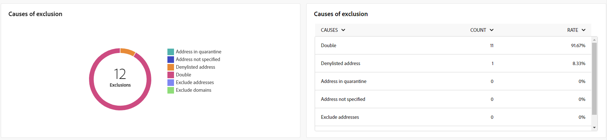
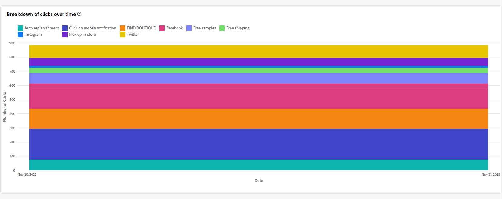

# 电子邮件渠道的全局报告 {#global-report-direct}

全局报告在渠道级别为用户提供流量和参与量度的全面概述。

导航到&#x200B;**[!UICONTROL 报告]**&#x200B;部分中的&#x200B;**[!UICONTROL 报告]**&#x200B;菜单。 您可以根据报表日期、文件夹或规则过滤数据。 [了解详情](global-reports.md)

## 投放摘要 {#delivery-summary-email}

### 投放概述 {#delivery-overview-email}

>[!CONTEXTUALHELP]
>id="acw_global_reporting_deliveries_overview_email"
>title="投放概述"
>abstract="**投放概述**&#x200B;展示便于深入了解您的受众如何与您发送的电子邮件投放和营销活动互动的关键绩效指标 (KPI)。"

**[!UICONTROL 投放概述]**&#x200B;显示关键绩效指标(KPI)，提供对访客与每个电子邮件投放交互情况的深入分析。 这些量度概述如下。

{zoomable="yes"}{align="center"}

+++了解有关投放概述量度的更多信息。

* **[!UICONTROL 要投放的邮件]**：投放准备期间处理的邮件总数。

* **[!UICONTROL 已投放]**：成功发送的邮件数与已发送的邮件总数相关。

* **[!UICONTROL 总打开次数]**：至少打开过一次邮件的目标收件人总数。

* **[!UICONTROL 总点击次数]**：在投放中至少点击一次的收件人总数。

* **[!UICONTROL 退回和错误]**：投放和自动返回处理期间累计的错误总数与已发送消息的总数之比。

* **[!UICONTROL 取消订阅]**：点击取消订阅的收件人数量。
+++

### 目标受众 {#delivery-summary-email-initial-target}

>[!CONTEXTUALHELP]
>id="acw_global_reporting_target_audience_email"
>title="初始目标受众统计信息"
>abstract="通过&#x200B;**目标受众**&#x200B;表和图可了解收件人参与情况，帮助您评估营销活动和投放的有效性。"

**[!UICONTROL 目标受众]**&#x200B;的表和图形展示了与收件人相关的数据，下面提供了详细的量度。

{zoomable="yes"}{align="center"}

+++了解有关目标受众量度的更多信息。

* **[!UICONTROL 目标受众]**：目标收件人的总数。

* **[!UICONTROL 要投放的邮件]**：投放准备后要投放的邮件总数。

* **[!UICONTROL 排除]**：应用规则时在分析期间忽略的地址总数，例如地址缺失、隔离或阻止列表。

+++

### 投放统计信息 {#delivery-summary-email-delivery-stats}

>[!CONTEXTUALHELP]
>id="acw_global_reporting_email_delivery_stats"
>title="投放统计信息"
>abstract="**投放统计信息**&#x200B;图和表概述关键量度，包括成功投放次数、错误数和新隔离数，提供简明概述以评估投放效果。"

**[!UICONTROL 投放统计数据]**&#x200B;表提供了每个电子邮件投放成功的明细，详述指标如下。

{zoomable="yes"}{align="center"}

+++了解有关投放统计量度的更多信息。

* **[!UICONTROL 要投放的邮件]**：投放准备后要投放的邮件总数。

* **[!UICONTROL 成功]**：已成功处理的邮件数与要传递的邮件数相关。

* **[!UICONTROL 错误/退回]**：投放和自动回弹处理期间累计的错误总数与要投放的消息数相关。

* **[!UICONTROL 新隔离]**：在投放失败（用户未知，域无效）后隔离的地址总数与要投放的消息数相关。

+++

### 排除的原因 {#causes-exclusion}

>[!CONTEXTUALHELP]
>id="acw_global_reporting_exclusion_email"
>title="排除的原因"
>abstract="**排除的原因**&#x200B;图和表说明在准备投放期间邮件被拒的具体原因，并提供详细的按规则细分。"

{zoomable="yes"}{align="center"}

排除项图表和表说明了阻止从目标用户档案排除的用户用户档案接收消息的原因。

电子邮件错误类型列在[Adobe Campaign v8 （客户端控制台）文档](https://experienceleague.adobe.com/docs/campaign/campaign-v8/send/failures/delivery-failures.html?lang=zh-Hans#email-error-types){target="_blank"}中。

## 投放吞吐量 {#delivery-throughput}

>[!CONTEXTUALHELP]
>id="acw_global_reporting_throughput_email"
>title="投放吞吐量"
>abstract="通过此&#x200B;**投放吞吐量**&#x200B;可全面洞察投放吞吐量，其中强调指定时间范围内的成功率和错误率。"

{zoomable="yes"}{align="center"}

“投放吞吐量”报表提供了对投放流程效率的深入分析，其中详细概述了指定时间范围内的成功率和错误率。

+++了解有关投放吞吐量量度的更多信息。

* **[!UICONTROL 成功]**：已成功处理的邮件数与要传递的邮件数相关。

* **[!UICONTROL 错误]**：投放和自动回弹处理期间累计的错误总数与要投放的消息数相关。

+++

## 投放失败 {#non-deliverables-email}

### 按类型细分错误 {#delivery-summary-email-breakdown-per-type}

>[!CONTEXTUALHELP]
>id="acw_global_reporting_error_type_email"
>title="按类型细分错误"
>abstract="详述&#x200B;**按类型细分错误**&#x200B;的表和图包含有关在此过程中遇到的各种错误类型的信息，包括用户未知、邮箱已满、域无效等。"

{zoomable="yes"}{align="center"}

每个类型&#x200B;**表和图形的**&#x200B;错误划分显示了与各个域中遇到的潜在错误相关的数据，具体指标如下所示。

此报告中显示的错误会触发隔离过程。 有关隔离管理的更多信息，请参阅[Campaign v8 （客户端控制台）文档](https://experienceleague.adobe.com/docs/campaign/campaign-v8/campaigns/send/failures/delivery-failures.html?lang=zh-Hans){target="_blank"}。

+++了解有关每个类型量度错误细分的更多信息。

* **[!UICONTROL 用户未知]**：在投放期间生成错误类型以指示电子邮件地址无效。

* **[!UICONTROL 无效域]**：发送投放时生成的错误类型，指示电子邮件地址的域错误或不存在。

* **[!UICONTROL 邮箱已满]**：在五次传递尝试后生成的错误类型表示收件人的收件箱包含太多邮件。

* **[!UICONTROL 帐户已禁用]**：发送投放时生成错误类型以指示地址不再存在。

* **[!UICONTROL 已拒绝]**：当地址被互联网访问提供商拒绝时生成的错误类型，例如在应用安全规则（反垃圾邮件软件）之后。

* **[!UICONTROL 不可访问]**：消息分发字符串中出现的错误类型，例如SMTP中继上的事件或域暂时不可访问。

* **[!UICONTROL 未连接]**：错误类型表示收件人的手机在发送时关闭或与网络断开。

+++

### 按域细分错误 {#delivery-summary-email-breakdown-per-domain}

>[!CONTEXTUALHELP]
>id="acw_global_reporting_error_domain_email"
>title="按域细分错误"
>abstract="说明&#x200B;**按域细分错误**&#x200B;的表和图展示与每种遇到的错误类型对应的数据，并按特定域分类。"

{zoomable="yes"}{align="center"}

每个域&#x200B;**表和图形的**&#x200B;[!UICONTROL &#x200B;错误划分显示了与每个域中潜在错误相关的数据。 指标与上面详述的每种类型&#x200B;]&#x200B;**表和图表的**&#x200B;错误划分共同。

## 跟踪指标 {#tracking-indicators-email}

### 投放统计信息 {#delivery-summary-email-statistics}

>[!CONTEXTUALHELP]
>id="acw_global_delivery_statistics_summary_email"
>title="投放统计信息"
>abstract="**投放统计数据**&#x200B;关键绩效指标 (KPI) 全面概述您的投放和营销活动效果，在此可了解成功投放次数、遇到的错误数和用户参与情况。"

**[!UICONTROL 投放统计信息]**&#x200B;量度提供关键绩效指标(KPI)，用于提供有关与每个电子邮件投放关联的数据的详细信息。 有关这些指标的更多详细信息如下。

{zoomable="yes"}{align="center"}

+++了解有关投放统计量度的更多信息。

* **[!UICONTROL 要投放的邮件]**：投放准备期间处理的邮件总数。

* **[!UICONTROL 成功]**：已成功处理的邮件数与要传递的邮件数相关。

* **[!UICONTROL 独特打开次数]**：至少打开过一次邮件的目标收件人总数。

* **[!UICONTROL 总打开次数]**：此域中至少打开过一次邮件的不同目标收件人的数量。

* **[!UICONTROL 点击选择退出链接]**：点击取消订阅链接的次数。

* **[!UICONTROL 镜像链接的点击次数]**：镜像页面链接的点击次数。

* **[!UICONTROL 转发数量估计]**：目标收件人转发的电子邮件数量估计。
+++

### 打开和点进率 {#delivery-summary-open-rate}

>[!CONTEXTUALHELP]
>id="acw_global_reporting_open_clickthrough_email"
>title="打开和点进率"
>abstract="**打开和点进率**&#x200B;的表揭示收件人与您的投放的互动情况，并展示打开率和点进率数据，从而快速深入地了解概况。"

**[!UICONTROL 打开和点进率]**&#x200B;表显示与收件人相关的数据。 指标详见下文。

{zoomable="yes"}{align="center"}

+++了解有关打开率和点进率指标的更多信息。

* **[!UICONTROL 已发送]**：已发送的邮件总数。

* **[!UICONTROL 投诉]**：此域中被收件人报告为不受欢迎的邮件数量和百分比。

* **[!UICONTROL 独特打开次数]**：此域中至少打开过一次邮件的不同目标收件人的数量和百分比。

* **[!UICONTROL 唯一点击次数]**：至少一次点击同一投放的不同目标收件人的数量和百分比。

* **[!UICONTROL 原始反应性]**：与至少打开一次投放的收件人数量相比，至少点击一次投放的收件人数量的百分比。
+++

## URL 和点击流 {#url-email}

### URL 和点击流关键绩效指标 {#url-email-kpis}

>[!CONTEXTUALHELP]
>id="acw_global_reporting_urls_clickstreams_email"
>title="URL 和点击流"
>abstract="**URL 和点击流**&#x200B;报告提供便于详细了解在投放期间点击次数最多的 URL 的重要关键绩效指标 (KPI)。"

**[!UICONTROL URL和点击流]**&#x200B;报表提供了关键绩效指标(KPI)，提供了有关投放期间获得最多点击数的URL的详细分析。 指标详见下文。

{zoomable="yes"}{align="center"}

+++了解有关URL和点击流度量的更多信息。

* **[!UICONTROL 反应性]**：已点击投放的目标收件人数量与已打开投放的目标收件人的估计数量之比。

* **[!UICONTROL 唯一点击次数]**：在投放中至少点击一次的不同收件人的总数。

* **[!UICONTROL 总点击次数]**：投放中链接的点击总数。

* **[!UICONTROL 平台平均值]**：计算每个比率（反应性、非重复点击和累积点击）下显示的平均比率，用于衡量过去六个月发送的投放数量。 只考虑具有相同类型和相同渠道的投放。 排除验证。
+++

### 访问量排名前 10 的链接 {#top10-global-report-email}

>[!CONTEXTUALHELP]
>id="acw_global_reporting_top10_email"
>title="访问量排名前 10 的链接"
>abstract="**访问量排名前 10 的链接**&#x200B;的图和表展示有关收件人与每个链接的互动情况的全面数据。"

**[!UICONTROL 前10个访问次数最多的链接]**&#x200B;图形和表包含每个链接的收件人行为的可用数据。 指标详见下文。

{zoomable="yes"}{align="center"}

+++进一步了解前10个最常访问的链接量度。

* **[!UICONTROL 总点击次数]**：投放中链接的点击总数。

* **[!UICONTROL 百分比]**：与投放交互的用户百分比。

+++

### 点击次数随时间变化的细分 {#global-report-email-breakdown-clicks}

>[!CONTEXTUALHELP]
>id="acw_global_reporting_urls_click_breakdown_email"
>title="点击次数随时间变化的细分"
>abstract="通过&#x200B;**点击次数随时间变化的细分**&#x200B;图可全面了解收件人在指定时间范围内如何与链接互动。"

**[!UICONTROL 随时间变化的点击细分]**&#x200B;图形包含每个链接的收件人行为的可用数据。

{zoomable="yes"}{align="center"}

## 用户活动 {#user-activities-email}

>[!CONTEXTUALHELP]
>id="acw_global_reporting_user_activities_email"
>title="用户活动"
>abstract="**用户活动**&#x200B;的图形表示形式详细地细分收件人互动情况，并通过信息图表格式描绘打开和点进。"

**[!UICONTROL 用户活动]**&#x200B;报告以图表形式显示打开数和点击数的细分。 此报告的量度详述如下。

{zoomable="yes"}{align="center"}

+++了解有关用户活动量度的更多信息。

* **[!UICONTROL 总点击次数]**：投放中链接的点击总数。

* **[!UICONTROL 打开次数总计]**：此域中至少打开过一次邮件的不同目标收件人的总数。

+++