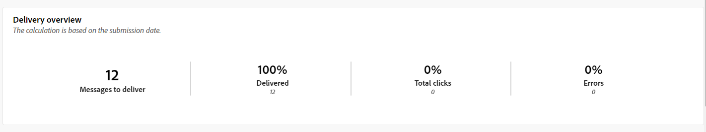
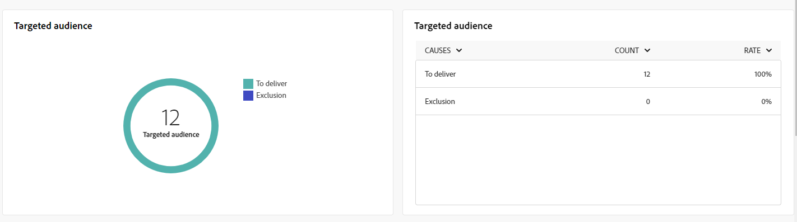

# 推送渠道全局报表 {#campaign-reports-push}

全局报告在渠道级别为用户提供流量和参与量度的全面概述。

导航到&#x200B;**[!UICONTROL 报告]**&#x200B;部分中的&#x200B;**[!UICONTROL 报告]**&#x200B;菜单。 您可以根据报表日期、文件夹或规则过滤数据。 [了解详情](global-reports.md)

## 投放摘要 {#delivery-summary-push}

### 投放概述 {#delivery-overview-push}

>[!CONTEXTUALHELP]
>id="acw_push_global_report_overview"
>title="推送投放概述"
>abstract="推送&#x200B;**投放概述**&#x200B;关键绩效指标彻底考察您的推送投放，并提供详细洞察和具体数据。它提供有关投放的效果、有效性和成果的全面详细信息。"

**[!UICONTROL 投放概述]**&#x200B;报告提供了关键绩效指标(KPI)，这些指标提供有关访客如何参与每个推送通知投放的详细信息。 指标详见下文。

{zoomable="yes"}

+++了解有关投放概述量度的更多信息。

* **[!UICONTROL 要投放的邮件]**：投放准备期间处理的邮件总数。

* **[!UICONTROL 已投放]**：成功发送的邮件数与已发送的邮件总数相关。

* **[!UICONTROL 总点击次数]**：在投放中至少点击一次的不同收件人的总数。

* **[!UICONTROL 错误]**：投放和自动返回处理期间累计的错误总数与已发送消息的总数之比。

+++

### 目标受众 {#delivery-summary-push-initial-target}

>[!CONTEXTUALHELP]
>id="acw_global_reporting_push_targeted_audience"
>title="推送目标群体"
>abstract="**目标群体**&#x200B;图和表展示与您的推送消息受众相关的数据，并展示有关要投放的消息和排除项的信息。"

**[!UICONTROL 目标受众]**&#x200B;表和图表显示与每个已发送推送通知投放的收件人相关的数据。 指标详见下文。

{zoomable="yes"}

+++了解有关目标受众量度的更多信息。

* **[!UICONTROL 目标受众]**：目标收件人的总数。

* **[!UICONTROL 要投放的邮件]**：投放准备后要投放的邮件总数。

* **[!UICONTROL 排除]**：应用规则时分析期间忽略的地址总数：地址缺失、隔离、列入阻止列表或类似原因。

+++

### 投放统计信息 {#delivery-summary-push-exec-stats}

>[!CONTEXTUALHELP]
>id="acw_global_reporting_push_delivery_stats"
>title="推送投放统计信息"
>abstract="**总体统计信息**&#x200B;报告提供有关发送的推送通知的信息，包括成功率、错误次数和隔离次数。"

**[!UICONTROL 投放统计数据]**&#x200B;表详细说明了每个推送通知投放的成功情况。 指标详见下文。

{zoomable="yes"}

+++了解有关投放统计量度的更多信息。

* **[!UICONTROL 邮件总数]**：准备传递后要传递的邮件总数。

* **[!UICONTROL 成功]**：已成功处理的邮件数与要传递的邮件数相关。

* **[!UICONTROL 错误/退回]**：投放和自动回弹处理期间累计的错误总数与要投放的消息数相关。

* **[!UICONTROL 新隔离]**：投放失败（注册无效、邮件拒绝、有效负载错误及类似原因）后隔离的地址总数，与要投放的邮件数相关。

  推送通知错误类型列在[Adobe Campaign v8 （客户端控制台）文档](https://experienceleague.adobe.com/docs/campaign/campaign-v8/send/failures/delivery-failures.html?lang=zh-Hans#push-error-types){target="_blank"}中。

+++

### 排除的原因 {#causes-exclusion}

>[!CONTEXTUALHELP]
>id="acw_global_reporting_push_exclusion"
>title="推送排除的原因"
>abstract="**排除的原因**&#x200B;图和表说明阻止用户轮廓接收推送通知的各种原因。"

**[!UICONTROL 排除原因]**&#x200B;图形和表格显示了阻止用户配置文件（已从目标配置文件中排除）接收消息的原因。

推送通知错误类型列在[Adobe Campaign v8 （客户端控制台）文档](https://experienceleague.adobe.com/docs/campaign/campaign-v8/send/failures/delivery-failures.html?lang=zh-Hans#push-error-types){target="_blank"}中。

## 投放吞吐量 {#delivery-throughput-sms}

>[!CONTEXTUALHELP]
>id="acw_global_reporting_throughput_push"
>title="投放吞吐量报告"
>abstract="**投放吞吐量**&#x200B;报告展示有关指定时间范围内整个 Platform 的推送通知投放吞吐量的详细信息。"

{zoomable="yes"}

**[!UICONTROL 投放吞吐量]**&#x200B;报表提供了对推送通知投放系统有效性的全面见解，提供了指定时间段内成功率和错误率的详细摘要。