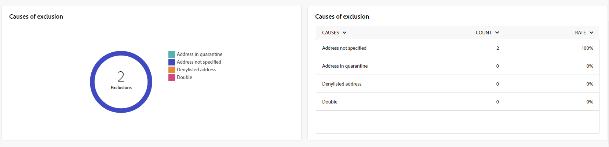

# 短信渠道全局报表 {#campaign-reports-sms}

全局报告可在渠道级别为用户提供流量和参与量度的全面概述。

导航至 **[!UICONTROL 报表]** 中的菜单 **[!UICONTROL 报表]** 部分。 您可以根据报表日期、文件夹或规则过滤数据。 [了解详情](global-reports.md)

## 投放摘要 {#delivery-summary-sms}

### 投放概述 {#delivery-overview-sms}

此 **[!UICONTROL 投放概述]** 报告提供全面的关键绩效指标(KPI)，可深入分析访客与每个短信投放的交互模式。 以下列出了以下量度。

+++了解有关投放概述量度的更多信息。

* **[!UICONTROL 要投放的消息]**：投放准备期间处理的消息总数。

* **[!UICONTROL 已投放]**：成功发送的消息数占已发送消息总数的百分比。

* **[!UICONTROL 点进率]**：在投放中至少点击一次的不同收件人的百分比。

* **[!UICONTROL 错误]**：投放和自动返回处理期间累计的错误数相对于已发送消息总数的百分比。

+++

### 目标受众 {#delivery-summary-sms-initial-target}

此 **[!UICONTROL 目标受众]** 表格和图形可显示每个已发送短信投放的与收件人相关的数据。 指标详见下文。

+++了解有关目标受众量度的更多信息。

* **[!UICONTROL 目标受众]**：定向收件人总数。

* **[!UICONTROL 要投放的消息]**：投放准备后要投放的消息总数。

* **[!UICONTROL 排除项]**：应用规则时分析期间忽略的地址总数：地址缺失、隔离、阻止列表等。

+++

### 投放统计信息 {#delivery-summary-sms-exec-stats}

此 **[!UICONTROL 投放统计信息]** 表详细列出了每次短信投放的成功情况。 指标详见下文。

+++了解有关投放统计量度的更多信息。

* **[!UICONTROL 消息总数]**：投放准备后要投放的消息总数。

* **[!UICONTROL 成功]**：成功处理的消息数与要投放的消息数相关。

* **[!UICONTROL 错误/退回]**：投放和自动回弹处理期间累计的错误总数，与要投放的消息数量相关。

* **[!UICONTROL 新隔离]**：在失败的投放（用户未知、域无效）后隔离的地址总数，与要投放的消息数相关。

  短信错误类型列在 [Adobe Campaign v8（客户端控制台）文档](https://experienceleague.adobe.com/docs/campaign/campaign-v8/send/failures/delivery-failures.html#sms-quarantines){target="_blank"}.

+++

### 排除原因 {#causes-exclusion}

此 **[!UICONTROL 排除的原因]** 图和表显示了阻止从定向用户档案中排除的用户用户档案接收短信投放的原因。

错误类型列在 [Adobe Campaign v8（客户端控制台）文档](https://experienceleague.adobe.com/docs/campaign/campaign-v8/send/failures/delivery-failures.html#email-error-types){target="_blank"}.

## 投放吞吐量 {#delivery-throughput-sms}

此报表提供有关指定时间范围内的投放吞吐量的全面详细信息。
