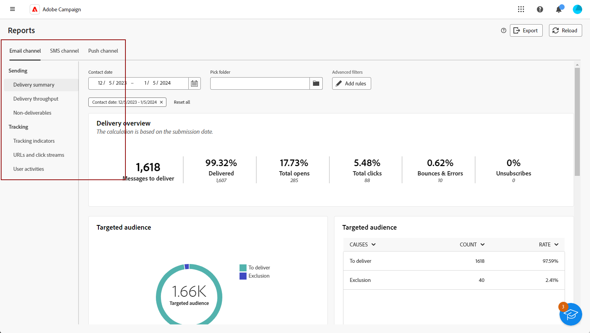

# 全局报告入门 {#global-report-gs}

>[!CONTEXTUALHELP]
>id="acw_campaign_reporting_global_report"
>title="全局报告"
>abstract="全局报告为分析营销活动绩效提供了强大而有效的方法。这些报告提供了活动中每个渠道的关键流量和参与量度的综合视图。"

**全局报告**&#x200B;作为一种有效的工具，提供您的营销活动实例中每个渠道的流量和参与情况量度的综合性总体概述。这些报告由各种小组件组成，每个小组件都提供您的营销活动或投放效果的一个独特视角。

关键绩效指标(KPI)每小时更新一次，确保获得最新的见解。 默认情况下，会对数据进行过滤，以涵盖过去30天的数据，从当前和相关的角度审视您的活动和投放效果。

以下页面提供了每个渠道的报表和相关量度的完整列表：

* [通过电子邮件发送全局报告](global-report-email.md)
* [短信全局报告](global-report-sms.md)
* [推送全局报告](global-report-push.md)
* [直邮全局报告](global-report-direct.md)

## 管理您的报表仪表板 {#manage-reports}

要访问和管理全局报告，请执行以下步骤：

1. 导航到&#x200B;**[!UICONTROL 报告]**&#x200B;部分中的&#x200B;**[!UICONTROL 报告]**&#x200B;菜单。

1. 在左侧菜单中，从列表中选择一个报表，并导航到选项卡以显示每个渠道的数据。

   {zoomable="yes"}

1. 从仪表板中，选择一个&#x200B;**开始**&#x200B;和&#x200B;**[!UICONTROL 结束时间]**&#x200B;以定位特定数据。

   {zoomable="yes"}

1. 从&#x200B;**[!UICONTROL Pick folder]**&#x200B;字段中，选择要从特定文件夹定位投放或营销活动。

   {zoomable="yes"}

1. 单击&#x200B;**[!UICONTROL 添加规则]**&#x200B;以开始构建查询，更好地筛选报表数据。 [了解如何使用查询建模器](../query/query-modeler-overview.md)

1. 从&#x200B;**[!UICONTROL URL并单击流]**&#x200B;中，您还可以选择&#x200B;**[!UICONTROL 热门访问链接]**&#x200B;或&#x200B;**[!UICONTROL 时段]**。

   通过&#x200B;**[!UICONTROL 查看方式]**&#x200B;选项，可按URL、标签或类别进行筛选。
