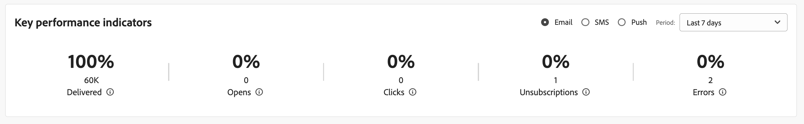

# 关键绩效指标 {#kpis}

>[!CONTEXTUALHELP]
>id="acw_homepage_kpi"
>title="关键绩效指标"
>abstract="利用&#x200B;**关键绩效指标 (KPI)** 部分，可以通过常见 KPI 检查平台有效性。"

>[!CONTEXTUALHELP]
>id="acw_keyindicators_spam"
>title="垃圾邮件"
>abstract="垃圾邮件 KPI"

浏览至主页，检查您平台的关键绩效指标。这些指标显示已投放、已打开、已点击、退订消息的数量和百分比以及错误率。

默认情况下，针对过去 7 天发送的投放内容计算量度。可以从信息卡右上部分的下拉列表更改时段。将排除已发送到测试配置文件的消息。

可以选择要显示的渠道。默认情况下，这些指标反映电子邮件渠道的量度。

## 已投放的消息 {#ui-delivered-kpi}

>[!CONTEXTUALHELP]
>id="acw_keyindicators_delivered"
>title="已投放"
>abstract="对于所选渠道，此指标显示已成功处理的所有消息总数，以及已成功投放消息数与已发送消息总数的百分比。"

已投放消息数反映了您的投放成功率。出于以下原因，投放成功率不可能为 100%：某些地址或电话号码错误、电子邮件提供商的垃圾邮件拦截程序可能拒绝您的消息，或者发生可投放性问题。

**已投放**&#x200B;指标显示每个渠道的以下 KPI：

* 已成功投放消息数与已发送消息总数的百分比。

* 已成功处理的所有消息总数。

在 Adobe Campaign 中，用于将消息标记为“已投放”的规则是：

“种子地址”字段等于“否”且状态等于“服务提供商已考虑”（对于短信）、“已发送”（对于电子邮件）或“移动设备已收到”（对于推送通知）的消息计数。

## 打开总数 {#ui-open-kpi}

>[!CONTEXTUALHELP]
>id="acw_keyindicators_opens"
>title="打开次数"
>abstract="对于所选渠道，此指标显示已打开的所有消息总数，以及已打开消息数与已成功投放消息总数的百分比。"

打开总数通过跟踪消息的打开总次数计算，无论打开消息的收件人数量如何。此指标仅适用于电子邮件。

**打开次数**&#x200B;指标显示每个渠道的以下 KPI：

* 已打开消息数与已成功投放消息总数的百分比。

* 每个渠道所打开消息的总数。

当收件人下载电子邮件中的图像时，Adobe Campaign 会检测到消息已打开。HTML 和多部分/替代电子邮件包含 0 像素图像，可让您检测已打开的消息。由于采用文本格式的消息不包含任何图像，因此，无法检测它们是否已打开。由于与图像显示相关的误差范围，基于消息打开次数计算的值始终是估计值。

## 点进率 {#ui-click-kpi}

>[!CONTEXTUALHELP]
>id="acw_keyindicators_clicks"
>title="点击次数"
>abstract="对于所选渠道，此指标显示消息中所有被点击的 URL 总数，以及点击次数与已成功投放消息总数的百分比。"

可以在消息内容中添加 URL，这会将收件人重定向到特定页面。点进率衡量已点击消息中链接的收件人的数量和百分比。

**点击次数**&#x200B;指标显示每个渠道的以下 KPI：

* 点击次数与已成功投放消息总数的百分比。

* 在投放中点击至少一次的不同人员的数量。将排除退订链接和电子邮件镜像页面的链接。

此指标基于整合跟踪表 (`nms:trackingStats`)。出于性能原因，在显示报告时将使用此汇总表来代替收件人跟踪日志表 (`nms:trackingLogRcp`)，并且它不是实时计算的。该表在检索跟踪日志几分钟后生成。

## 订阅率 {#ui-sub-kpi}

>[!CONTEXTUALHELP]
>id="acw_keyindicators_subscriptions"
>title="订阅"
>abstract="此量度显示所选渠道的所有服务订阅的总和，以及订阅相对于成功投放的消息总数的百分比。"

收件人可以选择加入电子邮件和短信通信。

此 **订阅** 指示器显示以下KPI：每个渠道的订阅数量占成功投放的消息总数的百分比。

>[!NOTE]
>
> 订阅和退订KPI因服务类型而异。 例如，电子邮件订阅和退订涵盖所有与电子邮件相关的服务，无论这些服务是由手动操作还是Web表单提供。 务必要将此方法与投放级别的取消订阅量度区分开来，后者跟踪取消订阅链接点击量，而不是实际的取消订阅用户。

## 退订率 {#ui-unsub-kpi}

>[!CONTEXTUALHELP]
>id="acw_keyindicators_unsubscriptions"
>title="退订次数"
>abstract="对于所选渠道，此指标显示服务中所有退订的总数，以及退订次数与已成功投放消息总数的百分比。"

收件人必须能够通过电子邮件内容中的专用退订链接或通过短信回复 STOP 来选择退订电子邮件和短信。

**退定次数**&#x200B;指标显示每个渠道的以下 KPI：

* 退订次数与已成功投放消息总数的百分比。

* 退订链接的点击总数，即 URL 类别等于“选择退出”。

>[!NOTE]
>
> 订阅和退订KPI因服务类型而异。 例如，电子邮件订阅和退订涵盖所有与电子邮件相关的服务，无论这些服务是由手动操作还是Web表单提供。 务必要将此方法与投放级别的取消订阅量度区分开来，后者跟踪取消订阅链接点击量，而不是实际的取消订阅用户。

## 错误率 {#ui-error-kpi}

>[!CONTEXTUALHELP]
>id="acw_keyindicators_errors"
>title="错误数"
>abstract="投放和自动退回处理期间累积的错误总数。关联比率是与要投放的消息数量的比率。"

Adobe Campaign 平台发送的某些消息无法送达目标。如果用户地址或电话号码有拼写错误、收件人更改了其电子邮件地址或其邮箱已满，可能会发生此情况。如果无法将消息发送到配置文件，远程服务器会自动向 Adobe Campaign 发送错误消息。可根据此错误确定是否应隔离电子邮件地址、电话号码或设备。

因此，您应始终检查和更新数据库，并确保所有配置文件都处于活动和有效状态。投放错误可以是暂时或永久的（软退回或硬退回），具体取决于消息未投放的原因。

**错误数**&#x200B;指标显示每个渠道的以下 KPI：

* 错误数与要投放的消息总数的百分比。

* 投放和自动退回处理期间累积的错误总数。
